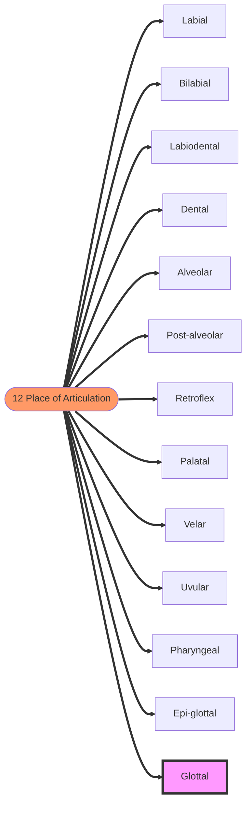

# Learn New Language

<TagLinks />

$Social \; Science = Social \; (as \; in \; society, \; human \, beings) + Science \; (facts)$

* Alphabets
* History
* Similarities

[difference between a letter and a character](https://ell.stackexchange.com/questions/55389/what-is-the-difference-between-a-letter-and-a-character)

## IPA - Internation Phonetic Albhabet

> Transcribing speech, How to write sounds!

* [IPA](https://en.wikipedia.org/wiki/International_Phonetic_Alphabet)
* [Why IPA](https://youtu.be/00pHrQo-0R4)
* [IPA Chart](https://en.wikipedia.org/wiki/International_Phonetic_Alphabet_chart)
* [IPA Generator](https://westonruter.github.io/ipa-chart/keyboard/)
* [IPA Aplhabets](https://en.wikipedia.org/wiki/Naming_conventions_of_the_International_Phonetic_Alphabet)
* [IPA - Help](https://en.wikipedia.org/wiki/Help:IPA)
* [Latin Alphabetical system](https://en.wikipedia.org/wiki/Latin_alphabet)
* [SSML - Speech synthesis MArkup Language](https://en.wikipedia.org/wiki/Speech_Synthesis_Markup_Language)
* [Interactive IPA chart](https://www.ipachart.com/)

```
sudo apt install espeak-ng-espeak
speak --ipa "Hello $(whoami) $(hostname --fqdn)"
echo "Hello Avi Mehenwal" | speak --ipa -m -X -v en+anika
```


IPA | examples
----|----------
/p/ | Peanut Pencil Please
/b/ | Big Bad Baby
/t/ | Take Two Turtles
/d/ | Doughnuts Don't Disagree
/k/ | Can Cat Cacle
/g/ | Giggles Girl Gargoyles
/t &#643;/ | Change Chewy Watches
/$\smallint$/ | Ship


* Vowels
* consonents
* syllables
* IPA Letters
  * Voice + Place + Manner
  * [Esh](https://en.wikipedia.org/wiki/Esh_(letter))
  * [Voiceless postalveolar fricative](https://en.wikipedia.org/wiki/Voiceless_postalveolar_fricative)
* utterances and prosody
  * allophones & phonemes
* How to learn accents? [Learn IPA](https://youtu.be/2bCM9RnDBZw)
* Features
* Openess - of jaw
  * sounds a, e
* Backness - of toungue
* **12** [Place of articulation for consonents](https://youtu.be/xMEFr7ghMTg)
  * Which part is causing the obsttruction
  * fish - `/fi/`
  * using lower lip and upper teeth
* Manner of Articulation
* Voicing `/s/` - voiceless `/z/` - voiced
* `f` and `v` are very similar. F is voiceless, v is voiced




bilabial
: using both upper and lower lips.

sound | examples
------|----------
`[m]`   | man
`[p]`   | pan
`[b]`   | ban
`[w]`   | water

Labiodental
: Lower lip contacts upper teeth

sound | examples
------|----------
f   | fish
v   | van

Dental
: Tip of toungue touches upper teeth

Alveolar
: toungue + back on upper teeth

sound | examples
------|----------
t | town
d | dog
s | sun
z | zoo
n | nail
r | run
l | launch

Post Alveolar
: sha, shine, vision. Hindi word tapu

Palatal
: Body of the toungue raised to the hard pallet. /j/ yes. Only one sound

Velar
: Back of toungue to soft pallet. 2 sounds in english.

sound | examples
------|----------
k | king
g | garden

uvular
: back of the toungue to uvular. None in english. French [r]

glottal
: point of contact back at glottal. English has 2

sound | examples
------|----------
h | home
? | uh-oh


<Footer />
