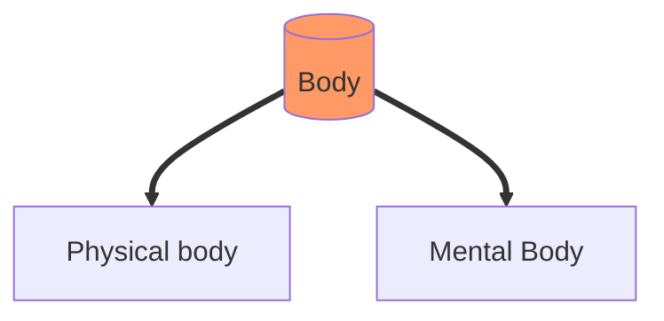

# Inner Engineering

<TagLinks />

> Process of life

Philosophy
:  is the study of general and fundamental questions about existence, knowledge, values, reason, mind, and language. Such questions are often posed as problems to be studied or resolved. The term was probably coined by Pythagoras. Wikipedia

Chant
: A chant is the iterative speaking or singing of words or sounds, often primarily on one or two main pitches called reciting tones

> Either do something good to yourself or to 10 people around you, else life is no good
> Who you are will find expression in everything you do

* What other have said, theories? Either believe it and get confident or dont believe them and get confused. Joyful confusion is not bad, but it makes most of us miserable
* Come to terms with your ignorance, natural reaction is to pay more attention

## Path Of Spirituality

::: warning Miracle
Like love $Boom= Thought + Emotion$

$$Miracle =Idead + Emotion + Life /, Energies$$

Extending beyond physicality or practising it makes you on the path of spirituality
:::

* Life in itself is a big miracle, are you in it or outside?
* Intelligence doesnt believe anything, fear binds it
* Devoution and Fear and polar opposites and cannot exist together
* People respecting you is the quality of people around you
* Put a pin in your head. So that you do not forget after having a good meal
* Be alturistic rather than egotististic, goes against animal instinct.
* Competence is rewarded and incompetence is not unpunished, whats there to live for?
* Gain a sense of their own competence, else you will become competitive
* [Halo Effect](https://en.wikipedia.org/wiki/Halo_effect)
* Education = learning to use your mind, body, energies, emotions in the way you want.

$Sadhana = Tools$ disciplined and dedicated practice or learning, especially in religion or music.

## Inner Engineering

### Mechanics of life

* 3-day program
* Shambhavi Mahamudra Kriya, a 21-minute yogic practice
* It is not a teching, but a technology
* What does engineerign mean? How can you engineer yourself?
* What do people seek when they goto temple? or a pub?
* Is it working?
  * Where you happy when you wer 5 years old? or NOW?
* Whatever you are deprived of, becomes the highest goal of your life, once you achieve that, it changes
* We have been given the most sophesticated machien on the planet, human body. THE GADGET
* Notice the maximum expansion/contraction on lungs while breating
* One day of complete 24 hours of blissfullness
* Somehow things happen? like netflix, drinking, gymming, but are they sustainable?
* Many times bullshit can get you to the top, but it will never let you stay there
* Your body have some compulsive needs
* Align yourself with the right geometry that aligns with universe
  * reorient your spirit
  * Resonance effect, just how antenna signal works
* Modern education is purely informative, not perceptive
* Human life always wants to be something more, expansion
  * something inside us, which doesnt like boundaries
  * transend the limitations of physicality
  * What means to use? to go there?
* Right now, activities are happening out of compulsiveness, not willingness
* People who drink, are like yogis, they are timeless
* There are studies, that a human being can have 30 personalities at a time (you can have 300)
* With some people, even the dreams are not happening their way
* To this mind, if someone teaches you this is good or this is bad do not do this, now its minds full time job to think about it
  * Monkey story
  * there is only addition and multiplicatio, no subtraction
* to this mind, you can not do anythign forcefully
* Meditate on your ideal self (in as much detail as possible)
  * how you want to be?
  * how you want your job to be?
  * how you want your relationship to be?
  * Now visualize it manifest.
  * How you want ideal world to be?
  * ideal self, ideal world, ideal life, ideal government!
    * everyone is well taken care of
* What did you learn in this session and how do you see yourself applying it in your life?
* In yoga, human intelligence is looked as 16 parts
* if you are in a jungle, you have to walk all thorough by yourself
  * and for that we need vigor, strength, vitality
  * not belief in god or goodness
  * belief has no place when truth is concerned

::: tip What are you?
$you = body + mind + emotion +energy$
:::

Saptarishi
: The seven sages

Pleasentness | Misery
-------------|-----------
If your body becomes pleasent | Health
If your body becomes very pleasent | pleasure
If your Mind becomes pleasent | peace
If your Mind becomes very pleasent | Joy
If your Emotions becomes pleasent | Love
If your Emotions becomes very pleasent | COmpassion
If your life energy become pleasent | Blissfullness
If your life energy become very pleasent | Ecstacy

congruent
: in agreement or harmony.

::: tip Spiritual Process
Spiritual prodcess is not a belief system, not an idealogy, not a philosophy.
It is when your experience of life is little more than your physical nature
:::

### The only bondage

* sound waves are energy too.
* What is desire? what the nature and origin of desire?
  * How do you decide that you will have breads for breakfast instead of fruits
  * Process of desire is always there, contents may change because of culture and location
* Root of all misery is **unfulfilled desire**
  * Every cell in your body has its own desire, desire to live
    * Immunity system
    * Try to choke yourself, it wont let you
* Controlling desire is contextual
  * loss of 1B $ may be same as loss of a cow for someone
* Detaching yourself  means running away from life
* I dont want to have a desire, in iteself is a unfulfilled desire
* Desire is what drives you on. Desire is for ALL
  * no matter where you go, it always want more
* To performa various activies you need different kind of egos
  * egos are like shadows
  * depends on external sources like, position of sun, single of multiple sources of light etc
* When you whole excperience of life is physical, desire is inevitable
  * experience of life by 5 faculties of senses
  * syses, ears, nose, mouth, skin
* Wrong identification with mind and body, How to fix it?
  * Who am I, ask inwards!
  * What is the nature of existence? most profound question
* Sun came up on time.
  * If it didn, everything we know as a life would come to an end within 18 hrs, except some deep sea microorganism
  * everything is going perfect in cosmos and one nasty thought in your head, everythign looks bad
* What ever kind of thought has a nature of desire in it
  * Thoughtprocess = desire
  * Active desire, Passive desire
  * put a ball n net, intensity of involvement of players during WC
  * Intensity of desire, enormous desire, intensity of action
  * Desire is not the porblem its happening compulsively then its a problem
  * Sift your desire from compulsiveness to consciousness state
  * The word idiot does not cause any har to anybody, it is just the way you react to it
    * its a harmless sound
* We got lof of work to do to awaken out conscousness self
* How to establish a stable platform to handle our intelligence
  * Liberate your mind
* https://isha.sadhguru.org/global/en/yoga-meditation/yoga-program-for-beginners/chit-shakthi-meditation
  * muscle segments contraction and relaxation from bottom to top
  * climbing a mountain - breath deep and fast
* set an example to live life beyonf limitations
* one person will be the doer and the other person will watch the experience of what the “doer” is doing.
* Keep your body safe, its useful to me
* Focus and attention, try to do everything with attention and consciousness
* Karma (4 layers of karma), prabhda, mukhti, moksha
  * Karma is not reward, punishment system. Its a memory based system. Yes it could be rewritten
* do not encourage titillation

::: tip Life
No desire, no Life

$Desire = Life$

* ~~Desire for money~~      ->  Desire for Divine
* ~~Desire for pleasure~~   ->  Desire for Paradise
* ~~Desire for power~~      ->  Desire for Peace

> Journey is from unconsciousness to consciousness.
> From **Re**action to Action
:::

## To live and to live totally

Nada Yoga
: yoga of sound. using sound for invocation

* Your desire is not for more, your desire is for all.
* experience more
* Food is not a commodity, its life
* If you eat properlu, 50% of digestion shoould happen in mouth
  * long [alimentary canal](https://en.wikipedia.org/wiki/Gastrointestinal_tract) like berbivoures
* Rotting is just extensive bacterial activity
  * whole lot of energy goes just to kill the bacterial revolution inside
* There is no culture about eating, just science
* Take responsibility, what can I do about it?
* Action is not about you, its about what kind of action is required to handle a situation
  * look at someone, some people might get it
  * if they stare back at you, you explain it to them
  * if they still dont, you might yell at them to correct theoir behaviour
  * some might require a knock on head
* If anger arises, (which it will) take responsibility, how to fix it, how to fix it?
* What is the difference between a love affair and rape?
* Our physical body needs presservation, everything else could be pulled down
* Self start vs push start
  * make life a constant great love affair
  * Do you want to have full fledge love affair with life? or get raped by life?
* Your actions are limited (even if you are superman), but your responsibility is limitless
  * If I a happy, its me
  * If I a unhappy, its me
  * If I make it, its me
  * If I do not make it, its me
  * If I live, its me
  * If I die, its me
  * If I win, its me
  * If I loose, its me
* Limitless responsibility is what you are referring to as the divine God
* Meditation on responsibility - 3 prople you know, 3 people you do not know
  * foreset, trees, animals, cellestial bodies
  * same sweet feeling for all of them.

::: tip Responsibility

$Responsibility = Response + Ability$

> Try to respond to everything that is happening around you, your responsibility is limitless.

* Willingness to respond
* Its different from Action, as they requires additional ingredients
:::

* With age, only agaility should go down, not aliveness

Food type         | time to pass through system
:-----------------|:--------------------:
A fruit           | 1-3 hrs time
Raw vegitable     | 12-15 hrs
Cooked vegitable  | 24-30 hrs
meat              | 48-50 hrs
raw meat          | 70-72 hrs

## You are not what you think

> **Happyness**

* Invoke the very best out of you
* The logical dimension of your life and the experiential reality of your life are diametric opposite to each other.
* Situations when you felt happyness? brief
  * Analysie the situations, what the common factor?
  * ATM, you got what you wanted
* which mudra do you take in chilly weather? want nothing to go inside. crossed
* moment-to-moment awareness
  * This moment is inevitable, totally unique
* Mechanics of happyness
* Happyness is not an occassion, it is a constant state of existence
* If you stay in a constatn state of pleasentnes, within 24 hrs your intellect can double
* We pick a piece of past, do a little repair job on it and then we call it future
* This moment is the only doorway both to creation and creator. Rest is just hallucination.
* If somebody always tell you what to do
  * strike him with lightning
* You are existing only because of Pain, not becasue of sense and intelligence
  * Dont main pain into suffering
  * Mind is very good at magnifying
    * Image on retina is very small, mind magnifies it
* If you activate all Nadis, you will have no sense of body
  * right arm got severed and fell down
  * Jesus - they may not know what they are doing
    * can a man say that if they are suffering?
* Only suffering is our making
* Truth is not something you get. You have to yield to it, there is no other way
* Inevitable is not the bondage, its the only freedom you have.
* In India, sucide is punishable by Law
  * Section 309 of the Indian Penal Code
* Intelligencce is unifying, Intellect is dissecting
* You can completely rewire yourself in 24 hours
  * irrespective of your past ecperience of Life
  * your genetics, your DNA
* Newton observed apple falling down and wrote down gravitation law
  * Did he also observe the tree, growing against gravity from where it fell!
  * Everyone knows rain falls down, ever wondered how the hell it got up to form the clouds!

> Energy body is a complex mechanism of over 72,000 components in it. 72k pathways or channels which are
> referred to as Nadis comprises of Pranamaya Kosha or he energy body

::: tip Truth
$Suffering \propto distance \, from \, Truth$
:::

## Mind - The Miracle

* If you accept something as yourself, it becomes a part of you
  * feeble boy carrying eavy rifle in NCC camp
* As ocean is a part of drop, drop is a part of ocean
* Everything is here and now
* For just eating, sleeping and reproducing, we do not need a human brian, all other organism are doing it
* Mind is an ongoing process
* Buddha gave his expression of body
  * 2,500 years ago, my body is made up of cells
  * 7200 energy pathways
  * BUddha also talks about atomic particles, anu, there was no word for it in that time
* Almost every scripture is in poetry, gita itself means poetry
* 4 layers to mind
  * Consciousness mind - less than 2% of mind
  * Subconsciousness mind - 2-3% of mind
  * Unconsciousness mind - 95% of mind
  * [Collective consciousness](https://en.wikipedia.org/wiki/Collective_consciousness)
    * there is only 1 shared mind
* Gautams talks about 7 layers to mind
* Our mind are deeply deeply conditioned by our previous life, family, experiences, life situations
* Mechanics of creating karma
  * Cognition
  * Recognition
  * Sensation - vedena
  * Reaction -
* Karma - is your making, how you look at life, we are the maker of our experience
  * If you have strong karma (linking and dislinking), your suffering is also growing
* You went to bed to have your body rested, not to get up at 7,O clock
  * break free from the cycle of karma
  * Compulsive bondage
* Karma - action, whos action? - my action, whos responsibility - my responsibility
  * To what ectent you see life, to that extent you see I am responsible
  * My life is 100% my doing. create the life you want. If you blame someone else, you will follow the destructive path
  * Karma is NOT [Fatalism](https://en.wikipedia.org/wiki/Fatalism)
* Chitt Shakti Meditation
  * You are love and all are drawn to you. Spread the fragerencce of love, include everyone

::: tip Karma
Your life is your karma.
:::

## Sounds of creation

* If you capable of doing whatever is needed joyfully, thats freedom
* Types of Food
  * Positive pranic food
    * Ashgourd/ Wintermelon, black pepper, honey, fruits, vegitables, nuts, dried fruits
  * Negative pranic food
    * Gralic, onion, asafoetida (hing), green chillies, coffee, tea (caffene), eggplant, Intoxicants
  * Zero pranic food
    * Potatoes, tomatoes
* Why we enjoy sleep? Aftereffect - restfullness
* In ayurveda, every root, every leaf have some medicinal value, we are just yet to find out
  * only a few we have learnt how to use
* Garlic is a very powerful stimulant
* Experienceig other life, like that of a tree other creature, you need to receptive and not on nervous stimulant
* If you do it by choice, you know when to stop. Break the compulsive pattern
* What are the sounds you can produce without toungue? What/How do people without toungue speak? What does toungue do?
  * Wagging
  * 3 primary color analogy
  * toungue mix and match basic sounds to make more sounds
  * Even animals can utter this sound, what does cat/dog do when they yawn
* Complex amalgamation of sounds
  * every sound has a form attached to it, every form has a sound attached to it.
  * This is the basics of mantras
* Basic sound in creation Aaaa Uuuu Mmmm
* Differencce b/w a fact and truth?
  * Fact is you are either man or a woman, truth is you are both
* Christianity, born in Jerusalem, where language at that time was [Aramaic](https://en.wikipedia.org/wiki/Aramaic)
  * crusified at the age of 32 saying they may not know what they are doing
  * They close everythign with Amen
* Ancient india had master desciple traditions
  * Anything that was spiritual was never written down
  * Truth canot be interpreted, it can only be percieved and experienced, scholar joke
* Subsonic sounds, what we can hear, ultrasonic sounds
* Why was jesus killed? he only talked about taking business out of the temple
* 500 years before jesus, buddha made fun of all the hindu gods
* Mark Twain, Anythign that can ever be done by a man or god is laredy been done in this land
* Aumkar yoga - How to speak aum
  * pathway to energy from just below the naval to the tip of nose
  * First prescription to psycological ailments is utter aum
  * be aware of the nature of vibrations that it causes
  * repetativeness will make you dull

Science of Mantras | terms
-------------------|--------------
pure sounds | Mantra
Corresponding form | Yantra
Technology of using these 2 together | Tantra

* Ardhasiddhasana
* Once you gain certain mastery, you can identify the sound attached to a form
  * and simply by uttering the sound you can conntect with the form
  * Quantum mechanics
    * Force of creation - Bhrama consort sarasvati (intelligence)
    * Forces of maintenance - Vishnu + Lakshmi
      * perseverance to maintain, otherwise you dont make money
    * Forces of destruction - Mahesh + Parvati (power, shakti)
  * Science was taught in story form
    * cetain people left the science and only picked up the story and exaggerated it to a point of ridiculness
* Without BVM you cannot move an inch of grass. What does it mean?
  * Does this mean 3 people in partnership are moving grasses!
  * WE can explain entire quantum mechanics through this story
* Naval - Manipuraka Chakra - vishnu
  * aka Hara, [Hara-kiri](https://en.wikipedia.org/wiki/Seppuku) - expert way of commiting suicide
  * All 72000 nadis are meeting here and redistributing
  * Hara located 3/4 of an inch below your naval
  * Maintenance centre
  * Children are make to cry to speak sound Aaaa, to strengthen maintenance centre
* Ohh strucks just where ribcage meets - Anahata - unstruck sound
* Mmm - Vishuddhi - filter
  * And idea, emotion, thought can poision your life
  * Individual sadhna - choose balance
* Silence is the baises of all sound
  * most powerful dimension of life
  * If we do not go back to nothingness, somethingness will fall apart
* 7 times indivudually Aaa Ooo Mmm followed by AUM 21, 33, 42, 54, 64, 68, 72, 84, 95, 108 times
* Sound is a substance of creation, meanings are made up in mind.
  * sound can transform into light, consciosly
* Pay attention and you can learn anything.
* [Brain waves of deep state meditators](https://youtu.be/10J6crRacZg), [Gamma Waves](https://en.wikipedia.org/wiki/Gamma_wave)
  * Olympic level meditaotrs - 62,000 lifetime hrs of meditation
  * Gamma waves are strong all the time.
  * Normal people emit them only at certain sensations, biting an apple
  * [Book - Altered Traits](https://www.amazon.com/Altered-Traits-Science-Reveals-Meditation/dp/0399184384)
  * Lab - university of Wisconson

## Education

* Schools = Raw materials for bigger factories
* Types of education
  * grow brain and bodies to their fullest
* School should be like raising a graden

## Creating what you want

* Life is percieved only if we are aware and alert to it
  * Memory is taken over our altertness and awareness. And its Wrong
  * How can you be bored? Stuck in your mind with all that rubbish?
  * Just the mechanism of a left can take a lifetime to understand
  * When you wake up atleast a 1/4 milltion people did not wake up on planet.
    * Thankful that you woke up.
    * Its not guarenteed that you will wake up next morning
    * Then look up for people you are about, if they woke up. Wow
  * What the biggest thing in life? Yoour life, you are alive
* Time is a very relative experience, if you are happy, it passes like a fly
* Whereever you go, look around and see what are the rules of the place! game and then make them yours
  * Game exists only because of a certain set of rules. Only if you see the rule as my rules, then you instantly become a part of it.
  * Inclusion, involvement for experience. Else you do not experience
  * If you enter forest, make the rules of forest as your own. Then you have experience
  * Orchestra of insects in night
  * You will miss it all, if you are not involved. Make the rules of game yours
* Be straight with youself
* Love is not about somebody else, its the way you are
  * You use someone else to open the doors inside you
  * Have a love affair with everyone
  * Why does it take other person to kindle it?
    * Full time human being
* Today we have resouce, technology and capability to address every human problem on planet
* BIggest industry on planet
  * Arms and ammunations
  * Pharmaceuticals
  * Alcohol
  * None of the life oriented industry is major
* What we think has become more important than waht is the baises of exitence
* Learn How to be?
  * Ask a person, what are you doing?
    * cutting stones
    * just something to fill bellies
    * building a wonderful building
* What do you want? A loving and joyful world?
  * Smile, say today I will generate a loving day
* What a person is doing and how much is he doing os not important, How they are doing it is important
* Crash course on Inner Engineering
  * My responsibility is limitless
  * This moment is inevitable, the way it is the way it is
  * This body and this mind is a gathering and not me
* The significance of being human is that you can decide the nature, scope, and pace of your evolution. Lets make it happen.

## How to face fear and self doubt

* you and exitence, in every possibilities there are all kinds of forces
* fear, anxiety are your own thoughts and Emotions
* understand thouself, rise through consciousness
* Do it well, whatever the hell you are doing
* Unwaivering attention - certain lack of attention, energy behind attention
* the more you know about life, better you can exist, its not a prerequisite to life in itself

Enlightment
: Dimensions beyond physical, inner dimension. Clarity came. daybreak, nightbreak

::: warning
People read 10 books they become scholars

People who read 1 book become religious
:::

* Use memory as a wisdom, so that you do not fall into same trap. Do not forget
  * either become wise to become wounded with it.
* We thankyou for the gift of companionship
* Nearly 70% diseases in last 50 years are Zootonic

## Pay attention

* If you look at something, look with everything you have got
* Realization that you do not know anything, paying attention is naturally
  * else there are all stigmas, assumptions and stereotypes
* Leader means you are able to see something others cannot.
* Attention without intention
* Attention deficiency syndrome
* [Aspire for intelligence, not information](https://youtu.be/R2nZUdObktk)
* Metaphorical Heart - emotional side of ourself
* There is only thought and behaviour, behaviour will catch upto thought based on karma
  * If thought is forefront, the way they think is the way they feel
  * If emotion is forefront, the way they feel is the way they think
* $Mind = Memory + Intelligence$
  * Body has tremendous memory than brain
* Too mmuch information without experience, the exuberance will be gone and a false sense of knowing will become strong
* Danger of intellect
* Technology can bring comfort and convenience to us, but will not bring life to us
* Indescriminate attention to somethign that is not relevant to you
  * then universe opens upto you
* openess / closeness to life
* Try sending good messages to all cells in your body, dont send the wrong signals

## How to choose a partner?

> Joyful face is always a beautyful face

* What is the one thing that always makes a person wonderful?
* Needs
  * physical Needs
  * social needs
  * financial needs
* What world throws at you not your choice, what you make out of it using Intelligence is the point

### Long term

> Rope of your being with

* Trust
* Cheerleader
* Deep sense of invlovement
* Laws of attraction - Geometric body
  * women sense of smell si very strong
* Inspirations, better each other up
* Dealing with resentment and jealousy
* Adjust with each others bullshit
* The man going to temple and the man going to bar are seeking the same thing
* Everybody shall pass in life, question is how to make it profound.
* Journey from constipated to $\implies$ consciousness
  * Expand your intent
* Forgive (remove bitterness inside you) but do not forget, and act out of what is eede by the situation and not by previous bitterness and <resentment></resentment>
  * embracing them
  * rehabilitating them
  * Restrain him/her
  * imprisioning/hanging them
  * butchering them on street
* DOnt have premeditative action. thats a crime

## Questions

1. Why we love the children and not kill them? Generally try to love them? Why? Why some people beat them?
   1. Morality -trying to be good, but at the root you are still the same. Nothing has changes at the root
   2. you can hold back your hands, but you cannot hold back your mind
   3. Your morality will not evolve you into a higher human being
2. How to make decision that you do not regret?
   1. Ask yourself will they still mean something to  you on deathbed, after 5 years, 10 years, 20 years of time?
      1. As most of them are traps
   2. Avoid Despirate goals
      1. think in isolation, meditation
      2. when you are happy
      3. Then work on your personality (mask), and persona will come
         1. Different personalities at different places
         2. develop = make it up
         3. but remember to keep it down, when you want
      4. Meditation - strip everything on you
         1. if it is a lie, we need to keep up
3. Which science has the greatest scope of effect?
   1. systematic approach applicable to larger number of situations and people
4. Start of the tern excited, end of term stressful, how to maintain state of blissfullness?
   1. your body geometry controls some aspects of your chemistry
   2. Accidental creation vs consciousness creation
5. Forces of nature
   1. somebody gliding the wave, somebody drowning beneath the way
   2. somebody figured it out.
   3. If you dont know all the pawns, there is no game
6. What is behind the curtain of life? Why are we born, die? If in the end we have to die, whats the point of all this hustle and puzzle and jigsaw of life?
7. How to awaken intelligence?
8. Gym vs Yoga?
9. Diseases treatment? Ailments types, Infectious and chronic?
   1.  External virus or internal damage
10. Simple Pactises to be healthy? - [is the idea life happening well](https://youtu.be/c_qoYTYCSG8)
    1.  using the body, mind and energies
    2.  eathing good food
    3.  1k cluching per day
11. Indian freedom fight movement vs Americal civil right revolution difference?
    1.  one fought with violence, laws were fixed but hatred still remained
    2.  Sensitivity for life
12. Simple practisdes to be healthy
    1.  Use the body
    2.  Eat right food
    3.  clinch and expland fist 1k times a day, watch results after 30 days
        1.  now replicate that to other parts of body, mind, heart and life energies inside you

## Yoga Practises

> Discipline of faculties

* [Shambhavi Mudra](https://youtu.be/C_xsXnRd_uc)
* [Vipassana](https://en.wikipedia.org/wiki/Vipassan%C4%81)
  * Neuroplasticity - changing mind connections using brain exercises
  * buddha did a research, every input, every data evokes a sensation in our body
    * we react to sensationsa and not to the outside objects, evolutionary proccess
    * Eg: just the sound of scratch!
    * we suffer the sensations and not the act itself
* [Upa Yoga](https://youtu.be/QjGF2MLdIz8) 7 sets of Practises, Pre/Sub yoga preperations
  1. For Health - directional movement for bodily joint liquids
     1. out - exalation | in - inhalation
     2. out - rotate fist around thumb | in - other side
     3. 4 directions
  2. for Success - The neck practises
     1. neural regeneration
     2. 5 neck and shoulder practises
     3. exhale - back | inhale - in
     4. shoulders'
        1. inhale - up | exhale - down
  3. for Wellbeing - Yoganamaskar 7 steps
     1. inhale -up | exhale - down
     2. Bala asana
  4. for Peace - Nadi shuddhi - 72000
     1. pingala - 36000
     2. ida - 36000
  5. for Joy - Nada Yoga - 7 times
     1. without employing toungue
     2. Universal sounds - sounds system can produced naturally
  6. for Inner Dimensions - Shambhavi Mudra, 3,6 minutes
     1. Maintain Yoga mudra
     2. Element of grace
  7. for Love - Namaskar process
     1. yin and yang
     2. Duality to oneness
     3. generate extreme of pleasent emotions - 3,4 minutes
* Isha Kriya - bring human is super, 12 minutes, 2 time each day
  * yogic posture with palms open
  * I am not the body, I am not even the mind
  * 7 times - Aaa, loud enought until you feel the vibrations
  * reorganization of energies
* [Yoga Journal](https://www.yogajournal.com/)
$$ Super \, Human = \{ \, breath, thought, awareness \, \}$$

## Ascended master / Enlightned beings

> Contributed somthing to human consciousness

* [Paramahansa Yogananda](https://en.wikipedia.org/wiki/Paramahansa_Yogananda)
* [Gautama Buddha](https://en.wikipedia.org/wiki/Gautama_Buddha)
* Socrates
* Lao Tzu
* Chuang Tzu
* Bodhi Dharma
* Pythagoras
* Zarathustra
* Mahavira

masochist

### Animal Instinct

> Its just that small devil inside you that makes you feel like that.

* Territorial imperative
* Crossed in love and now drinking and crying
* you are liable to arouse public indignation

#### Effects of colors

> Understand what color is?

* What you give away is your quality, just like colors in nature
  * what you give away is what you see
  * what you hold back is what you do not see

yellow | mooladhara, buddhist process. Stabilization
ochre | advanced buddhist, indian sanyasis
red | most vibrant things are red, femenine

### Resources

* [Herbal Tee](https://en.wikipedia.org/wiki/Herbal_tea)
* [How much caffene in various tea and coffee type?](https://www.thespruceeats.com/how-much-caffeine-in-green-tea-765281)
* https://www.schoolofhealth.com/naturopathy/studying-naturopathy/

<Footer />
