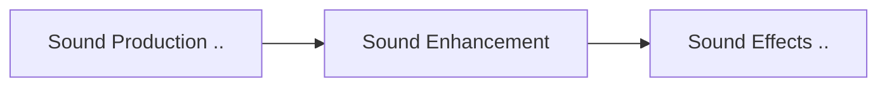

# 1. Music

<TagLinks />

## 1.1. Instruments

* [Clarinet](https://youtu.be/nENXs6n_ITI) - wodden flute with metalwork to enhance trills effect
* French Horn
* Triangle - solo :100:

## 1.2. Music Notes

## 1.3. How to become a Music Composer

* Melody first, background music later
* Background music first and melody later
* Chords Progression
  1. C
  2. Dm
  3. Em
  4. F
  5. G
  6. Am
  7. Bdim
  8. See you again - Charlie puth - 6 1 4 1 or Gm Bb Eb Bb
  9. 6 4 1 5 - Faded - Alan walker
* Parts of soung
  * Intro - 5 seconds
  * Hook
  * Predictability
  * Dominant musiccal instrument sound

## 1.4. Sound Effects - FX

* Sound Engineering
* [Sound Basics](https://www.youtube.com/playlist?list=PLJWlWUSxi9SfloQkixL755NYLJjsMMZBr)
* in movies, video games, explosions, artifically created sounds of thunderstorm

> Sound mixer via hardware or softwares

* Began in 1940
  * Earliest effect was **delay**
  * **Wow** effect
* Create, recod sound loops and overlay with other sounds
* High pass filter
* sound gain
* [compressor](https://youtu.be/IbIC7B4BU6g) - compression ration 3:1
  * even out the volume level of audio track
  * trim and adjust high treble sounds
  * multiband compressor - 4, 6 band compressor
* Adjust deplay of reverb (digitally added reverb), then EQ it
  * reverb with delay can create echo effect
  * ping - pong effect
* Pitch Shift
* EQ
  * We always do not want the full frequency sounds of all the instruments in our record
  * control frequency spectrum of audio
  * Bring the best out of each instrument
  * No mud, clash b/w instrument sounds
  * Add the right color and mood

### 1.4.1. FX Tools

1. [Audacity s/w](https://www.audacityteam.org/)
   1. Remove b/g noise
   2. breathy noise
2. [MAckie](https://en.wikipedia.org/wiki/Mackie)
3. [GarageBand - iOS](https://www.apple.com/mac/garageband/)

## 1.5. [Music Genres](https://en.wikipedia.org/wiki/Music_genre)

* Musical tribes
* Also exists in pairs, pro and alter vesion
  * Electronic | Organic
  * Pop / Rock | Classical
  *

## 1.6. Questions

* How to figure out the instruments used in a song

## 1.7. Resources

* [Decible](https://en.wikipedia.org/wiki/Decibel)

<Footer />
