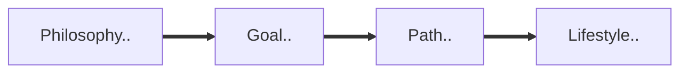

# Religion

<TagLinks />

> Shortest distance between two people is a story
> Building bridges
> Comedy acts like a wodden sword, hits the point without harming anyone

## [Hinduism]

> The goal is to attain self realization through deep mediation experience that god and me are the same being

* Not even a religion, its a way of life
* [Sanatan Dharma](https://en.wikipedia.org/wiki/San%C4%81tan%C4%AB)
* Worlds oldest religion, around 1500 BC (as recorded)
* India and hindu came from the same world SINDHU
* Sanskrit is the ancient languague of Indus Valley civilization
* One universal soul, formless, genderless source of reality
  * everything is a part of ocean, drops propelling out
* immortal souls, ATMA -> Transmigration via Karma (Action)
* Moksha - free from cycle of life and death
* Time has no beginning and end - it has cycles
  * 1 epoch 4.32 million years
    * Krita Yuga
    * Treta Yuga
    * Dvapara Yuga
    * Kalyug
* Dharma - each being has theor own dharms
  * lions dharm is to kill and eat deer
  * kings dharma is to rule well
* No prophets, no sigle religious book, instead vedas -> Upanishads(800-500 BC)
  * Rig vedas
    * Truth, reality, universe
    * war, wedding and rituals
  * Yajur vedas
    * sacrifisial rituals
  * Sama veda
    * sweet song that destroys sorrow
  * Atharva veda
    * curse enemies, charm your loved one
    * learn to invoke rain, herbal tip
    * warfare, how to make poison arrows

::: tip Hinduism
* is a non profit organization
:::

* Upanishads and Puranas, philosophical texts
* Mahabharata longest poem in the world, 5 times length of bible
  * Dharma must be followed for society to function
  * There is no knowledge like **sankhya** and no power like **yoga**
* 4 goals person should aim for to have a good life
  * Dharms
  * Artha
  * Kama - pleasure of body and mind
    * avoid materialism
    * krodha
    * Lobha
    * Moha - attachment to power
    * mada - excessive pride
    * Matsarya - jealousy
  * Moksha - break the cycle and merge with the source of creation
* Shiva - Tandava dance destroyed the world after the epoch end
* If scale of dharma are tipping and externa, intervention is required, a AVATAR (descent) is sent
  * to restore dharma
* Caste System - based on their abilities, not by their birth
  * Manusmrity careated some hard rules around it
    * Bhramins lords of all casts
    * Forbid movement among casts
* 

### [Dharma]

* carries a lot of weight
  * Dhriti
  * Kshama
  * Dama
  * Asteya - theft
  * Shauch
  * Dhi
  * Vidya
  * Satya
  * Akhrod - absence of anger
* Everyone has mix of 3 tendencies Gunas = tendencies
  * Sattva - tendencies towards purity and truth
  * Rajas - towards action and activity
  * Tamas - tendency towards inaction
    * All 3 together affects persons thoughts, behavious and personality
*

::: tip Dharma
Natural order for natural law

$Dharma \approx	\{ \, Duty \cup Righteousness \cup Moral \, Conduct \cup Natural \, Law \, \}$
:::

## [Buddhism]

* Indian sage
* 2500 years ago
* 4th largest religion in world
* Born to a royal family
  * mother died when he was young - 7days after birth
  * lived inside palace
  * trained by vishwamitra
  * swan shot by arrows
  * Fight b/w weak and strong
  * Son - Rahul
* THere is no knowledge without sacrifise
* In order to gain anything, first you  must loose everything
* The world is filled with pain and sorrow, but we can find serenity
  * No matter what your circumstances, you will end up loosing everything, end up aging, end up ill
  * Figure out how to make it all right
  * How to deal with all this?
* Promise of story is relevant and its treaching
  * He who sees me, see the teaching. And he who sees the teachings, sees me
* Path of seeker, he doesnt have a solution yet, but he recognizes the problem
  * Why the human beings suffer? Is there any escape?
* Gods became less important than the rituals themselves
* Trans-state - rigrous yogic practises
* Budda did it All, all to the utmost
  * eat one grain per day
  * sleep on nails
  * standing on one foot
  * drink his own urine
* We are all in it together, everything is connected
* Grace of accepting the life - when buddha accepted rice from a young girl, decision towards life
  * you cannot do it completely from your own
  * wash himself, strengthened and then sat for mediation
* He had 2 gurus, which did not help him, following ritual almost broke his body and mind
  * Trust himself now
* Batteled with the god of desire, with all temptations
* cosmic vision of the workings of the entire universe in 6 years
  * his past lives, evolution
  * capacity to attain Nirvana is within us.
  * Just this, just this, the quality of this moment
* How to teach the path of spirituality?
* Its not the path of [Asceticism], or sensory indulgance, its the middle way
  * example to extra tight, loose string to produce sound. THere is a  middle way
* Problem of suffering? And What to do about it? Everything else is beside the point, creation etc
* He established a community who could live together and help each other - sangha
* Pay attention to your own thoughts
* One time you are angry, one time you are calm and happy, who are you?
  * one thing today and another thing tomorrw, water in glass, next day in air or human
  * Causality, everything is connected to everything else
* We are burning with Desires all of us
* Miracle - something unexpected, hard to explain
* Unknown is unspeakably more than know, and it will always be there.
* Always reason before accepting
* He too was helpless sometimes, how own kingdom was massacared, even he failed to perform a miracle
* Change has to come from within
* Let the dharma and the discipline be your teacher and died peacefully
* Remember me as the one who woke up

## Jainism

* Jain tradition is older than Buddhism
* Adinath - first yogi of hatha yoga

#### Four Noble Truths

* Buddha [four noble truth](https://en.wikipedia.org/wiki/Four_Noble_Truths)
* Humans are the specie where new born require nurturing
  * evolve human circuits of generosity, empathy, humbleness, humility

1. There is suffering/ dis-satisfaction in this world
   1. It doesnt arises by itself, it has causes. Our own mind can cause it.
2. Suffering has a cause
   1. could be Desire
   2. Be smart about desire
3. Make an astonishing claim, Truth of end of suffering - Nirhodha
4. [Noble eightfold paths](https://en.wikipedia.org/wiki/Noble_Eightfold_Path)
   1. Right view
      1. Actions have Consequences
   2. Right Resolve / intention
      1. no ill-will
   3. Right speech
   4. Right Action
   5. Right Livelyhood
   6. Right Effort
   7. Right Mindfulness
   8. Right Samadhi
      1. [Vipassana Mediation](https://en.wikipedia.org/wiki/Vipassan%C4%81)

* recipies to life, as to which one makes the best soupe
* Liberation from Samsara

### Story of Buddha

* Born around 6th centuary BC in foothills of himalayas
* If you below mind you are buddhu, above buddha
* What is taht man? old
* Will it happen to me too?
* What is he doing? sick person
* What are they doing? at a funeral
* 1800 different varieties of doing yoga, like how medical sciences are becoming today
* Take away the barriers, which are not allowing me to experience it
* He sat with a resolve to find out the nature of existence
* [Buddhist pilgrimage sites](https://en.wikipedia.org/wiki/Buddhist_pilgrimage_sites)
* Buddha attained **Bliss of liberation** state - Anand nugget samadhi

[Hinduism]: https://en.wikipedia.org/wiki/Hinduism
[Dharma]: https://en.wikipedia.org/wiki/Dharma
[Buddhism]: https://en.wikipedia.org/wiki/Buddhism
[Asceticism]: https://en.wikipedia.org/wiki/Asceticism

## Islam

* [Mecca Kabba](https://youtu.be/PDxKxnVZtgo)
  * built by Abhrahim
  * white stone which turned black
  * black stone said to date back as adam and eve
  * was robbed by Abu Tahir al-Qarmati once
    * now only fragments remains
  * Stone is not a meteorite, possibly a Agate

## Paganism

* Wiccan

## [Christianity](https://en.wikipedia.org/wiki/Christianity)

* started in germanya round 4th centuary
* The four largest branches of Christianity are the
  * Catholic Church (1.3 billion/50.1%)
  * Protestantism (920 million/36.7%)
  * the Eastern Orthodox Church (230 million)
  * Oriental Orthodoxy (62 million/Orthodoxy combined at 11.9%),
* 1/3 of total global popullation
* Church tax **8-9%** in germany if you are a part of state reognized Church
  * easy to marry
  * Renovating churches, salary
* A protestant church started because a king wanted a divource
* Period of [Reformation](https://en.wikipedia.org/wiki/Reformation) 16thC Europe
  * church was a very powerful institute, they own 1/3rf of european land
  * they marry, confessions, death rituals, read bible (latin)
  * sola fide
  * [Martin Luther](https://en.wikipedia.org/wiki/Martin_Luther)
    * churches rituals did not have the power to save souls
    * alligations that preist were not doing rituals properly and none of them had any spiritual power
    * new translation of bible into german
    * landlords vs clergymen, biggest german peasent revolt before french revolution
      * was supressed with crushing brutality 100,000 people were killed

[Indulgences](https://en.wikipedia.org/wiki/Indulgence)
: In the teaching of the Catholic Church, an indulgence is "a way to reduce the amount of punishment one has to undergo for sins"

congregation
: a group of people assembled for religious worship.

### References

* [sacred-texts.com](https://www.sacred-texts.com/hin/index.htm)
* [hinduamerican.org](https://www.hinduamerican.org/)
* [What is Dharma](https://youtu.be/Y6x9Ms2IXVg)
* [Moral state wikipedia](https://en.wikipedia.org/wiki/Moral_character)
* [List of relition by Popularity](https://en.wikipedia.org/wiki/List_of_religious_populations)
* [story of buddha](https://youtu.be/EDgd8LT9AL4)
* [whore of Babylon](https://en.wikipedia.org/wiki/Whore_of_Babylon)

<Footer />
