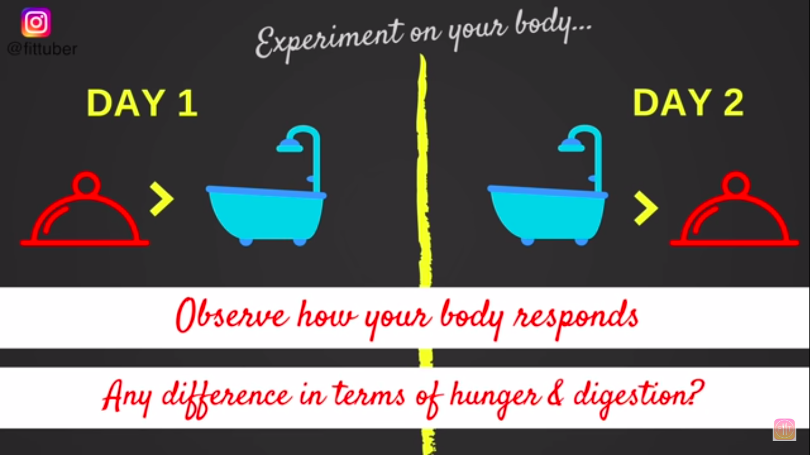

# Routine

<TagLinks />

Bathing in hot water is considered wrong in Ayurveda, no matter the weather,
a healthy person should not use it.

* Bath in the evenings as in Japan, remove all dirt you have collected
* Direction you take bath in also matters.
* Oil message before bath
* Use scrubber to remove dead skin
* Practise deep breathing while bathing
* Do not bath after meals

> Bathing is not just meant to cleanse the physical body but also rejuvinates the mind and soul
> Be mindful of bathing.
> It should be carried out calmly and purposefully. Its only then one reaps its benefits

* Use 100% natural products
  * Arata
  * Plant sources and non GMO

<Footer />
