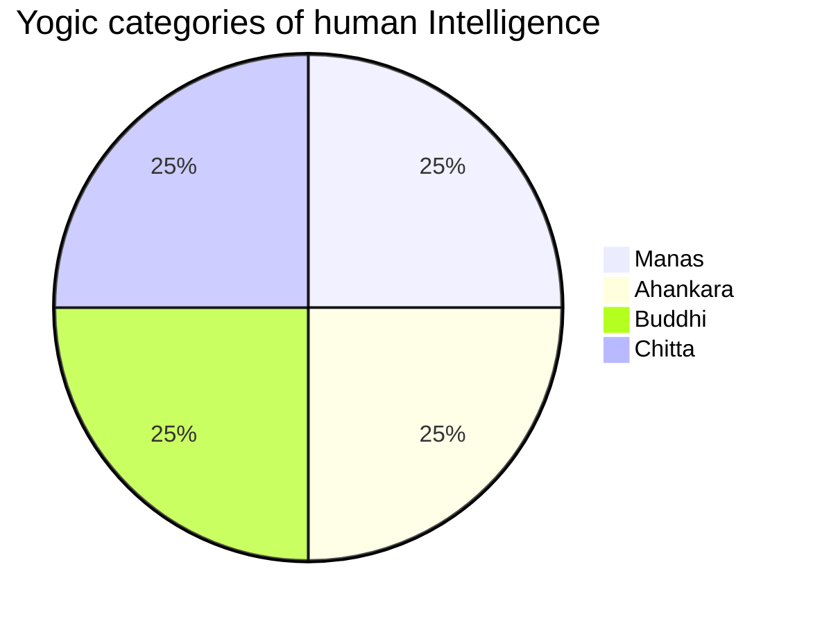

# 1. Yoga

<TagLinks />

* Life and death are centain level of **Time** and **Energy** at play
* Life is a interplay of energies
  * coming to terms with energies and utilizing them in a way to do what you can do and have the serinity to understand what you cannot do.
* Energy Management
* Belief - waht you do not know, you concretize those assumptions
* You have setup the menu, but you are surprise when its served on table
* Consciousness is different from mental alertness
  * its always there, question is intensity and volume
  * light dim/fade, what eyes percieve example
* 8 dimensions of memory
* Devotion is a dimension of intelligence
* Religion is a very inexpensive way of psychetry
  * a lot more people would have lost their mental balance
* very thin line b/w sane and insane, and we are crossing b/w them more often than you think
* If you are willing to strive, you can cross all the limitations that nature has set for you
* Adiyogi gave 112 methods to whichi a human being can evolve to their ultimate nature
* Science of consecration
  * high density material, solidify mercury
* 12 years - 1 solar cycle
* body - if you live approx 75 years, 12-1400 tons of food
* baby - drinks Life
* next generation should be one step more than us, else its a crime against humanity
* Modern sciencce look at space and time, yogic science looks only at time, because there is time there is a consequence of space
* Distance b/w memory and you creates clearity, is earth round or flat? if you are on moon for sure you can see that earth is round, thats distancing
* Cosmic Indentity - 1st step of education
  * never empower a limited identity
* Human Intelligence 16 parts
  * Bhuddhi
  * Chitta
  * Ahankara - intellect works behind identity
  * Chitta
  * Manas
* 8 dimensions of memory
* All feelings and emotions adds a certain kind of chemistry to the body
* Drink water close to body temperature, with $\pm$ 4^o celcius temperature variation
* Daily consumption of honey with warm water, its close to blood
* Keep your humanity full on all the time
* Life is not thoughts, memoeries, emotions, openions, prejudices etc.
  * Has your creation can become larger than the creator
  * Is whats happening on your phone larger than what's happenign in cosmos
* Chaitaniyam - consciousness
  * is a star (sun) which shines in mind and throught that to all the organs in body
  * Analogy of human body to a modern computer, send the right commands (joy) to your body

Inner Engineering = distance between you and your body and mind

::: tip Life

> Energy Management

$Life \propto Enery$

where, $Time \, is \, constant$
:::

* Practise before sleep, what is NOT you, keep aside.
* Every Indian epic starts with a question.
  * vigyaan bhairav Tantra - what do you do with your eyes close?
  * Ramayan - sita where are you?
  * Gita - why should I kill my family members?

Religion
: Religion is a social-cultural system of designated behaviors and practices, morals, worldviews, texts, sanctified places, prophecies, ethics, or organizations, that relates humanity to supernatural, transcendental, or spiritual elements.[1] However, there is no scholarly consensus over what precisely constitutes a religion

Scriptures
: Religious texts

[Sadhana](https://en.wikipedia.org/wiki/S%C4%81dhan%C4%81)
: Sādhanā is a discipline undertaken in the pursuit of a goal. Abhyāsa is repeated practice performed with observation and reflection. Kriyā, or action, also implies perfect execution with study and investigation. Therefore, sādhanā, abhyāsa, and kriyā all mean one and the same thing

## Patanjali Yogic Sutras - 8 limbs

> Karma vs Fate

* Foundational scripture for the practise of mediation.
* **196** sutras in cryptic sanskrit, brief
  * control of body, breath, senses and mind
  * English word yoke
* His yoga consists of 8 parts, ashta anga yoga
* [Yama - god of death](https://en.wikipedia.org/wiki/Yama)
* [Eight limbs of yoga](https://en.wikipedia.org/wiki/Ashtanga_(eight_limbs_of_yoga))
* Meditation ~ Mindfullness (smriti)
* Butterfly [Metamorphosis](https://en.wikipedia.org/wiki/Metamorphosis)
  * butterly transforms not once but twice
* Pranayama - breathing and nervous system are connected
* Dharana
  * sound
  * mantras
  * image, experience
  * divine within you

## 1.1. Intelligence

* https://isha.sadhguru.org/yoga/yoga-articles-mind-stress/harnessing-true-power-mind/

## 1.2. Yoga for Health Upa Yoga

### 1.2.1. Directional movenments

* When you lie down for long hours, sleep, lubricating fluids tends to settle down and not in circulation
* Directional movenments to lubricate your movements
* Sit in Hightened state
* 3 cycles on hand directional movements in sodewards direction
  * out - outward rotation, in - inward rotation
* 3 cycles forreward and backward
* 3 cycles upward
* 3 cycles downward

### 1.2.2. Knee Rotation

* inhale - go backward
* exhale - come forward

### 1.2.3. Spine and clearity

> Actrivate the clearity

* 8-12 times swing and stretch then stand straight
  * Should happen in a series without a break, no pause in between

> Yoha for success - Neck practises, alertness and fade away lathergy

* on all 3 axises
* cycle starts with inhaling
* bring back to starting position exhaling
* 3 cycles
* 4th practise - rotate neck around solduers
* 5th practise - rotate soldur forward and backward movement

### 1.2.4. Yoga Namaskar

> yoga for well being

* strengthen spine
* Light stomach condition
  * 2 hrs after meal
* up - full inhalation
* down - full exhalation
* standing posture - 3 cycles
* squat down - 3 cycles
  * move hands first forward backward and then up and down
* in [Balasana](https://en.wikipedia.org/wiki/Balasana) unless breath stabilizes
* tension in arms when moving

### 1.2.5. Nadi Shuddhi

> Yoga for peace

* Major nadis are **pingala** and **ida**, 36000 each. total 72000
* There is a connetion between breath and mental structure
* left hand loosely on lap, plam facing upwards
* use only right hand
* Thumb and ring finger, full breath. Focus on breath. COnsciousness effect
* Use same nostril for inhalation and exhalation
* 4 mins minumum

unsolicited
: not asked for; given or done voluntarily.

## 1.3. [yoga documentary](https://youtu.be/92J-JPChaeI)

> Free of Religion

* [samkhya] - oldest philosophy of india
* How to uncover our real nature?
* Before and after patanjali? what becomes of yoga
* [Patanjali]
  * author of Yoga Sutras
    * could be written on one single page
  * sanskrit grammer
  * composition of ayurved
* Experimentation and observation were performed inside the human body
* Sit in comfortable asana, stabalize then breath control and look inwards
* Point of concentraion could be internal, external imaginary effect
* Indus Valley oldest and largest civilization in world
* Meditate on elements of nature
* [samkhya] philosophy
  * Primal nature - prakarti
    * Sattva
    * Raja
    * Tama
  * Conscious Entity - Purusha - boundary restfulness
* 3 elements of prakarti are transformed into 24 elements of nature
* Hatha yoga
  * 84 asanas
    * Bhadrasana
* We all emerge from one consciousness - code geass

## What is [Meditation](https://en.wikipedia.org/wiki/Meditation)

* Buddhist way of life is 2400 years old, Zen is just about 1200 years old
* Dhyaan - close your eyes and sit, you can do many things, chan in china and then zen in other parts
  * japa
  * tapa
  * dharana
  * Dhyana
  * samadhi
  * Pratiyahara
* Various ways
  * simplest being - watch the breath, breathing techniques
    * its sensations, pauses, cycles, where does it gets absorbed in body

### 1.3.6. Yogic Practises

* [yoga sutras] of patanjali
  * 196 sanskrit sutras

1. Niyama - observances
2. Āsana - physical postures
3. Prāṇāyāma - control of the prana(breath)
5. Pratyahara - withdrawal of the senses
6. Dhāraṇa - concentration
7. Dhyāna - meditation
8. Samādhi - absorption

10. Samadhi path
   1. skilled practisioners
11. Sadhan path
    1.  Yama - restraints or ethics of behaviour
        1.  Non violence
        2.  truth
        3.  non stealing
        4.  vrat - supreme self descipline
   2. niyam - discipline
      1. cleanlyness
   3. asana - posture
   4. Pranayam - breath control
   5. Pratyahar - withdrawl
   6. Dharna - concentration
   7. Dhyana - meditation
   8. samadhi

## 1.4. samkhya philosophy

* there are as many gods as the people - heights of democracy
* Shiva
  * Kundilini - base of hatha yoga, base of spinal chord

[Patanjali]: https://en.wikipedia.org/wiki/Patanjali
[samkhya]: https://en.wikipedia.org/wiki/Samkhya
[yoga sutras]: https://en.wikipedia.org/wiki/Yoga_Sutras_of_Patanjali

## 1.5. Rajyoga

* Swami Vivekananda
* Knowledge is based on experience
  * Experiment and reasoning
* Faculty to observe inside
* BHakti yoga
* Karm yoga
* Gyaan yoga
* Raja yoga

## 1.6. Yoga sutras

* https://youtu.be/5MhVXHwtaWw
* https://www.youtube.com/watch?v=uUmg-2Y6KcM
* https://www.google.com/search?q=ashtanga
* sleep - certain level of consciousness is still Actrivate
  * may, may not dream
  * we may say we had a good/bad sleep
* Meditation stages
  * Exterior examination
  * Internal examination
  * Inspiration
  * Realization

## Yogic Diet

> Food is building block of body, energy from creation to power your body
> Taking food is itself a sadhana
> Out body should float ahead of us, we should not drag this.

* Experiment with food, what makes you agile and ebergetic?
* [Ekadashi](https://en.wikipedia.org/wiki/Ekadashi) means 11 days lunar day
  * 2 times a month, 24 in a calender year
  * 1 mandala - 48 days
    * for 3 days body doesnt need food
  * 4 days before the full-moon / new-moon day
    * only after sunset they eat 1 meal
* Being alert with eyes closed and not sleeping, takes some level of body mastery
* Everything we borrow from the planet causes certain level of inertia in system
  * Neem and turmeric + mildly laced honey water
* 8 hrs gap b/w meals
* Cooking food destroys the digestive enzymes in food
  * body has to work extra hard to cope up with that, hence we feel lethargy for 1.5 hrs after meal
  * then body recovers back
  * 50-60% of food we eat is going to waste, but body has to still process it.
* 40-50% uncooked food
  * bruice lee was a vegetarian
* Rest = Energy Equation, Consumption vs Production

## Suffering Types

### physical

### Mental
1. grief
2. sadness
3. depression

## 112 methods to salvation - Adiyogi, Tantra

> Vigyaan Bhairava Tantra

Beautyful conversation b/w adiyogi and parvati, 162 slokas. In Tantra, life is counted as number of breaths and not in years.

Numbers | Types
--------|--------
9 | centred around breath
11 | Chants, uttrances of sounds and syllables, science of Mantras, slokas
22 | Desires
12 | Focus
3 | Ease
7 | Sight
10 | Visualization of light
5 | Stillness
12 | Omnipresence
11 | Logical reasoning
7 | Being one with consciousness
3 | void with universe

* 84 methods are pure Kriya
* [Vigyana Bhairava Tantra](https://en.wikipedia.org/wiki/Vij%C3%B1%C4%81na_Bhairava_Tantra)

## 4 Breathing Techniques

Breathing is not the sensation we feel in nostrils and passage to lungs, rather its a phenomenon.

attention
: mental alertness. Can pay attention to something, can withdraw attention. Can turn it on and off

Awareness
: intensity of life, aliveness.

awakefullness | wakefullness
: awake enough to percieve through sense organs. Limited to physical reality, cannot tell what other person might be thinking. Penetration of perception deepens. Changes your experience of life. Crank up the intensity of life energies.

* Awareness | Attentiveness | [Alertness difference](https://youtu.be/va5iJSmm168)
* Difference b/w doing things consciously vs mechanically like moving a hand.
  * Differen of quality - grace, beauty
  * "Sunday religions" - going to church on sunday
    * God must be creatice, he creted world in 6 days and then went on very long holiday!
  * Mediation is like pair of eyes (always there) and not like glasses (that you can remove them), even in sleep
1. Gaps in breath - Buddha Technique
2. Breath is circular, observe the change of gears
3. breath through the centre to the fullest, like a child, experience the centre
4. Observe stops in breath - Zen buddhist monks

## Attentiveness 5

> Air is some material, but we are breathing **prana**, something more to air
> Why everything feels like chaos

* Truth is not a concept, rather an experience
5. [Pineal Gland](https://en.wikipedia.org/wiki/Pineal_gland), the third eye, eye of horus, illumanati eye, just attention b/w eyebrows
  * you become the witness to any human emotion
  * head is filled with prana
  * becomes inactive at age of 2 or by 17
  * Aaa Meditation
  * Releasing Industry - drugs, sex, alcohol or meditation and self-help
  * science says it controls mood swings
6. Hypnotism - told to focus eyes at a certain point, within 3 minutes ineer attention to 3rd eyes
  * face looses its vitality, then subconscious mind takes the order
  * with third eye, dreama and reality becomes one - Buddha
* When in a worldly activity, keep attentive b/w 2 breaths and reborn a new
7. Feel prana, essence of breath,
   1. you can predict your death, enter sleep being aware of prana, focus shifts to third eye, you can reshape your dreams, Lucid dreams. Death is deep sleep
8. Devoution | Awareness | Faith | Belief, dont eat, think like a divine in you who is eating, observe the change
9. Lie down as dead, enrages in wrath, stay so - Ramanamaharishi attained enlightnment
   1.  stare without moving eyelash
   2.  become the Act, and thus being distant from the act eventually
10. Love and Sex
11. stop the door of senses
12. weightless, levitation - buddha sitting posture
13. Imagine 5 colors represeting your senses  meeting at one centre
14. visualize your spine, nerve inside spine
15. Close the 7 openings, the concentrate on 3rd eye, see whats happening
16. Blessed one, touch/look/hear anything and respond via heart, without thinking, making a plan and acting
    1.  jesus said - love is god
17. Unminding mind - keep in the middle - until, no centres
18. look lovingly at some object and generate emption of happyness
    1.  lust - getting something out of it, love - surrender, to give something
    2.  make that thing more beautyful
    3.  love is the only meditation
    4.  If you stare its ugly, so look with love
19. Focus senses on body parts and levitate the rest.
20. Why do we feel tired travelling in train, even when we are sitting?
    1.  Many dances as meditaion techniques, circular movements, whirling
21. Focus and narrow on a body part which is paining until pain disappears, its the body thats hurt not you
22. Remember your past as an observer/witness in reverse order, its not you, its a version of you.
23. Take an object and fell it through all senses in absense of everything else. Become the object
24. When a mood against someone or for something arises, dont place it on the person in question, remain centred.
    1.  Dont let a stone ripple your calm sea, ocean, pond
25. Just as you have the impulse to do something, stop
    1.  your activity is like circumference, you are the centre
26. When a desire comes, stop/quit it.
    1.  earthworm back in box
    2.  dont consider it, dont reason it
    3.  therapist says, let it out
27. Roam about until exhausted and then drop to the ground
    1.  exhaustion mean, util you actually drop on floor
    2.  3 layers of energy
        1.  day to day activity
            1.  run 4 rounds
        2.  emergency situations
            1.  run, your house is on fire
        3.  infinite cosmic energy
28. Seperation between you, your body and mind. transcending mind
    1.  it make be hot where you are, imagine its cold outside and snowing
29. Love | Attachment | Devoution
30. close your eyes, move inwards, look inwards
    1.  dreams are also a emotion
    2.  Whats your true self? body, mind
    3.  knowledge is not something you posess, its something you realize, like a Light
31. stopping your eye movements, brain thinks when your eyes move
32. See as if you are seeing a person/thing for the first time, ordinary things
33. looking at the sky, beyond clouds, the serenity
    1.  buy a car and then what, and then what?
    2.  vacume is infinite
34. Master desciple techniques
35. look into depth,
36. Look at some object then withdraw it from sight, then from thought
37. Go backwards, come to feeling, feel each sound of the language, drop the sound but stick with feeling
    1.  Sounds are given a meaning
    2.  feelings $\implies$ sounds $\implies$ linguistic decoration $\implies$ words $\implies$ thoughts $\implies$ system of thoughts
    3.  this is science of Mantras
38. Bath in the centre of sound, as in the continuous sound of waterfall.
    1.  hear the sound of sounds
    2.  only silence can hear sounds
    3.  sound should hit the belly, you are centre, let sounds pass by
39. All mantras are meaningless sounds - AUM, intone a sound, as sound enters soundfulness so do you.
    1.  sound cannot exist without a silence
40. In the beginning and gradual refinement of the sound of any letter, awake
41. When listening to stringed instrument, hear their composite central sound. Thus [Omnipresence](https://en.wikipedia.org/wiki/Omnipresence)
42. Intone a sound audibly, then less and less audibly, as feeling deepens into silent harmony
43. With mouth slightly open, keep mind in the middle of tongue, or as beath comes in silently. Feel the sound **HH**
    1.  Ramanujam - answers come to him autoimatically from hara centre
44. Centre of sound AUM without A or M
    1.  awareness of subtle nuances of soundfulness
45. When tired, constipated, focus on exhale.
46. Stopping ears by pressing and rectum by contracting, enter the sound
    1.  piss in fear, body looses control in emergency, its an external control built by us in mind
47. Enchant your name
48. At the start of sexual union, keep attentive on fire in the beginning, and so counting. avoid embers in the end
    1.  lust $\implies$ sex $\implies$ love $\implies$ Devoution
    2.  not a mind act, put your whole being
    3.  overflowing energy can make you release the energy. Remain with the beginning, forget the end, be with fire
    4.  Union as A
        1. Square - 2 people both of thinking type and feeling type
        2. As a Triangle - better than square
        3. Circle - there are no angles - when not seeking the release
    5.  Dont exploit each other.
    6.  Valley Orgasm
49. Become the shaking energy, life a tree shedding the leaves, embrace the energies and not the act
    1.  2 vibrating energies coming together to form a circle
50. Remember union, embrace the transformation
51. You are the actual cause, other things just helped get it out of you.
    1.  Anger - not on person, as an emotion and thank person for bringing out the hidden energies
52. When eating or drinking, become the taste of the food or drink and be filled
53. We use words so casually, God, love etc. without realizing the intensity of it. We are creating fake refletion of moon in a pond, when a stone is thrown, ripples are only in fake image and not on the real moon
    1.  dont live like a fake
54. Whatever satisfaction is found in whatever act, stay with it, Actualize it.
55. yoga nidra
56. Maya - shankaracharya enlightnment technique
    1.  Quantum world - everything is different
57. In moods of extreme desire, be undisturbed - express, supress and witness
    1.  Christianity - reborn as sinners
    2.  mirror full of dust, dirty mirror or mirror that was pure became dirty
    3.  Desire is DIS-EASE
58. seeing life as a big drama - leela - always at play no matter what
    1.  Be a player and be involved with it.
59. Oh beloved, put attention neither on pleasure nor on pain, but between these.
    1.  remain with it happyness/uneasyness whatever. Be a watcher.
60. All is with in you, so accepting, let them be transformed.
    1.  Dont do it to others what you would not like to be done to you.
61. As waves comes with water and flames with fire, so the universal waves with us.
    1. taking some form temporarily
    2. dont be indentified as wave, flame but as ocean, air, fire itself
    3. burst the bubble

<Quote text="A prayer is not a prayer unless you pray for others" by="Buddha" />

Devotion
: Devoid of you. you are the way you are. your way of being is not determined by who is standing in front of you. People have ttendency to bow down when they feel helpless and step on head when they feel powerful.

## Mastry Over Dreams

::: tip Spirituality
Spirituality = Realization, touch the centre
:::

1. Everything thing is Maya
2. Categorize people into 4 categories
   1. Solid Identity
   2. Liquid Image
   3. Away from centre
   4. At centre
      1. buddha, christ, krishna
3. Jesus - What happens in the kingdom of god?
   1. There shall be time no longer
4. A child is not loved, he will never be able to love, centre needs to be created by society/ family
5.

## Kamasutra

* 7 chapters, chapter 2 being most popular worldwide

## Food

> How we survive is a miracle!

* What you are eating is important, but how you are eating it also important.
  * Russian scientist PC pavlock, cat eating food observed through xray, then the dog is unleashed.
  * when cat was afraid, stomach stopped secreting digestives enzymes for 6 hours, when it started back again, food had already gone bad in stomach
* just like you are about to play veena, just how you enter the temple and ready to pray

### 1.6.7. References

* [Kriya Yoga](https://en.wikipedia.org/wiki/Kriya_Yoga)
* [Yogic Diet](http://www.yogadiet.com.au/wp-content/uploads/YogaDiet.pdf)
* [Yoga Journal](https://www.yogajournal.com/)
* [Yoga and chakras](https://www.yogaoutlet.com/blogs/guides/yoga-the-chakras)
* [Kundalini Yoga](https://en.wikipedia.org/wiki/Kundalini_yoga)
* https://buddhism.stackexchange.com/questions/33985/shivas-112-ways-to-attain-enlightenment-and-buddhas-way?newreg=22e1c0dc04e2471db96046112cf5983a
* https://www.accesstoinsight.org/lib/authors/vonglasenapp/wheel002.html
* https://www.ebay.de/p/162484167?iid=203021713559&chn=ps&norover=1&mkevt=1&mkrid=707-134425-41852-0&mkcid=2&itemid=203021713559&targetid=899896891158&device=c&mktype=pla&googleloc=9044184&poi=&campaignid=10203814515&mkgroupid=101937404797&rlsatarget=pla-899896891158&abcId=1145989&merchantid=232385452
* [Socrates](https://youtu.be/b2wM4pApOtM)
* [osho - book of secrets](https://hinduism.stackexchange.com/questions/6889/what-is-the-most-authoritative-book-translation-on-vignana-bhairava-tantra?newreg=1685475231f449e783124183f193f39f)
* https://en.wikipedia.org/wiki/Sufism
* https://en.wikiquote.org/wiki/Mansur_Al-Hallaj
* https://journeythroughmeditation.com/

<Footer />
