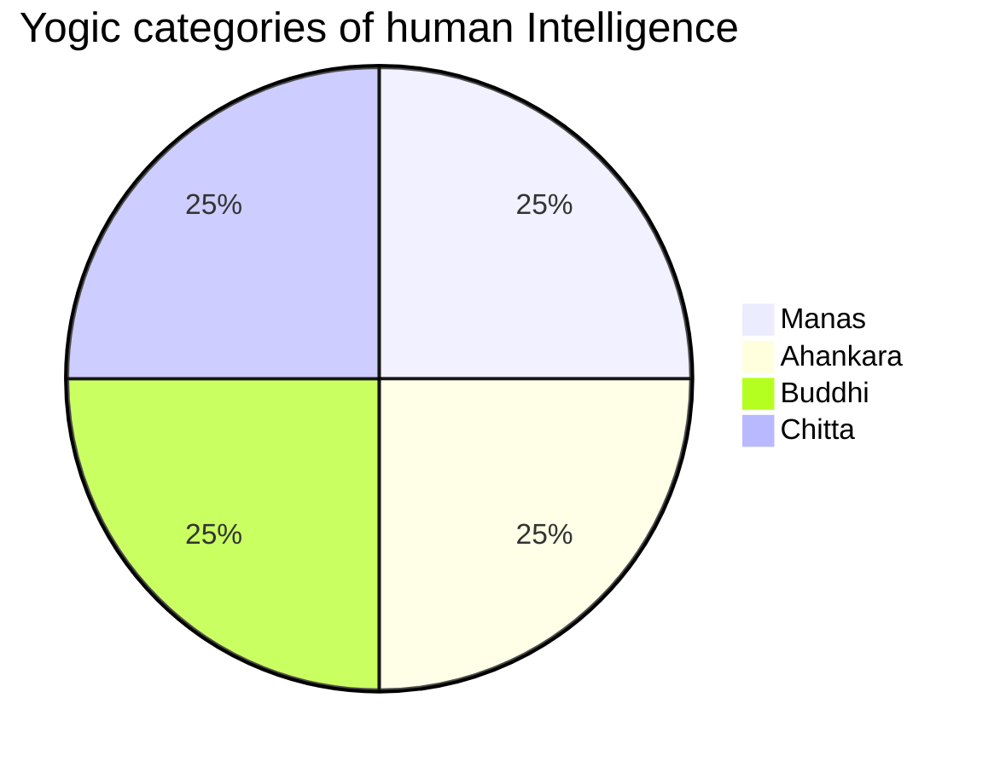

# Yoga

<TagLinks />

* Life and death are centain level of **Time** and **Energy** at play
* Life is a interplay of energies
  * coming to terms with energies and utilizing them in a way to do what you can do and have the serinity to understand what you cannot do.
* Energy Management
* Belief - waht you do not know, you concretize those assumptions
* You have setup the menu, but you are surprise when its served on table
* Consciousness is different from mental alertness
  * its always there, question is intensity and volume
  * light dim/fade, what eyes percieve example
* 8 dimensions of memory
* Devotion is a dimension of intelligence
* Religion is a very inexpensive way of psychetry
  * a lot more people would have lost their mental balance
* very thin line b/w sane and insane, and we are crossing b/w them more often than you think
* If you are willing to strive, you can cross all the limitations that nature has set for you
* Adiyogi gave 112 methods to whichi a human being can evolve to their ultimate nature
* Science of consecration
  * high density material, solidify mercury
* 12 years - 1 solar cycle
* body - if you live approx 75 years, 12-1400 tons of food
* baby - drinks Life
* next generation should be one step more than us, else its a crime against humanity
* Modern sciencce look at space and time, yogic science looks only at time, because there is time there is a consequence of space
* Distance b/w memory and you creates clearity, is earth round or flat? if you are on moon for sure you can see that earth is round, thats distancing
* Cosmic Indentity - 1st step of education
  * never empower a limited identity
* Human Intelligence 16 parts
  * Bhuddhi
  * Chitta
  * Ahankara - intellect works behind identity
  * Chitta
  * Manas
* 8 dimensions of memory
* All feelings and emotions adds a certain kind of chemistry to the body
* Drink water close to body temperature, with $\pm$ 4^o celcius temperature variation
* Daily consumption of honey with warm water, its close to blood
* Keep your humanity full on all the time
* Life is not thoughts, memoeries, emotions, openions, prejudices etc.
  * Has your creation can become larger than the creator
  * Is whats happening on your phone larger than what's happenign in cosmos
* Chaitaniyam - consciousness
  * is a star (sun) which shines in mind and throught that to all the organs in body
  * Analogy of human body to a modern computer, send the right commands (joy) to your body

Inner Engineering = distance between you and your body and mind

::: tip Life

> Energy Management

$Life \propto Enery$

where, $Time \, is \, constant$
:::

* Practise before sleep, what is NOT you, keep aside.

## Intelligence

* https://isha.sadhguru.org/yoga/yoga-articles-mind-stress/harnessing-true-power-mind/

## Yoga for Health Upa Yoga

### Directional movenments

* When you lie down for long hours, sleep, lubricating fluids tends to settle down and not in circulation
* Directional movenments to lubricate your movements
* Sit in Hightened state
* 3 cycles on hand directional movements in sodewards direction
  * out - outward rotation, in - inward rotation
* 3 cycles forreward and backward
* 3 cycles upward
* 3 cycles downward

### Knee Rotation

* inhale - go backward
* exhale - come forward

### Spine and clearity

> Actrivate the clearity

* 8-12 times swing and stretch then stand straight
  * Should happen in a series without a break, no pause in between

> Yoha for success - Neck practises, alertness and fade away lathergy

* on all 3 axises
* cycle starts with inhaling
* bring back to starting position exhaling
* 3 cycles
* 4th practise - rotate neck around solduers
* 5th practise - rotate soldur forward and backward movement

### Yoga Namaskar

> yoga for well being

* strengthen spine
* Light stomach condition
  * 2 hrs after meal
* up - full inhalation
* down - full exhalation
* standing posture - 3 cycles
* squat down - 3 cycles
  * move hands first forward backward and then up and down
* in [Balasana](https://en.wikipedia.org/wiki/Balasana) unless breath stabilizes
* tension in arms when moving

### Nadi Shuddhi

> Yoga for peace

* Major nadis are **pingala** and **ida**, 36000 each. total 72000
* There is a connetion between breath and mental structure
* left hand loosely on lap, plam facing upwards
* use only right hand
* Thumb and ring finger, full breath. Focus on breath. COnsciousness effect
* Use same nostril for inhalation and exhalation
* 4 mins minumum

unsolicited
: not asked for; given or done voluntarily.

## [yoga documentary](https://youtu.be/92J-JPChaeI)

> Free of Religion

* [samkhya] - oldest philosophy of india
* How to uncover our real nature?
* Before and after patanjali? what becomes of yoga
* [Patanjali]
  * author of Yoga Sutras
    * could be written on one single page
  * sanskrit grammer
  * composition of ayurved
* Experimentation and observation were performed inside the human body
* Sit in comfortable asana, stabalize then breath control and look inwards
* Point of concentraion could be internal, external imaginary effect
* Indus Valley oldest and largest civilization in world
* Meditate on elements of nature
* [samkhya] philosophy
  * Primal nature - prakarti
    * Sattva
    * Raja
    * Tama
  * Conscious Entity - Purusha - boundary restfulness
* 3 elements of prakarti are transformed into 24 elements of nature
* Hatha yoga
  * 84 asanas
    * Bhadrasana
* We all emerge from one consciousness - code geass

### Yogic Practises

* [yoga sutras] of patanjali
  * 196 sanskrit sutras

1. Niyama - observances
2. Āsana - physical postures
3. Prāṇāyāma - control of the prana(breath)
5. Pratyahara - withdrawal of the senses
6. Dhāraṇa - concentration
7. Dhyāna - meditation
8. Samādhi - absorption

10. Samadhi path
   1. skilled practisioners
11. Sadhan path
    1.  Yama - restraints or ethics of behaviour
        1.  Non violence
        2.  truth
        3.  non stealing
        4.  vrat - supreme self descipline
   2. niyam - discipline
      1. cleanlyness
   3. asana - posture
   4. Pranayam - breath control
   5. Pratyahar - withdrawl
   6. Dharna - concentration
   7. Dhyana - meditation
   8. samadhi

## samkhya philosophy

* there are as many gods as the people - heights of democracy
* Shiva
  * Kundilini - base of hatha yoga, base of spinal chord

[Patanjali]: https://en.wikipedia.org/wiki/Patanjali
[samkhya]: https://en.wikipedia.org/wiki/Samkhya
[yoga sutras]: https://en.wikipedia.org/wiki/Yoga_Sutras_of_Patanjali

## Rajyoga

* Swami Vivekananda
* Knowledge is based on experience
  * Experiment and reasoning
* Faculty to observe inside
* BHakti yoga
* Karm yoga
* Gyaan yoga
* Raja yoga

## Yoga sutras

* https://youtu.be/5MhVXHwtaWw
* https://www.youtube.com/watch?v=uUmg-2Y6KcM
* https://www.google.com/search?q=ashtanga
* sleep - certain level of consciousness is still Actrivate
  * may, may not dream
  * we may say we had a good/bad sleep
* Meditation stages
  * Exterior examination
  * Internal examination
  * Inspiration
  * Realization
*

### References

* [Kriya Yoga](https://en.wikipedia.org/wiki/Kriya_Yoga)
* [Yogic Diet](http://www.yogadiet.com.au/wp-content/uploads/YogaDiet.pdf)
* [Yoga Journal](https://www.yogajournal.com/)

<Footer />
