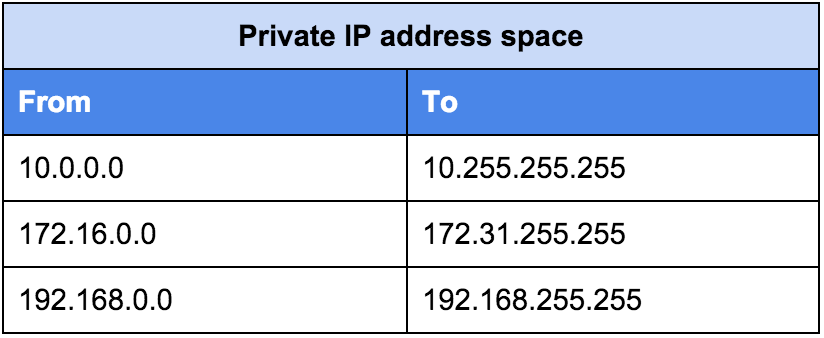

# IP Address

<TagLinks />

::: tip /8 Problem
**/8** address is worth **$200M** to **1.5 billion**
Small number of companies own majority of the addresses.

[IPv4 Exhaustion Problem](https://en.wikipedia.org/wiki/IPv4_address_exhaustion) | [NAT](https://en.wikipedia.org/wiki/Network_address_translation) saves the day.
:::

## IP Address

> Very much like mailing and postal service by humans.
> Whats the composition of an IP address?

Representation in

1. Decimal format 127.0.0.1
2. 32-bit Binary format, actually used in computer hardwares.

Simple math, how many total addresses are possible?
:   32-bit, each bit can have either of 2 values (0|1)

    $2^{32} = 4,294,967,296$ Addresses

## Classful Networking

* Class C for smaller businesses as there are less number of hosts
* Maybe class A for larger corporations
* [Map of the internet](https://xkcd.com/195/)
* [List of assigned /8 IPv4 address blocks](https://en.wikipedia.org/wiki/List_of_assigned_/8_IPv4_address_blocks)
* [Internet census, Carna botnet](https://en.wikipedia.org/wiki/Carna_botnet)
  * Of the **4.3 billion possible IPv4 addresses**, Carna Botnet found a total of **1.3 billion addresses in use**, including 141 million that were behind a firewall and 729 million that returned reverse domain name system records. The remaining 2.3 billion IPv4 addresses are probably not used.

## CIDR - Classless Interdomain Routing

Valid CIDR block for 10.0.0.15/20 ?
:   It represents a range of IPs

    * **10.0.0.15** first starting IP **/20** subnet mask
    * We calculate the last IP address and total number of IPs in CIDR block

    $32-20 = 12 \implies$ last 12-bits are used for IP addressing

    How many IPs can be represented by 12-bits $2^{12} = 4096$

* part following `/` in CIDR notation is subnet mask
* [CIDR to IPv4 conversion tool](https://www.ipaddressguide.com/cidr)
* [How to calculate first and last IP in CIDR?](https://medium.com/@ravir.cseiitb/understanding-subnets-and-cidr-ranges-ddeba4c542da)

### Who Manages all IP address on internet?

Roles of [IANA](https://www.iana.org/)?

1. Maintains and manages DNS and IP addresses
2. Multistakeholder model
3. Ineternet Protocol Address Allocation
4. The protocol Parameter Registry
5. TLD - Top Level Domain management system
6. Country code top level DNS
7. Timezone Database Management

<iframe width="560" height="315" src="https://www.youtube.com/embed/D__mAX-2sXo" frameborder="0" allow="accelerometer; autoplay; clipboard-write; encrypted-media; gyroscope; picture-in-picture" allowfullscreen></iframe>

<iframe width="560" height="315" src="https://www.youtube.com/embed/Lk5j25nmZKY" frameborder="0" allow="accelerometer; autoplay; clipboard-write; encrypted-media; gyroscope; picture-in-picture" allowfullscreen></iframe>

## Public/Private IPs

::: tip Internet
We have smaller networks connected to larger networks to make Internet.
:::

Public IPs are available **on the internet**, means directly connected to the internet.
Its unique all over the world. No other person/organization can have it. <Badge type="tip" vertical="middle" text="For Example," /> Phone Numbers as analogy

Private IP address are **NOT** on internet. Whats the range?

If private IP addresses are NOT on internet, then how do we access internet from them?
:   Private IPs are usually connected to public IP through a router and NAT to connect to internet.

* Private IPs works in conjunction with Subnet Mask. Only IP means nothing, cant do much with it alone.

What does a Network Mask do?
:   Tells all network devices (like routers, hubs, network cards), that this number represents network address and this part represents node address.

    Distinguish between network part and host part.

<iframe width="560" height="315" src="https://www.youtube.com/embed/peRsC0lZpUU" frameborder="0" allow="accelerometer; autoplay; clipboard-write; encrypted-media; gyroscope; picture-in-picture" allowfullscreen></iframe>

## IAM - Identity Access Management

How to create Policies?
:   JSON directive format

## AWS Cognito

> Decentralized Managed Authentication

## Resources

<iframe width="560" height="315" src="https://www.youtube.com/embed/z07HTSzzp3o" frameborder="0" allow="accelerometer; autoplay; clipboard-write; encrypted-media; gyroscope; picture-in-picture" allowfullscreen></iframe>

*[IANA]: Internet Assigned Number Authority

<Footer />
    }

    AMAZONAPIGATEWAY(api)

    AWSLAMBDA(lambda) {
        LAMBDAFUNCTION(addComments,addComments)
    }

    AMAZONDYNAMODB(dynamo) {
        TABLE(comments,Comments)
    }
}

user - browser

browser -d-> site :**1a**) get\nstatic\ncontent
site ~> logs :1a
site .u.> browser :**1b**
browser - js
js -r-> comments :**2a**) get\ncomments
comments ..> js :**2b**

js -r-> api :**3**) add\ncomment

api -d-> addComments :**4**

addComments -> comments :**5**

comments ..> js :**6**) new\ncomments
@enduml