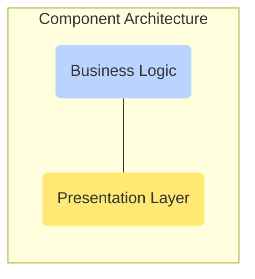

# Vuejs 3

<TagLinks />

## Why vue3?

<mark>Major changes</mark>

* Rendering improvements
  * Additional Compiler switches sent with code
* Reactivity model is different from vue2, source code changed
  * Written in typescript
* [Composition API](https://composition-api.vuejs.org/)
  * New way of organizing shared features in components using `setup()`
* New lifecycle hooks for keep-alive
  * [What is Keep alive?](https://www.keycdn.com/support/http-keep-alive)
  * `activated()` | `deactivated()`
  * `errorcaptured()`

<Procons>
  <template v-slot:con>
    <h3>Vue2 Limitation</h3>
    <ol>
      <li>Components Redability</li>
      <li>Code reuse patterns</li>
      <li>Limited Typescript support</li>
    </ol>
  </template>

  <template v-slot:pro>
    <h3>vue3 Solutions</h3>
    <ol>
      <li>Composition API syntax `setup()` (optional). Organise code by  logical concerns</li>
      <ol>
        <li>Mixins</li>
        <li>Mixin Factory</li>
        <li>Scoped Slots</li>
        <li>Composition Functions</li>
      </ol>
    </ol>
  </template>
</Procons>

<Badge type="tip" vertical="middle" text="For Example," /> Search component with searching and sorting

## When to use Composition API?

> More advanced component syntax for logical code organization.

* `setup()` Analogous to `asyncData()` in `nuxtjs`, doesnt have access to `this` object and runs before lifecycle hooks
  * props
  * context
  * good place to put API calls

## Design Principles of Vue 3.0

* [Public RFC](https://github.com/vuejs/rfcs)
*

Bottleneck of traditional DOM

The performance of traditional virtual DOM is determined by the total size of template
rather than the amount of synamic content in it.

How to solve this problem? Tackeling performance problem

Template --prase usinf compiler->
javascript render functions returning vurtual DOM treees
 --> internal rendering engine and diffing

Look for synamic content in templates, like v-for and v-if for logical block
* Lot of people write lot of markup in theor template
* If a piece of tempalte only containe a single dynamic binding, its inefficient to walk throught the whole template tree and diffing everything just to find out a single {{message}} has changed
* Divide templates into blocks, block tree
* reduce the amount of recursive traversal by magnitude
* All static content hoisted outside render functions
* Average improvement is more than 100% in chrome

## New Vue Compiler

* Full sourcce map support
* Plugin based transform pipeline
* Layered design for higher order compiler
* Advanced block basedsynamic part tracking'
* Static tree hoisting
* Event handler caching
* Stable slots detection

https://vue-next-template-explorer.netlify.app/#%7B%22src%22%3A%22%3Cdiv%3EHello%20World!%3C%2Fdiv%3E%22%2C%22options%22%3A%7B%22mode%22%3A%22module%22%2C%22prefixIdentifiers%22%3Afalse%2C%22optimizeBindings%22%3Afalse%2C%22hoistStatic%22%3Afalse%2C%22cacheHandlers%22%3Afalse%2C%22scopeId%22%3Anull%7D%7D

* HOw vuew compiles template
* HOisting helpful during hydration
* Server Side Rendering

3X better SSR performance than vue2

* New SSR compilation strategy

## DOM

* Programming interface, wholedocument as XML tree structure
* Connects JS to HTML
  * What pages to render
  * Which events to respond to
* UPdating the DOM s inefficient
* What creates DOM tree?
  * Rendering Engine => webkit in chrome
* Which porblem does virtual DOM solves?
  * Instead of applying all the changes to real DOM we first apply them to virtual DOM
  * Which doesnt get rendered in real browser
  * it is really cheap
  * Editing a blueprint, raher than rebuilding the whole building
  * Batch changes together for efficiency

## Virtual DOM

* Tree datastructure with JS objects
* Exists in memory and never rendered
* Same idea used by Angular, React and vue2
* Also workd for mobile devices like ReactNAtive, NativeScript

How does it handles State Changes?

* Tree is rebuilt completely on state changed
* At any given point there are 2 virtual trees that exists in memory at the same time
* Compare 2 trees, get the difference between them and then reconsile the changes by creating the patch
* Diffing Algorithm - minimum number of operations necessary
* Diffing vs Reconcialation
  * O(n3) complexity problem
  * O(n) heuristic
  * Breadth First Search
* Createa a whole copy of exactly real DOM
* Javascript representation of real DOM nodes
  * Compare virtual DOMs and get the minimal number of changes each time we nedd to update the DOM

When the first specification for the DOM was released in 1998, we built and managed web pages in very differently. There was far less reliance on the DOM APIs to create and update the page content as frequently as we do today.

Simple methods such as document.getElementsByClassName() are fine to use on a small scale, but if we are updating multiple elements on a page every few seconds, it can start to become really expensive to constantly query and update the DOM.

The virtual DOM was created to solve these problems of needing to frequently update the DOM in a more performant way. Unlike the DOM or the shadow DOM, the virtual DOM isn't an official specification, but rather a new method of interfacing with the DOM.

https://vuejsdevelopers.com/2017/02/21/vue-js-virtual-dom/

## :construction_worker_woman: TDD with vueapp

> One of the pillars for writing robust softwares. Builds trust

* Lifeline for releases, development
* TDD - extreme Programming - Kent Beck in 90s
* [How and what to test components?](https://vue-test-utils.vuejs.org/)
  * Public API - Black box Testing
  * props that you pass and user events interactions
  * jest will run everything running through compiler without associating the file to it
  * `vue-template-compiler`, `vue-jest`, `@vue/test-utils`
* ==spec== testing code in JS world

<iframe width="560" height="315" src="https://www.youtube.com/embed/DD1fEhcEzY8" frameborder="0" allow="accelerometer; autoplay; encrypted-media; gyroscope; picture-in-picture" allowfullscreen></iframe>

## Test VueJS Components

[Test vuejs components](https://vueschool.io/courses/learn-how-to-test-vuejs-components)

Library/Tools | Description
--------------|--------------
[jest](https://github.com/facebook/jest) | Jest is a JavaScript testing framework maintained by Facebook, Inc. with a focus on simplicity. It works with projects using: Babel, TypeScript, Node.js, React, Angular and Vue.js. It aims to work out of the box and config free.
[vue-jest](https://github.com/vuejs/vue-jest) | Jest transformer for Vue SFC, loads `.vue` files into jest
[vue-test-utils](https://vuejs.github.io/vue-test-utils-next-docs/guide/installation.html) | Additional classes to compile, mount vue source code and makes it possible to run tests.

* [Test vue3](https://lmiller1990.github.io/vue-testing-handbook/composition-api.html#the-composition-api)
* Transform vue files to vue-jest
* Generate and write HTML geenerated from components to snapshot files
* mount a component
* Test a prop
* Test lifecyclemethods, computed properties and methods
* test code in `--watch` mode
* `spyOn()` method to test is a method is called or not
* How to find elements in DOM
  * `wrapper.find()`
* fire DOM events like click, hover etc
  * in test have to sent the event manually, happens automatically in browser
  * `element.trigger('click')`
* Test components with stores, crucial
  * leveraging data from store rightaway
* Test component behaviours
  * making API calls
  * committing or dispatching mutations or actions with a * Vuex store
  * testing interaction

<iframe width="560" height="315" src="https://www.youtube.com/embed/7r4xVDI2vho" frameborder="0" allow="accelerometer; autoplay; encrypted-media; gyroscope; picture-in-picture" allowfullscreen></iframe>

<SimpleNewsletter/>
<Disqus />
