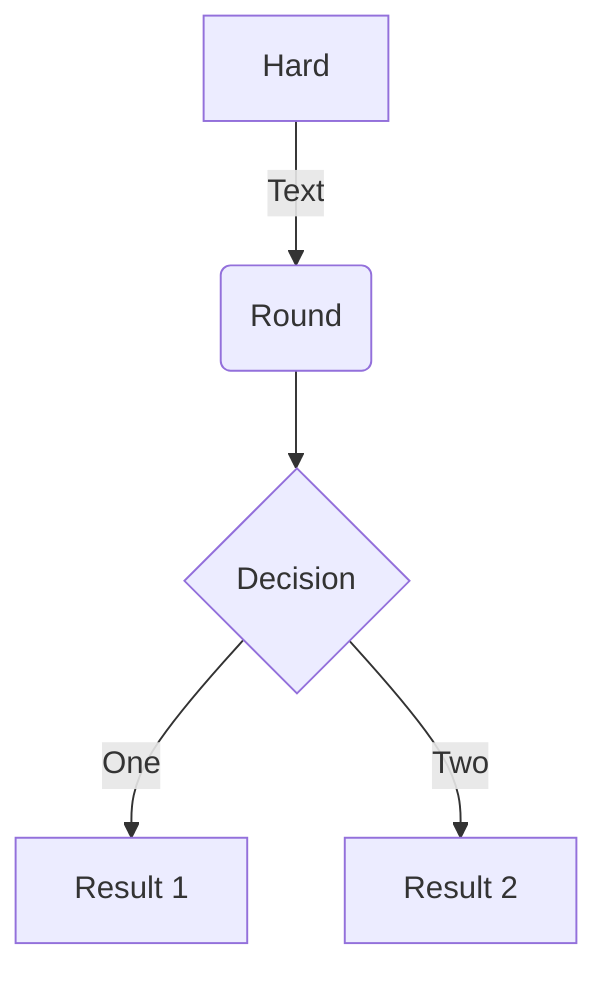
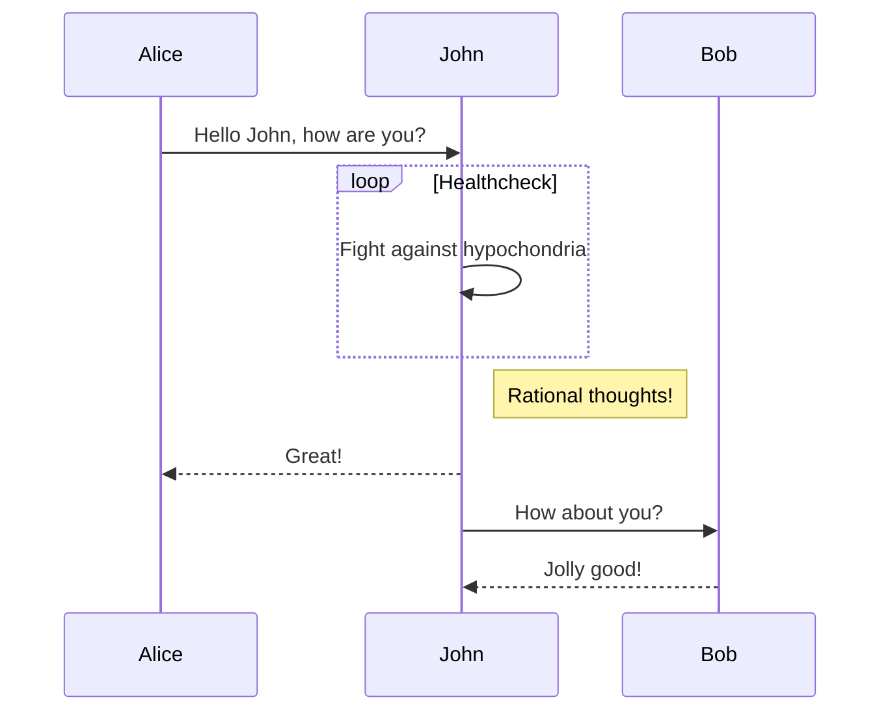
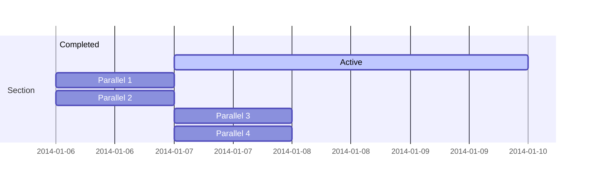
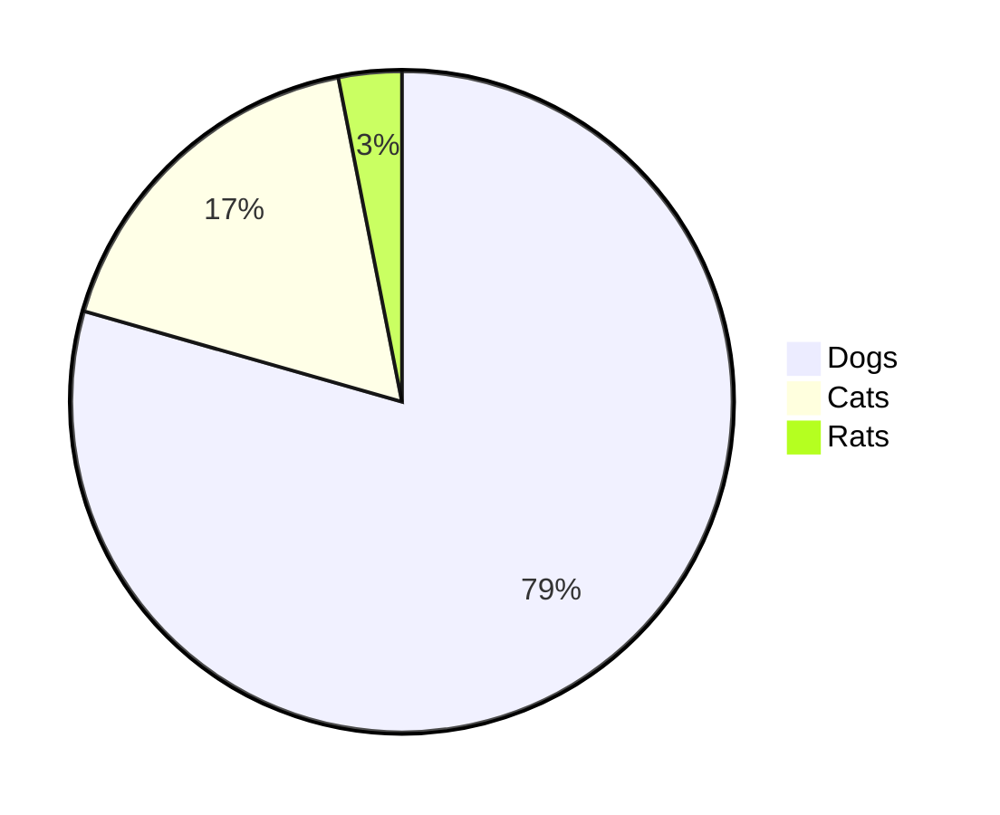
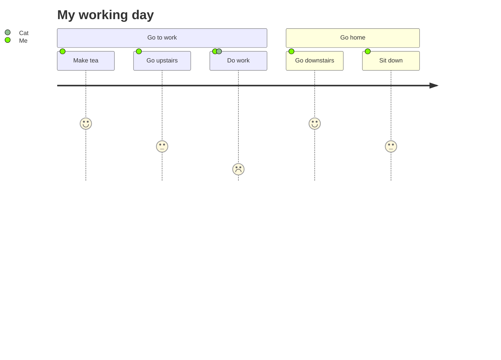

---
tags:
- test
- markdown
---

# Components

## D3.js

blank

<Dot />
<!-- <Dot code="digraph {a -> b -> c}" /> -->

## Badge

<Badge text="warning" type="warning"/>
<Badge text="tip" type="tip"/>
<Badge text="danger" type="error"/>
<Badge text="default theme"/>

## Bars

<Bar text="Skill - 1" color="red" len=20 />
<Bar text="Skill - 2" color="yellow" len=40 />
<Bar text="Skill - 3" color="green" len=60 />
<Bar text="Skill - 4" len=100 />

<mark> Hihlighted text </mark>

## Pros and Cons

<Procons>
  <template v-slot:pro>
    <h3>Mention some pro</h3>
    <ul>
      <li>one pro</li>
      <li>two pro</li>
      <li>three pro</li>
    </ul>
  </template>

  <template v-slot:con>
    <h3>Here are some cons</h3>
    <ul>
      <li>one con</li>
      <li>two con</li>
      <li>three con</li>
    </ul>

  </template>
</Procons>

## MermaidJs









<mermaid>
pie
"Dogs" : 386
"Cats" : 85
"Rats" : 15
</mermaid>




## Google Charts

<Test />

@flowstart ant
st=>start: Start
ip=>inputoutput: Inputoutput
sub=>subroutine: Subroutine
cond=>condition: Process?
process=>operation: Process
e=>end: End

st->ip
ip->cond
cond(yes)->process->e
cond(no)->sub
sub->e
@flowend

@flowstart
st=>start: Start
ip=>inputoutput: Inputoutput
sub=>subroutine: Subroutine
cond=>condition: Process?
process=>operation: Process
e=>end: End

st->ip
ip->cond
cond(yes)->process->e
cond(no)->sub
sub->e
@flowend

<Quote text="What else can I say" />
<Quote text="Look it for yourself,
can even have multi-line span quotes
" by="avi"/>
<Quote />

@startuml
strict digraph meme {
  exists [color=blue]
  authenticate [color=blue]
  require
  create
  UserCreated
  destroy
  UserDestroyed
  get [color=blue]
  authenticate -> require
  create -> UserCreated
  destroy -> require
  destroy -> UserDestroyed
  get -> require
}
@enduml


$x^2=4$

Euler's identity $e^{i\pi}+1=0$ is a beautiful formula in $\mathbb{R}^2$.


$$\frac {\partial^r} {\partial \omega^r} \left(\frac {y^{\omega}} {\omega}\right)
= \left(\frac {y^{\omega}} {\omega}\right) \left\{(\log y)^r + \sum_{i=1}^r \frac {(-1)^i r \cdots (r-i+1) (\log y)^{r-i}} {\omega^i} \right\}$$


Supposing that $y >= 0$ and that $[\log x]$ represents the integer part of $\log x$, let:

$$\Phi (y) = \frac {1} {2 \pi i} \int_{2 - i \infty}^{2 + i \infty} \frac {y^{\omega} \mathrm{d} \omega} {\omega \left(1 + \frac {\omega} {(\log x)^{1.1}}\right)^{[ \log x ] + 1}}, x > 1$$

Obviously, when $0 <= y <= 1$, there is $\Phi(y) = 0$. For all $y >= 0$, $\Phi(y)$ is a non-decreasing function.

When $\log x>=10^4$ and $y>= e^{2{(\log x)}^{-0.1}}$, thus:

$$1 - x^{- 0.1} <= \Phi (y) <= 1$$


# Markdown Style

### [Definition lists](https://github.com/markdown-it/markdown-it-deflist)

Term 1

:   Definition 1
with lazy continuation.

Term 2 with *inline markup*

:   Definition 2

        { some code, part of Definition 2 }

    Third paragraph of definition 2.

_Compact style:_

Term 1
  ~ Definition 1

Term 2
  ~ Definition 2a
  ~ Definition 2b

something
:: define that

### [Abbreviations](https://github.com/markdown-it/markdown-it-abbr)

This is HTML abbreviation example.

It converts "HTML", but keep intact partial entries like "xxxHTMLyyy" and so on.

*[HTML]: Hyper Text Markup Language


### [Footnotes](https://github.com/markdown-it/markdown-it-footnote)

Footnote 1 link[^first].

Footnote 2 link[^second].

Inline footnote^[Text of inline footnote] definition.

Duplicated footnote reference[^second].

[^first]: Footnote **can have markup**

    and multiple paragraphs.

[^second]: Footnote text.


### [Custom containers](https://github.com/markdown-it/markdown-it-container)

:tada: :100:

::: tip
This is a tip
:::

::: warning
This is a warning
*here be dragons*
:::

::: danger
This is a dangerous warning
:::

::: details
This is a details block, which does not work in IE / Edge
:::

<Quote text="Some funny quote"/>


::: v-pre
`{{ This will be displayed as-is }}`
:::

## Heading

# Test
## h2 Heading
### h3 Heading
#### h4 Heading
##### h5 Heading
###### h6 Heading

## Horizontal Rules

___

---

***


## Typographic replacements

Enable typographer option to see result.

(c) (C) (r) (R) (tm) (TM) (p) (P) +-

test.. test... test..... test?..... test!....

!!!!!! ???? ,,  -- ---

"Smartypants, double quotes" and 'single quotes'


## Emphasis

**This is bold text**

__This is bold text__

*This is italic text*

_This is italic text_

~~Strikethrough~~


## Blockquotes


> Blockquotes can also be nested...
>> ...by using additional greater-than signs right next to each other...
> > > ...or with spaces between arrows.


## Lists

Unordered

+ Create a list by starting a line with `+`, `-`, or `*`
+ Sub-lists are made by indenting 2 spaces:
  - Marker character change forces new list start:
    * Ac tristique libero volutpat at
    + Facilisis in pretium nisl aliquet
    - Nulla volutpat aliquam velit
+ Very easy!

Ordered

1. Lorem ipsum dolor sit amet
2. Consectetur adipiscing elit
3. Integer molestie lorem at massa


1. You can use sequential numbers...
1. ...or keep all the numbers as `1.`

Start numbering with offset:

57. foo
1. bar


## Code

Inline `code`

Indented code

    // Some comments
    line 1 of code
    line 2 of code
    line 3 of code


Block code "fences"

```
Sample text here...
```

Syntax highlighting

``` js
var foo = function (bar) {
  return bar++;
};

console.log(foo(5));
```

## Tables

| Option | Description |
| ------ | ----------- |
| data   | path to data files to supply the data that will be passed into templates. |
| engine | engine to be used for processing templates. Handlebars is the default. |
| ext    | extension to be used for dest files. |

Right aligned columns

| Option | Description |
| ------:| -----------:|
| data   | path to data files to supply the data that will be passed into templates. |
| engine | engine to be used for processing templates. Handlebars is the default. |
| ext    | extension to be used for dest files. |


## Links

[link text](http://dev.nodeca.com)

[link with title](http://nodeca.github.io/pica/demo/ "title text!")

Autoconverted link https://github.com/nodeca/pica (enable linkify to see)


## Images

Like links, Images also have a footnote style syntax

![Alt text][id]

With a reference later in the document defining the URL location:

[id]: https://octodex.github.com/images/dojocat.jpg  "The Dojocat"


## Plugins

The killer feature of `markdown-it` is very effective support of
[syntax plugins](https://www.npmjs.org/browse/keyword/markdown-it-plugin).


### [Emojies](https://github.com/markdown-it/markdown-it-emoji)

> Classic markup: :wink: :crush: :cry: :tear: :laughing: :yum:
>
> Shortcuts (emoticons): :-) :-( 8-) ;)

see [how to change output](https://github.com/markdown-it/markdown-it-emoji#change-output) with twemoji.


### [Subscript](https://github.com/markdown-it/markdown-it-sub) / [Superscript](https://github.com/markdown-it/markdown-it-sup)

- 19^th^
- H~2~O


### [\<ins\>](https://github.com/markdown-it/markdown-it-ins)

++Inserted text++


### [\<mark>](https://github.com/markdown-it/markdown-it-mark)

==Marked text==


## New nodejs env setup

```
sudo apt install nodejs
sudo apt install npm

curl -sS https://dl.yarnpkg.com/debian/pubkey.gpg | sudo apt-key add -
echo "deb https://dl.yarnpkg.com/debian/ stable main" | sudo tee /etc/apt/sources.list.d/yarn.list
sudo apt update && sudo apt install yarn

yarn global add vuepress
```

https://www.npmjs.com/package/vuepress-plugin-mailchimp

---

[anything]: https://github.com/avimehenwal/mydocs
[nsdopf]: https://github.com/avimehenwal/mydocs


* Can program them automatically
* Diagram datacentres, nodes, computers and processes etc
* [Use colors](https://graphviz.gitlab.io/_pages/doc/info/colors.html)
  *[ With global settings, same for all nodes](https://stackoverflow.com/questions/28853898/groups-of-nodes-with-the-same-attributes-in-graphviz-file)
* [Use shapes of boxes, roughly 60 shapes](https://graphviz.gitlab.io/_pages/doc/info/shapes.html)
* https://developers.google.com/chart/image/docs/gallery/graphviz?csw=1
* where to place assets files, dot files
  * https://code.visualstudio.com/docs/editor/variables-reference\
* https://github.com/z3by/vuepress-theme-modern-blog
* https://github.com/FriendlyUser/vuepress-theme-cool-starter
* https://github.com/wowthemesnet/mediumish-vuepress-blog-theme
* [vuepress themes](https://jamstackthemes.dev/ssg/vuepress/)
* [Add vuetify to vuepress theme](https://stackoverflow.com/questions/52684077/how-to-add-vuetify-to-default-vuepress-theme)


```sh
docker run --name blog --rm -d -p 8080:8080 -v (pwd):/blog avi/vuepress

docker stop blog; && docker container ls

docker stop blog; docker container ls; docker run --name blog --rm -d -p 8080:8080 -v (pwd):/blog avi/vuepress

neato -Tsvg graph1.dot > ../.vuepress/public/graph1-1.svg
```

How to run a graphviz service on web for anyone to use
: http://bijanebrahimi.github.io/blog/graphviz-in-markdown.html


NEATO is a program that makes layouts of undirected graphs following the
filter model of DOT. Its layout heuristic creates virtual physical models and
runs an iterative solver to find low energy configurations. The intended applications are in telecommunication networks, computer programming and software engineering. Here is an example layout depicting an entity-relationship
database schema. It took 0.01 seconds of user time to generate on a garden
variety PC running Linux.

## DOTFILES magic


