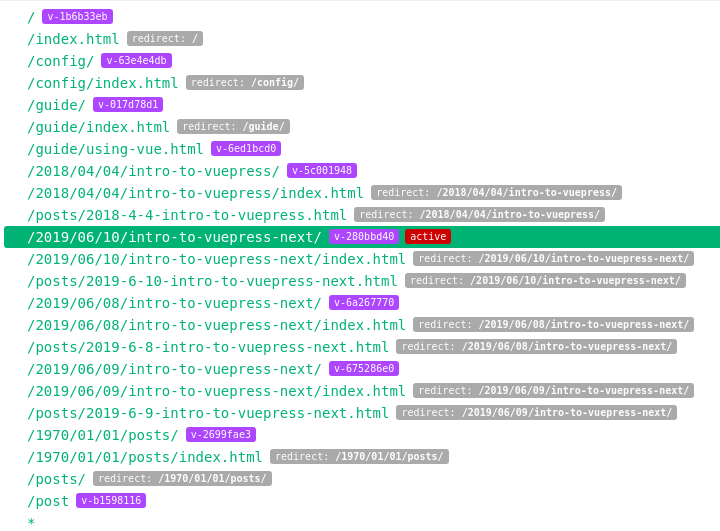
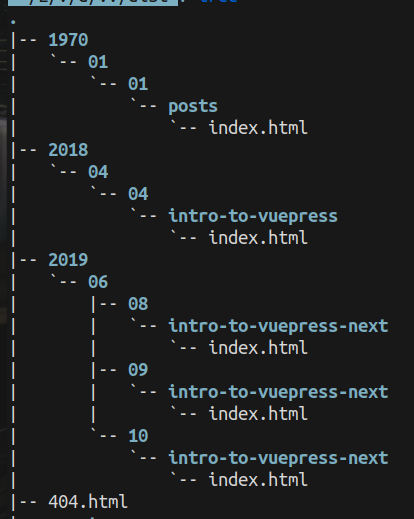

# vuepress-blog

After setting the `dirname` to blog directory

http://localhost:8080/2019/06/08/intro-to-vuepress-next/



How to assign LAyouts to new blog pages?

* `theme` directory to create a new theme with Layout.vue
  * will override default theme

http://localhost:8080/1970/01/01/posts/

debug vue routes using vue devtools - routes
* pagination layout in pagition setting section
  * links to posts and control length
  * `null` on other pages

```js
// vuepress-plugin-blog configuration
    [
      '@vuepress/blog',
      {
        directories: [
          {
            // Unique ID of current classification
            id: 'post',
            // Target directory
            dirname: 'posts',
            // Path of the `entry page` (or `list page`)
            path: '/post/',
            layout: 'IndexPost',
            itemLayout: 'PagePost',
            itemPermalink: '/post/:year/:month/:day/:slug',
            // Pagination
            pagination: {
              lengthPerPage: 2,
              prevText: 'Prev',
              nextText: 'Next',
              layout: 'PagePost',
            },
          },
        ],
      },
    ],
```

Filter blog post pages

```vue
<template>
  <ol>
    <li v-for="item in filteredPosts" :key="item.title">
      <a href="item.regularPath">
        {{ item.title }}
      </a>
    </li>
  </ol>
</template>

<script>
export default {
  data: () => ({
    title: "Post Index Layout",
    postsDir: "posts",
  }),
  computed: {
    filteredPosts() {
      let posts = []
      const pattern = new RegExp(this.postsDir, 'gi');
      this.$site.pages.filter((page) => {
        if (page.regularPath.match(pattern)) {
          posts.push(page)
        }
      });
      console.log(typeof posts, posts);
      return posts
    },
  },
};
</script>
```



### Resources

* https://github.com/ulivz/70-lines-of-vuepress-blog-theme/blob/master/index.js
* https://github.com/ulivz/70-lines-of-vuepress-blog-theme/blob/master/layouts/Layout.vue


## Vuepress

* All images in `public` folder
* Documentation websites, present how to write code
* Google Analytics
* `READNE.md` translates to `index.html`
* How do we get a Sidebar?
* vuepress is still a SPA
  * navigating inside the same application, faster
  * same goodie for SEO
* vuejs - frontend framework
  * uses vue SSR server side rendering capabilities to genetate HTML
  * runs both on server and client
* vuepress skips server part
* JS is fetched onces, thats why we see loading bar only once
* [ ] Responsive Layout
* [ ] Service Workers
  * locally cached
* Embed interactive vue components into your markdown
* Use noramal HTML
* Register components in `.vuepress/components` folder
* `$site` - metadata for the entire website
* Use relative url

{{ 3+4 }}

The `<pre>` tag defines preformatted text.


<pre style="color:pink">
 {{ $page }}
</pre>

<div v-for="i in 3">
 Hello {{ i }}
</div>


### Special README.md file

A subdirectory is invisible to VuePress unless it has a README.md in it. Those README.md files can be blank

The root README.md file must start with a header. It doesn't have to be an H1 (# as shown above) but it should be either H2 (##) or H3 (###) for proper generation of search indexes and sidebars.