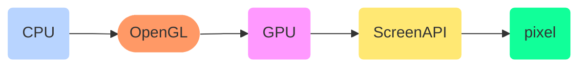

# Graphics

<TagLinks />

::: quote
How pixel is drawn on screen?
:::

Graphics are candidates for [System Programming](https://en.wikipedia.org/wiki/Systems_programming)

## OpenGL

* `OpenGL` is a GPU usage specification, is **NOT** a library or framework
  * communication between CPU and GPU
  * GPU builds actual array of colors which is then sent to electronics that runs the screen
  * OpenGL lets you access graphics hardware or GPU
  * `directx`, `vulkan`, `direct3d`
* How do I download it?
  * GPU manufacturer ships the implementation, like NVIDIA with GPU drivers
  * `vulkan` cross platform

* Shader is s/w that runs on GPU
* C++ for OpenGL
* How to draw a window on a computer?
  * OS provides APIs for Windowing System
    * specific to OS. How about a library which can issue commands for all OS?
  * `GLFW`

<iframe width="560" height="315" src="https://www.youtube.com/embed/W3gAzLwfIP0" frameborder="0" allow="accelerometer; autoplay; encrypted-media; gyroscope; picture-in-picture" allowfullscreen></iframe>

## Specifications

* How to read specification like a pro?
  * What issue does it solve?
  * How does it solve it?

## Related

* [System programming](/programming/systemprogramming.md)
*

## Resources

* [OpenGL Playlist](https://www.youtube.com/playlist?list=PLlrATfBNZ98foTJPJ_Ev03o2oq3-GGOS2)

<Footer />
