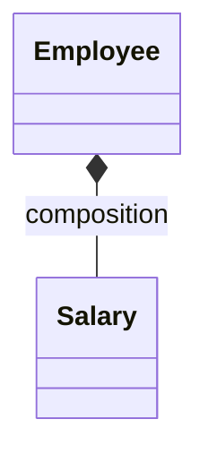
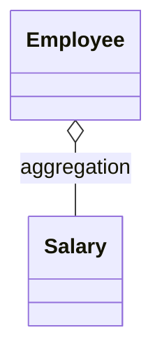
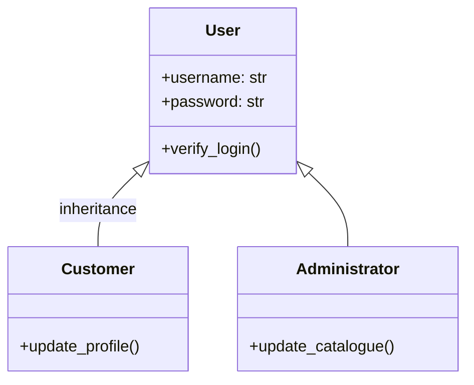
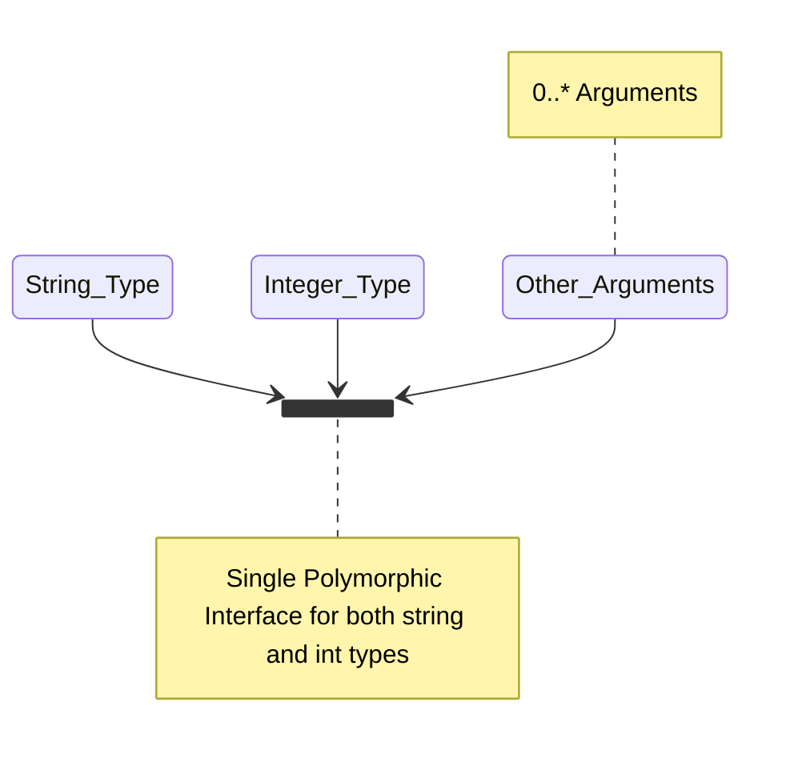
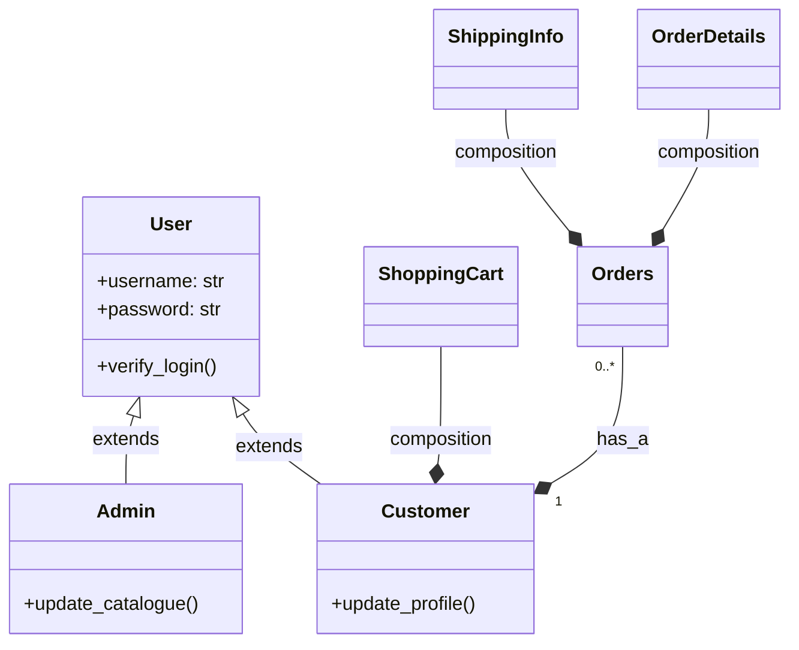

# Object Oriented Programming

<TagLinks />

## UML - Unified Modelling Language

Tools

* [GitUML](https://www.gituml.com/)
  * Revolutionize code documentation and code visualization
* Pyreverse - Pylint


## :chart: UML Diagram

[UML](https://en.wikipedia.org/wiki/Unified_Modeling_Language) - Unified Modelling Language
:   structure of a software system

    * [Class Diagrams](https://en.wikipedia.org/wiki/Class_diagram)

### Entities / Classes

### Relationships

> Deligating Responsibility

1. Inheritance --|>
2. Assocaition
3. Aggregation - has a
   1. can exist without source object and independently
4. Composition - is a part of
   1. has the **scope** and **lifetime** of called object, cannot exist without it

[Check documentation](https://mermaid-js.github.io/mermaid/#/classDiagram)

```py
# Composition
class Employee:
    def __init__(self, name, pay, bonus):
        self.name = name
        self.emp_salary = Salary(pay, bonus)
```



```py
# Aggregation
class Employee:
    def __init__(self, name, pay, bonus, Salary):
        self.name = name
```



### Multiplicity

* How is it all done in Python?



## OOP - Object Oriented Programming Concepts

### :potable_water: Polymorphism [wiki](https://en.wikipedia.org/wiki/Polymorphism_(computer_science))

> Static (compilet time) or Dynamic (run time) implementation

provision of a single interface to entities of different types



#### 1. [Ad-hoc Poylmorphism](https://en.wikipedia.org/wiki/Ad_hoc_polymorphism)

> common interface for an arbitrary set of individually specified types.

Operator Overloading [wiki](https://en.wikipedia.org/wiki/Operator_overloading)
:   * aka **adhoc Polymorphism**, syntactic sugar
    * Different implementations based on arguments

    **Eg,**

    1. In javascript and python, `+` operator acts either as arithmetic addition or string concatination based on the type of arguments

    ```py
    print(1 + 2)
    print("Avi" + "Mehenwal")
    print("Avi" * 4)     # repeat 4 times
    ```

Whats the difference between operator overloading and overriding?
:   The main difference between overloading and overriding is that in overloading we can use
    same function name with different parameters for multiple times for different tasks with
    on a class. and overriding means we can use same name function name with same parameters
    of the base class in the derived class. this is also called as re useability of code in
    the programme.


Polymorphic functions can be supplied with arguments of different types

[Functional Overloading](https://en.wikipedia.org/wiki/Function_overloading)
:   Functions of same name with different implementations

    For example, `doTask()` and `doTask(object O)` are overloaded functions.


[Operator Overloading](https://en.wikipedia.org/wiki/Operator_overloading)
:   Different operators have different implementations based on their argument

    For example, use of `+` and `*` operator in python language

Useful Links for this topic

* [Type Systems and Type Theory](https://en.wikipedia.org/wiki/Type_theory)


### 2. [Parametric Polymorphism](https://en.wikipedia.org/wiki/Parametric_polymorphism)

> Function usage doesnt not depend on argument type, implementation takes care of it
> Skip providing types with arguments

A function or a data type can be written generically so that it can handle values
identically without depending on their type.[1] Such functions and data types are
called [**generic functions**](https://en.wikipedia.org/wiki/Generic_function)
and **[generic datatypes](https://en.wikipedia.org/wiki/Generic_programming)** respectively and
form the basis of generic programming.

**For example,** a function `append` that joins two lists can be constructed so that it does not care about the type of elements: it can append lists of integers, lists of real numbers, lists of strings, and so on.

### 3. [Subtyping / Inclusion Polymorphism](https://en.wikipedia.org/wiki/Subtyping)

> when a name denotes instances of many different classes related by some common superclass

Why need it? whats the advantage?
:   to restrict the range of types that can be used in a particular case of polymorphism

    Uses Inheritance principles of base class and super class

::: tip Subtyping and Supertyping
$T :> S$  $\implies$ $T$ is said to be a **supertype** of $S$

$S <: T$  $\implies$ Type $S$ and **subtype** of $T$
:::




<Footer />
