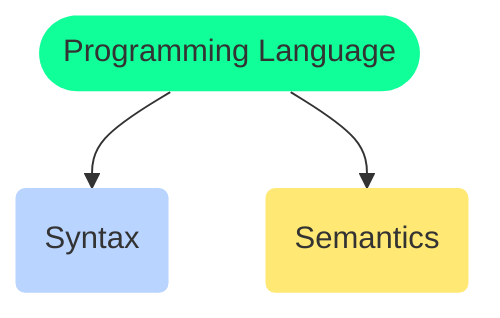
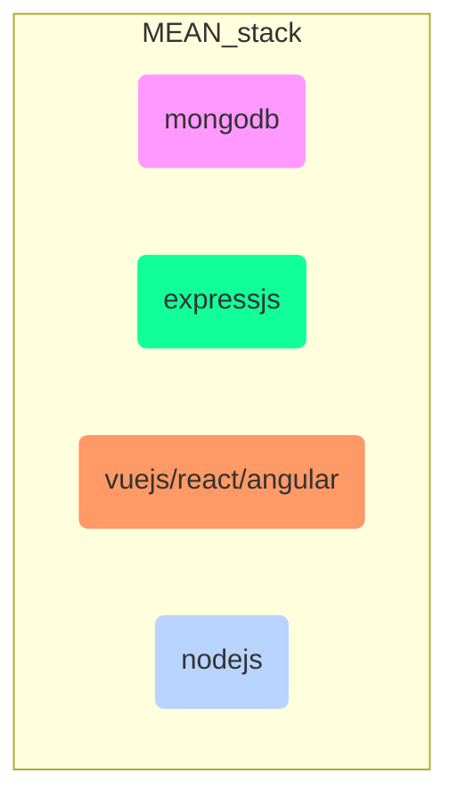
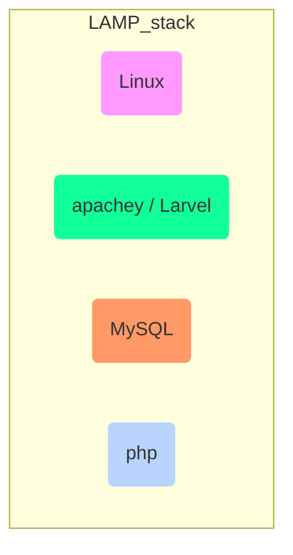

# Programming Languages

<TagLinks />

Generally programming languages are either compiled or interpreted. It depends on their implementations

::: tip
Some languages could both be compiled and interpreted at the same time.
For example, `python`, `perl` etc.
:::

What is the difference between scripting and programming languages?
: Major differences

    1. Scripting languages are generally dynamically types.
    2. `javascript`, `php`, `python`, `bash`
    3. Generally interpreted, do not have compiled step
    4. [List of compiled programming languages](https://en.wikipedia.org/wiki/Compiled_language)

Javascript vs php? Which stack to use
: Longetivity, probably javascript os going to be there for a long time

## PHP - Hypertext Preprocessor

| PHP                            | Javascript                          |
| ------------------------------ | ----------------------------------- |
| Server side scripting language | Client side scripting language      |
| cross-platform                 | cross-platform                      |
| multi-threaded                 | single threaded                     |
| web-backend                    | web-interface                       |
| direct db access               | interactions via HTTP calls to APIs |

<Footer />
