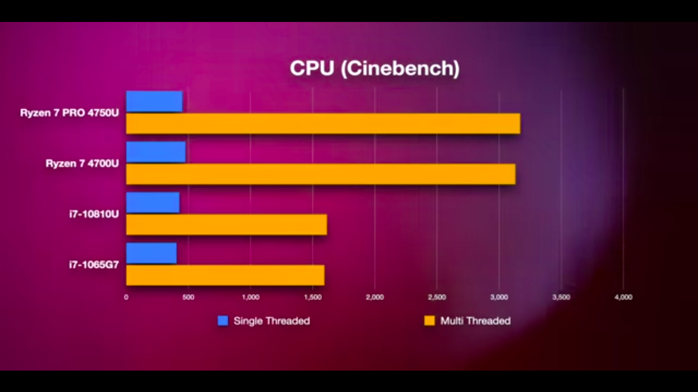
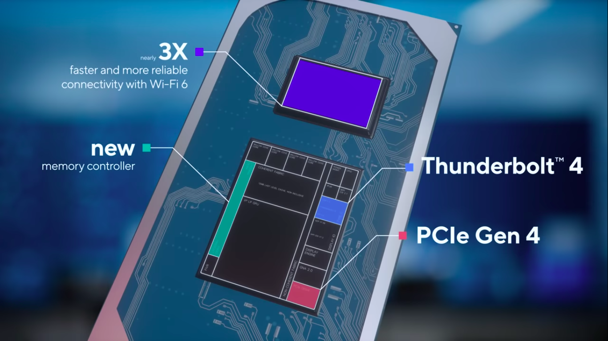
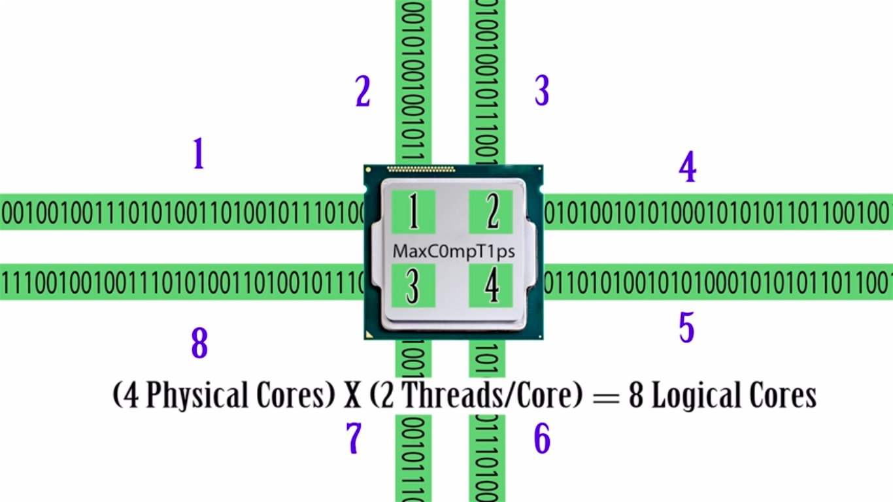

# Hardware

<TagLinks />

::: quote TechLead
It is essentially my job to look at computer for longer periods of time
:::

## Top Linux laptops

> Best ultrabooks

1. [ ] [XPS](https://en.wikipedia.org/wiki/Dell_XPS) 13 2-in-1
2. [ ] [XPS 13 developer edition](https://www.dell.com/en-us/work/shop/dell-laptops-and-notebooks/new-xps-13-developer-edition/spd/xps-13-9300-laptop/ctox13w10p1c2200u)
3. [ ] ThinkPad X1 Carbon Gen 8
4. [ ] Lenovo Thinkpad X1 extreme Gen 2
5. [ ] [X1 Yoga Gen 5](https://www.lenovo.com/de/de/laptops/thinkpad/thinkpad-x1/X1-Yoga-Gen-5/p/22TP2X1X1Y5)
6. [ ] Asus Zenbook 14 ultra
7. [ ] [HP Spectre 14](https://www8.hp.com/us/en/laptops/2-in-1s/spectre-x360-14-convertible-laptop.html) inch with tiger lake CPU
   1. [Tilt Pen](https://store.hp.com/us/en/pdp/hp-tilt-pen-p-2my21aa-abl-1)

Ultrabook | USD | EUROS |
----------|-----|-------|
XPS 13 Developer Edition <br>8GB, i7-10th gen | 1,380 | |
XPS 13 <br>8GB, i5-10th gen | 1,180 | |
[XPS 13 9310](https://www.dell.com/de-de/work/shop/dell-notebooks/neu-xps-13/spd/xps-13-9310-laptop/bn93214?view=configurations) <br>16GB, i7-10th gen |  | 1550 |
Macbook por 13 <br>,16GB LPDDR4x, i7-10th gen | | 2,320 |
XPS 13 3310 <br>16Gb LPDDR4x, i7-11th gen |  | 1550 |
[Yoga 71](https://www.lenovo.com/de/de/laptops/yoga/yoga-2-in-1-series/Yoga-7i/p/88YGC701456)(14") <br>16GB DDR4, i7-11gen | | |
New XPS 13 2-in-1 | | 1800 |
[Asus zenbook 14 ultralight](https://www.amazon.de/-/en/90NB0MP5-M04250-ASUS-Computer-ZenBook-Blue/dp/B086RBB2Q4/ref=sr_1_3?dchild=1&keywords=asus%2Bzenbook%2B14&qid=1601830487&quartzVehicle=93-269&replacementKeywords=asus%2Bzenbook&sr=8-3&th=1) | | 1100 |

> Laptops for programmers

XPS 13 vs XPS 2-in-1 difference?
:   2-in-1 make laptop work as a tablet

    * difference with hinges
    * https://www.omgubuntu.co.uk/2017/10/stylus-labs-write-handwriting-notes-app-linux#:~:text=Xournal%20is%20considered%20the%20go,and%20it's%20a%20solid%20choice.

* AI optimized battery life

## 2-in-1

Comes in 2 varients, detachable keyboard mode and flip screen 360 style

## WIndows

* Upgrade to Professional to be able to use docker and virtualization.
* Windows Home doesn't have virtualization enabled

## Thinkpad UPgrades

https://www.crucial.com/compatible-upgrade-for/lenovo/thinkpad-e470#memory

```bash
sudo lshw -short -C memory
sudo dmidecode -t memory | grep -i speed
lsmem
```

## AMD Ryzen 4700u

* Do not suppoet latest WiFi 802.11ac standard, intel does

Why pay so much for XPS 13 vs Asus Zenbook 14 ultralight?
:   Carbon fibre body inside

> Ready to live that dongle life

## Why developer edition laptop

* You can make linux run on a toaster, BUT it takes time and effort.
* Hence buy hardware optimized for running linux systems.
* Ships only the hardware that works with linux and nothing else

> Incident when linus bought a dell laptop and WiFi didnot work.


## Latest and greates

* core i9 processor family
* Dell accidental Damage service control, 50 euros per year
  * Hardware only
  * Only available in the country of purchase
* **200 euros** for [touchscreen](https://www.dell.com/de-de/shop/compare?ocs=cn93203,cn93214)
* [16 GB RAM for laptop 110 euros](https://www.amazon.de/Crucial-CT16G4SFD824A-Speicher-PC4-19200-260-Pin/dp/B019FRCV9G/ref=asc_df_B019FRCV9G/?tag=googshopde-21&linkCode=df0&hvadid=310638483583&hvpos=&hvnetw=g&hvrand=10606312424444589182&hvpone=&hvptwo=&hvqmt=&hvdev=c&hvdvcmdl=&hvlocint=&hvlocphy=9044184&hvtargid=pla-404032904866&psc=1&th=1&psc=1&tag=&ref=&adgrpid=63367893073&hvpone=&hvptwo=&hvadid=310638483583&hvpos=&hvnetw=g&hvrand=10606312424444589182&hvqmt=&hvdev=c&hvdvcmdl=&hvlocint=&hvlocphy=9044184&hvtargid=pla-404032904866)


## AMD vs Intel CPU

Team Blue vs Team Red

> Worlds first 7NM CPU, power efficiency per Watt

* AMD in 2006 purchased [ATI graphics](https://en.wikipedia.org/wiki/ATI_Technologies) company
* AMD [Ryzen processor](https://en.wikipedia.org/wiki/Ryzen), modern Architecture based on [Zen](https://en.wikipedia.org/wiki/Zen_(microarchitecture))
  * 40NM, 12NM now 7NM form factor
* Intel 10th generation is divided into 2,
  * **u** underclocked, older school
  * **G** G3, G5, G7 etc are newer 10NM chips
* Apple software is way too tightly integrated and fine tuned with intel hardware
* LP (Low power) DDR4 and normal DDR4 have upto **14%** performance impact on AMD processor. Go with normal DDR4
* Intel 10 generation [Ice Lake processor](https://en.wikipedia.org/wiki/Ice_Lake_(microprocessor)) 10NM



* Lenovo ThinkPad X395 - business
* Microsoft Surface Laptop 3
* Acer Predator Helios 500 - gamming
* Lenovo Flex 14, 8GB 2-in-1
* HP Envy x360

### Intel Comeback

* with [EVO Platform](https://www.intel.com/content/www/us/en/products/docs/evo.html)
* SuperFin - New manufacturing process


#### Graphics

* Intel UHD Graphics
* Intel Iris XE Graphics - newer for 11-generation CPU (ends with G3/G7) etc



what is the difference between a core and a thread?



## Lenovo Yoga

duet 7i competitior to microsoft surface

* Keyboard cover and stylus are included

Thinkpads
L-Series < T-Series < X-Series

## Accessories

### 60% keyboards

https://www.amazon.com/60-keyboard/s?k=60%25+keyboard

* https://www.keychron.com/

Is OS dependent on CPU architecture? How?
:   [Yes](https://www.quora.com/Is-an-operating-system-cpu-architecture-dependent)

## Sell

Where to sell second hand laptops? https://wirkaufens.de/index.php/verkaufen/11/Notebooks.html

## Thinkpad x1 carbon gen 8 vs X1 carbon Extreme

* 

## Resources

* https://www.dell.com/en-us/work/shop/dell-laptops-and-notebooks/new-xps-13-developer-edition/spd/xps-13-9300-laptop/ctox13w10p1c2200u
* https://www.zdnet.com/article/dell-readies-a-tiger-lake-refresh-on-xps-13-ubuntu-linux-developer-edition/
* [Dell XPS 13 2-in-1](https://www.dell.com/en-us/shop/dell-laptops/sr/laptops/xps-laptops/16gb-ram?appliedRefinements=6094,23085,5993)
* https://www.lenovo.com/de/de/laptops/thinkpad/thinkpad-x1/X1-Extreme-Gen-2/p/22TP2TXX1E2

<iframe width="560" height="315" src="https://www.youtube.com/embed/suQnh1TvGHw" frameborder="0" allow="accelerometer; autoplay; clipboard-write; encrypted-media; gyroscope; picture-in-picture" allowfullscreen></iframe>

<iframe width="560" height="315" src="https://www.youtube.com/embed/WutBn_mm0c8" frameborder="0" allow="accelerometer; autoplay; clipboard-write; encrypted-media; gyroscope; picture-in-picture" allowfullscreen></iframe>

<iframe width="560" height="315" src="https://www.youtube.com/embed/6u4ew6IT4Vo" frameborder="0" allow="accelerometer; autoplay; clipboard-write; encrypted-media; gyroscope; picture-in-picture" allowfullscreen></iframe>

<iframe width="560" height="315" src="https://www.youtube.com/embed/hwTYDQ0zZOw" frameborder="0" allow="accelerometer; autoplay; clipboard-write; encrypted-media; gyroscope; picture-in-picture" allowfullscreen></iframe>

<iframe width="560" height="315" src="https://www.youtube.com/embed/3Kg2DymFmDI" frameborder="0" allow="accelerometer; autoplay; clipboard-write; encrypted-media; gyroscope; picture-in-picture" allowfullscreen></iframe>

Intel CPU evolution
<iframe width="560" height="315" src="https://www.youtube.com/embed/TqOCC65HkCQ" frameborder="0" allow="accelerometer; autoplay; clipboard-write; encrypted-media; gyroscope; picture-in-picture" allowfullscreen></iframe>

<iframe width="560" height="315" src="https://www.youtube.com/embed/tcKCBwEPXZc" frameborder="0" allow="accelerometer; autoplay; clipboard-write; encrypted-media; gyroscope; picture-in-picture" allowfullscreen></iframe>

<iframe width="560" height="315" src="https://www.youtube.com/embed/PcNK_OC6HMA" frameborder="0" allow="accelerometer; autoplay; clipboard-write; encrypted-media; gyroscope; picture-in-picture" allowfullscreen></iframe>

<iframe width="560" height="315" src="https://www.youtube.com/embed/8Cb-87YD_N0" frameborder="0" allow="accelerometer; autoplay; clipboard-write; encrypted-media; gyroscope; picture-in-picture" allowfullscreen></iframe>

<Footer />
