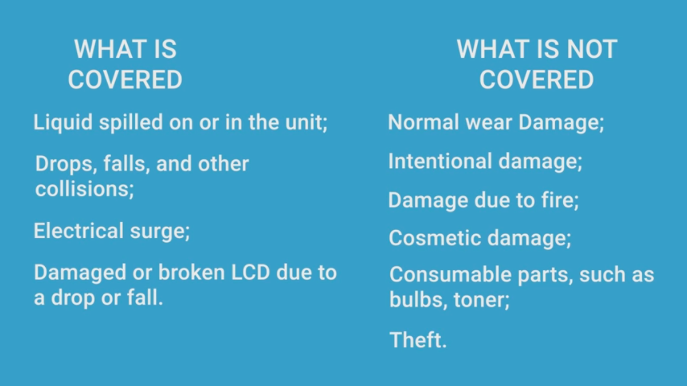

# Hardware

<TagLinks />

## Top Linux laptops

> Best ultrabooks

1. [ ] XPS 13 2-in-1
2. [ ] [XPS 13 developer edition](https://www.dell.com/en-us/work/shop/dell-laptops-and-notebooks/new-xps-13-developer-edition/spd/xps-13-9300-laptop/ctox13w10p1c2200u)
3. [ ] ThinkPad X1 Carbon Gen 8
4. [ ] Lenovo Thinkpad X1 extreme Gen 2

Ultrabook | USD | EUROS |
----------|-----|-------|
XPS 13 Developer Edition  8GB, i7-10th gen | 1,380 | |
XPS 13  8GB, i5-10th gen | 1,180 | |
XPS 13 touchscreen  16GB, i7-10th gen |  | 1340 |

> Laptops for programmers

XPS 13 vs XPS 2-in-1 difference?
:   2-in-1 make laptop work as a tablet

    * difference with hinges
    * https://www.omgubuntu.co.uk/2017/10/stylus-labs-write-handwriting-notes-app-linux#:~:text=Xournal%20is%20considered%20the%20go,and%20it's%20a%20solid%20choice.

## Latest and greates

* core i9 processor family
* Dell accidental Damage service control, 50 euros per year
  * Hardware only
  * Only available in the country of purchase
* **150 euros** for touchscreen
* [16 GB RAM for laptop 110 euros](https://www.amazon.de/Crucial-CT16G4SFD824A-Speicher-PC4-19200-260-Pin/dp/B019FRCV9G/ref=asc_df_B019FRCV9G/?tag=googshopde-21&linkCode=df0&hvadid=310638483583&hvpos=&hvnetw=g&hvrand=10606312424444589182&hvpone=&hvptwo=&hvqmt=&hvdev=c&hvdvcmdl=&hvlocint=&hvlocphy=9044184&hvtargid=pla-404032904866&psc=1&th=1&psc=1&tag=&ref=&adgrpid=63367893073&hvpone=&hvptwo=&hvadid=310638483583&hvpos=&hvnetw=g&hvrand=10606312424444589182&hvqmt=&hvdev=c&hvdvcmdl=&hvlocint=&hvlocphy=9044184&hvtargid=pla-404032904866)

## Resources

* https://www.dell.com/en-us/work/shop/dell-laptops-and-notebooks/new-xps-13-developer-edition/spd/xps-13-9300-laptop/ctox13w10p1c2200u
* https://www.zdnet.com/article/dell-readies-a-tiger-lake-refresh-on-xps-13-ubuntu-linux-developer-edition/
* [Dell XPS 13 2-in-1](https://www.dell.com/en-us/shop/dell-laptops/sr/laptops/xps-laptops/16gb-ram?appliedRefinements=6094,23085,5993)
* https://www.lenovo.com/de/de/laptops/thinkpad/thinkpad-x1/X1-Extreme-Gen-2/p/22TP2TXX1E2

<iframe width="560" height="315" src="https://www.youtube.com/embed/suQnh1TvGHw" frameborder="0" allow="accelerometer; autoplay; clipboard-write; encrypted-media; gyroscope; picture-in-picture" allowfullscreen></iframe>

<iframe width="560" height="315" src="https://www.youtube.com/embed/WutBn_mm0c8" frameborder="0" allow="accelerometer; autoplay; clipboard-write; encrypted-media; gyroscope; picture-in-picture" allowfullscreen></iframe>

<Footer />
