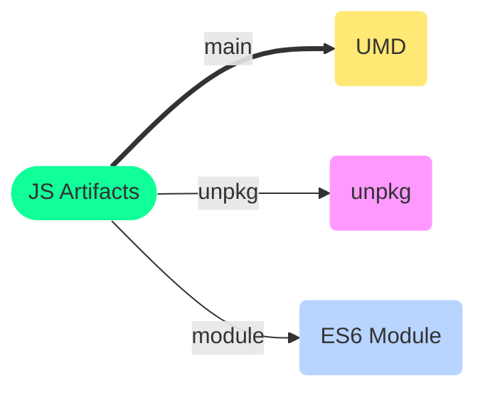
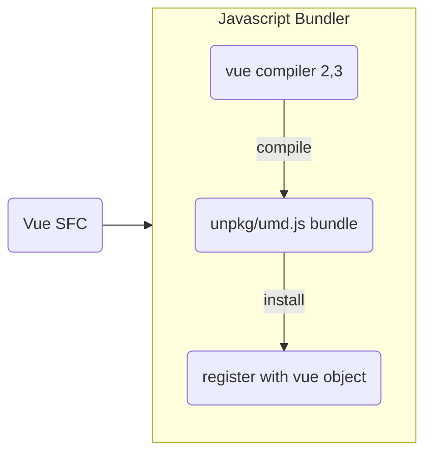

# :mailbox_with_mail: Node Package Manager

<TagLinks />

::: quote npm fun-fact :)
Biggest repository of open sourced code with over [350,000](http://www.modulecounts.com/) packages
:::

## :ping_pong: Dependency Management

> How to use, include and consume code from npm with in your apps

[Dependency Type](https://classic.yarnpkg.com/en/docs/dependency-types/)   | Description
------------------|-----------------
dependencies (default)  | requried at runtime of your time. `react`, `vue`
devDependencies         | required only a build time. `eslint`, `babel`
[bundledDependencies](https://github.com/search?l=&q=bundledDependencies+filename%3Apackage.json&type=Code)     | would be included with `yarn pack` when we package it.
peerDependencies        | your package needs a dependency that is the same exact dependency as the person installing your package
optionalDependencies    | If they fail to install, Yarn will still say the install process was successful.

## :label: Build Artifacts Types



1. CommonJS - load modules synchronously
2. AMD - Asynchronous Module Definition
3. UMD - Universal Module Definition
   1. could be used directly in browser under `<script>` tag

$$UMD = AMD + CommonJS$$

::: tip Javascript scopes
In JavaScript, functions are the only way to create new scope.
:::

What are modules in javascript again?
:  Way to organize content or code in this case.

   Analogous to how book is divided into volumes, chapters, sections, paragraps
   Problem is JS doesnt have in built classes as in other programming languages like python.

   Enter [Module Pattern](https://www.freecodecamp.org/news/javascript-modules-a-beginner-s-guide-783f7d7a5fcc/#c33a)

What are ES6 Modules?
:   The most important difference between the current JS Module formats (CommonJS, AMD) and ES6 modules is that

    ES6 modules are designed with static analysis in mind. What this means is that when you import modules,
    the import is resolved at compile time — that is, before the script starts executing. This allows us to
    remove exports that are not used by other modules before we run the program. Removing unused exports
    can lead to significant space savings, reducing stress on the browser.

* [Rollupjs bundler](https://rollupjs.org/guide/en/)
  * Why? Has a dedicated plugins to generate distributable vue components called [vue-sfc-rollup](https://github.com/team-innovation/vue-sfc-rollup)
  * else whould have to use vue-template compiler
* https://www.freecodecamp.org/news/javascript-modules-part-2-module-bundling-5020383cf306/
* https://vuejs.org/v2/cookbook/packaging-sfc-for-npm.html
* [Why ES6 module better than CommonJS?](https://rollupjs.org/guide/en/#why-are-es-modules-better-than-commonjs-modules)
* [How to create package.json?](https://classic.yarnpkg.com/en/docs/creating-a-package/)

## :sound: Automate Releases

### Release Tasks

1. Work of features/tasks, make conventional commits
   1. Maybe get some test, lint, code-coverage, performance reports etc
2. generate `CHANGELOG`
3. Release Notes
4. Tag master branch
5. bump version in `package.json`
6. publish artifacts to `npm`

### Tools which can help in above steps

commitng

* git flow
* husky | commit-lint
* commitzen | [@commitlint/prompt](https://commitlint.js.org/#/)

Versioning

* standard-version
* semantic release


### Some useful npm packages

* date-fns - https://date-fns.org/
* dotenv - https://www.npmjs.com/package/dotenv
* socket.io - https://socket.io/
* uuid - https://www.npmjs.com/package/uuid
* axios - https://github.com/axios/axios
* classnames - https://jedwatson.github.io/classnames/

## :eye: VueJS Workflow

> How to package and release vue reusable components?



```vue
<script src="https://unpkg.com/vue"></script>
<script src="https://unpkg.com/my-component"></script>
...
<my-component> some slot </my-component>
...
```

How do I compile vue components individually SFC?
:  `yarn vue-cli-service build` can compile and build the entire app.

   > Use webpack for apps and rollup for libraries and SFC

## :newspaper: News

* npm is now a part of Github. [Github acquired npm](https://github.blog/2020-04-15-npm-has-joined-github/)

<Footer />