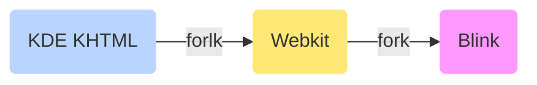

# Blink Browser Engine

<TagLinks />

> Blink is a Browser Engine / Rendering Engine / Layout Engine

* 2013, written in C++ as a part of [Chromium] Project, [Official Chromium](https://www.chromium.org/)
* Chromium has a multi-process architecture.
* Chromium has one browser process and N ==sandboxed renderer processes==. Blink runs in a renderer process.
* Blink has **one main thread**, N worker threads and a couple of internal threads.
  * All JavaScript (except workers), DOM, CSS, style and layout calculations run on the main thread.

What is [Chromium] Project?
:   FOSS project started in 2008, C, C++, js, daily release

    Source code could be compiled into a web browser.

    #### Differences from Chrome

    1. Chrome has more features
    2. closed source - binaries are licensed as freeware under the Google Chrome Terms of Service

[Chromium]: https://en.wikipedia.org/wiki/Chromium_(web_browser)

What is Renering?
:   Process of applying paint to the wall

## References

* [Comparision of Browser Engines](https://en.wikipedia.org/wiki/Comparison_of_browser_engines)
* [How a modern browser works](http://taligarsiel.com/Projects/howbrowserswork1.htm)

*[XSLT]: Extensible Stylesheet Language Transformations

<Footer />
