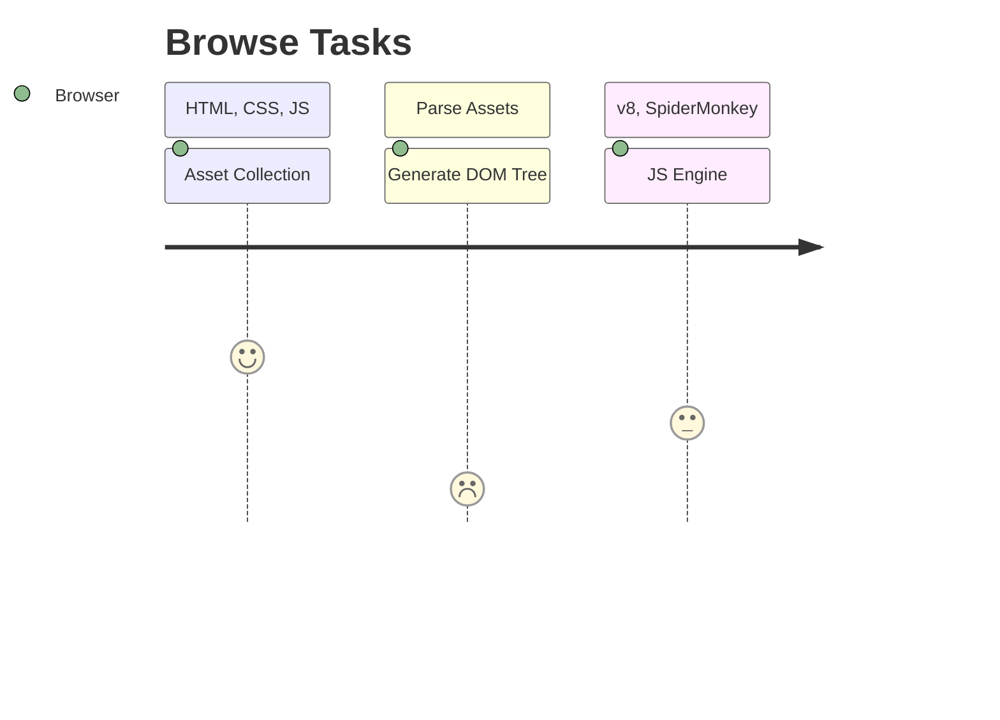
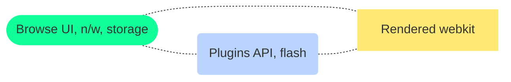
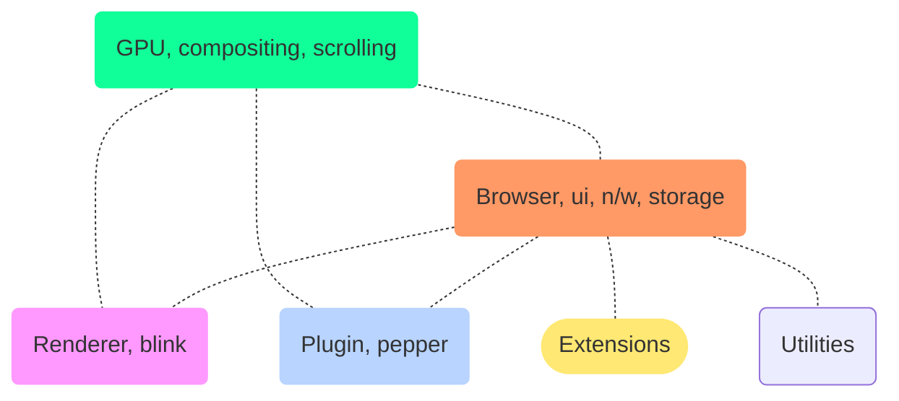
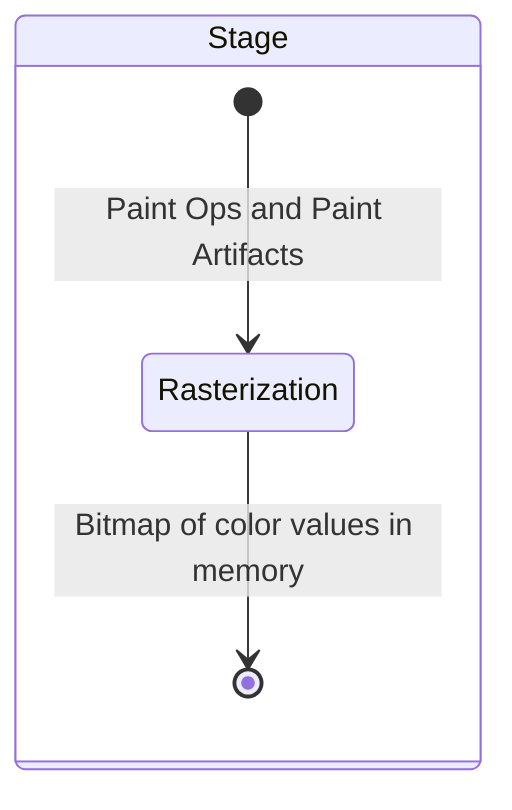

# Browser

<TagLinks />

::: quote
How does a browser works?
:::



What is a Browser?
:   Collection of software programs to access and use WWW - World wide web

    ::: tip
    In 2019, an estimated  $4.3 / 7.8$ billion people used a browser.
    :::

    1. Collects assests (html, css, js, images, other multi media) from across web
    2. Parses and creates series to data structures to work with them
    3. Renders DOM and Layouts to Paints and pixels

Browser consists of other s/w likes

1. DOM Parser
2. CSS Parser
3. Rendering Engine
4. [Javascript Engine](https://en.wikipedia.org/wiki/JavaScript_engine) - JIT compilers, executes `.js` code at client side
   1. aka [Javascript Runtimes](https://www.google.com/search?q=javascript+runtime)
5. GPU Modules
6. Layout
7. Rendering - compositing
8. Paint and Pixels

$$Rendering \, Engine = DOM + CSS \, Parsers$$

[Browser Name](https://en.wikipedia.org/wiki/List_of_ECMAScript_engines) | [Javascript Engines List](https://en.wikipedia.org/wiki/List_of_server-side_JavaScript_implementations)
------------|---------------------
Firefox     | [Spider Monkey](https://en.wikipedia.org/wiki/SpiderMonkey)
Chrome      | [v8 Engine](https://en.wikipedia.org/wiki/V8_(JavaScript_engine))
Safari      | Nitro
IE          | Chakra

Everything is processes by browser, thats why its called **client side**

## JS Notes

* Single threaded, one call stack, one thing at a time
* call stack - where in code base we are
* Blowing the stack - function recursively calls itself unless `Maximum call stack size exceeded`
* blocking - cannot do anythign unless everything is loaded, parsed and rendered
  * Enter Asynchronous calls
  * but browser is single threaded, then how does it work?
* `eventloop` job is to look at `task queue` and `js stack`
  * [Eventloop model](https://developer.mozilla.org/en-US/docs/Web/JavaScript/EventLoop)
  * [Loupe tool](http://latentflip.com/loupe/)
* chrome [webapis](https://developer.chrome.com/apps/api_other)

```js
console.log('Hello')

setTimeout(() => {
    console.log('asynchronous');
}, 5000)

console.log(World');
```


## Jargons

* Context Execution Stack
* Execution Heap

::: warning Browser Question
1. What does it consists of? How can we make one?
2. How does it work? What operations does it take?
3. API to manupulate DOM?
4. Why blocking calls is a problem in browsers?
:::

<iframe width="560" height="315" src="https://www.youtube.com/embed/8aGhZQkoFbQ" frameborder="0" allow="accelerometer; autoplay; encrypted-media; gyroscope; picture-in-picture" allowfullscreen></iframe>

<Quote text="Google chromes devtool is gold standard bitch!" />

## Google Chrome

*[CDP]: Chrome devtool Protocol

What does blue and red line mean in devtools?
:   The Blue line - ==DOM content loaded event==

    It happens when the browser finished parsing the main document.

    The Red line - ==Load event==
    It happens when the browser finished retrieving all the resources required by the **main document.**

    After the red line: Here you will see loading of asynchronous and cached resources required by the main document and by other resources.

##### DNS Lookup

When you connect to a website, it has to look up the IP from the DNS. For example, your computer will contact a DNS asking if it knows where "google.com" is. If it does, it'll give you an IP. If it doesn't, it'll either give you the IP of another DNS or it will contact that DNS itself (I'm not sure which implementation applies where) until eventually you end up with the IP of the host you're looking for.

##### Connecting

Time it takes to connect with that IP. I'm not sure of the details here.

##### Sending

After connecting, you send the request to the server. It can be a request to view a page or submit data or anything.

##### Waiting

After sending your request, you wait for the server to respond to it. It can be busy or might take a while to process whatever you requested.

##### Receiving

Once the server has processed your request, it'll send data back to you.

## History of web

::: quote George Santayana
Those who cannot remember the past are condemned to repeat it.
:::

* Humble beginning in 1990's
* High and low points in [browser wars](https://en.wikipedia.org/wiki/Browser_wars)
* Massively new natural order
* Netscape `<blink>` tag, when engineers went out drinking
  * `<marquee>` tag added by windows in response to competition
* First implementation of CSS in browser
  * IE had dynamic layout, Netscape had to reload
  * Netscape didnt have a dynamic system
    * If you resize window, they would load the entire page from server
    * there was no caching
* ==Check-in bear==, real physical bear next to a board
  * if you are checking in your code, you write your name and take the bear to your desk
* 1997 - DHTML, suddently everything was dynamically programmable
* `XMLHTTPRequest` was born
* 2001 - death of IE internet, focusing only on compatibility and customer retention
  * [Mashups](https://en.wikipedia.org/wiki/Mashup_(web_application_hybrid)) became popular
  * Firefox, webkit started gaining traction
* 2004 - WHATWG was formed
  * W3C kind of lost its way
* Dont become complaicent just because you are on the top
* Not all the smart people work at your company, disruptive factors
* 2007 - Mobile Revolution
  * web was not ready
    * web pages were still 1024 $*$ 768
    * work both with/without mouse and keyboard
    * network spottyness

## Anatomy of Browser

::: danger chrome
Chrome now has $\approx$ **25 Million** lines of code
:::

* What did things looked like before chrome?
* There would always be bugs in s/w you write or libraries you consume
* IPC by message passing over shared memory
* Browser process is the `main` process

### Chrome Initally



::: tip threads
Threads in chrome child processes. Many threads in main browser process. Main browser thread

1. UI thread, where most of browser logic lives
2. IO, non blocking IO, IPC
3. Files sockets
:::

### Chrome Today

* GPU by `WebGL`
* Utilities like
  * Processing, parsing JSON
  * adding, removing extensions script
* Future - decoupled microservices layered architecture
  * switch from single process for networking, io, storage to seperate processes on high RAM devies
  * and single process on low RAM devices
  * [FaaS](https://en.wikipedia.org/wiki/Function_as_a_service)




* single browser process parent to everything else
  * has a main function in giant binary
  * no matter how many tabs you have opened, single process
* Share chrome profiles
  * `content::BrowserCOntext` in chrome API
* BrowserWindow Object specific to a page, for a certain profile
* Observer Pattern on `WebContent`
* No limit on render frame limit

> Can you please explain that to me in as gruesome detail as possible

## Chrome Release cycle

> Feature Freeze - Code in Please

* 6 week release cycle
* 2 canary release - almost daily
  * In software testing, a canary is a push of programming code changes to a small group of end users who are unaware that they are receiving new code.
  * Branch everyday for canary

## Life of Navigation

* What happens when you type something in URL navigation bar


1. Parse URI, could be a search string
2. pass it to `webContents` $\approx$ tabs
   1. `NavigationController` session History
3. Network Service
4. Renderer Layer


## Life of a Pixel

> pointers to important classes and data structures in the codebase.

::: tip WebPage
A Real webpage is thousands of lines of html, css and javascript code delivered in plain text to browser over network. So, how is it all rendered?

:::


* Content `content::WebContents` class
  * Types of Contenet
    * HTML
    * CSS
    * Javascript
    * images
    * WebGL
    * WebAssembly
    * video
    * canvas
    * PDF
* Other things like Tab controls are **Browser UI Elements**
* Rendering happens inside a ==sandboxed process==
  * other tabs are safe
* Uses low level graphic primitive library like `OpenGL`, `vulkan`, `directX` etc


* Goal of rendering is to convert `{` html, css, js `}` $\xrightarrow{convert}$ openGL calls to draw pixels on screen
  * Right intermediate datastructures to update rendering effeciently after modification
* Rendering happens in stages, multiple stages with multiple data structures
* HTML Parser $\xrightarrow{html}$ DOM Tree
  * one of the first tree we will encounter in rendering stages
  * `v8` js engine exposes APIs like `document.createElement('span')` over DOM
  * There can be multiple DOM trees for same webpage
    * Shodow tree
    * which can have `slots` to fill in the data later
* Parsed CSS is applied to DOM, elements are selected and styles are applied by traversal
  * CSS File -> StyleRules (efficient lookups)
  * Style properties are defined decleratively in a `JSON` file in chrome code base
  * Corresponding style classes are generated by python script at build time
  * `styleResolver::styleForElement` How to add and apply styles to elements?
  * `Document::UpdateStyle` traverses DOM upside down and apply Compute styles to nodes

::: quote
In computer science, trees are upside down
:::

* After html is parsed and styles are applied, job is to compute the visual geometry of all elements
* `Harfbuzz` to select text glyphs that corresponds to a character in text
* Layout Problems
  * overflow, when child is bigger than parent element
* Layout operates on seperate tree called **Layout Tree**
  * tree is built after style resolution stage
* DOM tree and Layout tree are **NOT** $1:1$
  * `display: none` no layout tree node is created
* How to we paint then? After geometry is determined list of paint operations. `PaintTree`
* Paint stacking order is different from DOM  model
* Raster includes image decode



* Raster uses `Skia` graphics library to issue GL calls
  * Skia ships with chrome binary but has a seperate repository
  * also used by Android OS
  * understands **paths** and **bezier curves**
  * some harddware accleration optimizations
* GPU level optimizations

::: warning Rendering Pipeline
1. DOM
2. style
3. layout
4. paint
5. raster
6. GPU
7. Pixel on screen
:::

* What about change? changes are expensive
  * do not want to eun whole pipeline on chages
  * zooming
  * scrolling
  * animation - 60 frames per second gold standard
  * incremental loading
  * javascript
* Each layer has a concept of **Granual Asynchronous Invalidations**
* Compositing
  * Break page into layers
  * Combine them into another thread called `impl`
  * Layer Promotion from layout stage
  * Composite after paint - under construction
* Rastering tasks are divided into **tiling**, raster the tile below vieport first


<iframe width="560" height="315" src="https://www.youtube.com/embed/m-J-tbAlFic" frameborder="0" allow="accelerometer; autoplay; encrypted-media; gyroscope; picture-in-picture" allowfullscreen></iframe>

### resources

* [Life of a pixel slides](https://docs.google.com/presentation/d/1boPxbgNrTU0ddsc144rcXayGA_WF53k96imRH8Mp34Y/edit#slide=id.g60f92a5151_40_0)

## Lifecycle of a Process

* Browser process has highest privilages than child processes
* [ ] Draw a trace of program under execution

::: quote
Chrome is a multi process application
:::

1. Synchronous initialization of main component of chrome
   1. `PostEarlyinitialization` enable diable feature A/B testing very early in stage
   2. Thread Pool -
   3. Startup Manager - decide startup mode
      1. full mode or lightweight mode
   4. `PreCreateThreads` and Post
   5. `PreMainMessageLoopRun` create and load profiles and start **keyed service**
      1. which depends in profile like bookmarks, extensions
      2. Load extensions - had to happen early
2. Run main thread loop
   1. Get tasks from tasks queue to be processed
   2. `IO` and `UI` tasks

* Locks are not used in chrome. Why? as they can create **deadlocks** and **priority inversions**
  * virtual threads
* Expensive operations are executed asynchronously
* Shutdown Benhaviour
  * No input requests are recieved

## IPC

* Web Battery API
* Mojo IPC
* Industries involved in buying and selling of vurnabilities


## Life of A Script

> Javascript execution pipeline

::: quote
V8 is a ecmascript implementation
:::

* Memory Managwement
* Web WebAssembly
* Chrome dev Tools
  * Live Edit
  * Profiling
* Convenient `gin` library wrapper to work with `v8`
* `v8::Isolate`
* `v8::Context`
* `v8` might store compiled bytecode on disk
* There is a seperate thread for parsing script during loading
* Scanning and parsing $\rightarrow$ AST
* `ignition` interpreter, has registers
* Bytecode is the source of truth for devtools, once generated AST could be discarded
* Object Shapes or Maps
* Garbage Collector **Orinoco**
* Web Assembly - statically typed
* Most of the time is spent in parsing stage

## History of Web Assembly

* Web has 2 general purpose programming languages, `javascript` and `webassembly`
* Binary format
  * smaller in size, compact
  * designed to be fast
* How fast can javascript (with JIT interpreter) get?
* 2009 Research paper - **Native Client**
* 2010 Portable Native Client PNaCl
  * using portion of LLVM IR
* Excellent for security but prevents calling Web APIs
  * Pepper Plugin API was implemented
* 2010 Uniy port to NaCl
* 2011 Bastion game ported to NaCl
* 2013 Chrome 31 ships PNaCl on web
* 2010 `emscripten` in parallel world `asm.js`
  * turn LLVM IR $\rightarrow$ javascript
  * 2011 could compile Python, doom
  * Relooper Algorithm

*[NaCl]: Native Client

## Video and Audio Codec

> Silicon Valley Season

::: tip why codec?
1080p uncompressed video @30 fps $=$ **1.49 Gbits/second**

Internet speeds at best are 150 MBps (in Singapore)

1080p `H.264` video at 30fps $=$ ==**5 Mbps**==
:::

* With chrome, media consumption is millions of hours each day
* Codec = Compress and Decompress to save transmission size
* Media Compression

Codec | Content Types
------|---------------
`VP9`   | video codec
`webP`  | Image codec
`opus`  | Audio codec
`draco`   | Geometry
`H.264`   | older video codec

* How do we make these codec?
* ORganizations that work on codec development
  * MPEG - not royality free
    * mp3, mpeg-2, avc, hevc
  * Alliance for Open Media - founded in 2015 fall - royality free policies
* same quality at lower bit rate
* How compression works?
  * divide image into blocks - block decomposition
  * inter predictions, when a block is similar
    * temporal prediction
  * seperate noise from codec then sent it to still be able to have noise effect
* How to deploy codec?
  * `flash`, `silverlight`
  * HTML5 `<video>` tag. Do not have to put codec yourself, browser will do that for you
* youtube - `VP9` codec, `AV1`
* When users change laptops, codecs are going to work differently?
  * CPU is different
  * Able to change codec on fly, without stutter
  * when you switch from low screen to full screen, codcc changes from `AV1` $\rightarrow$ `VP9`

::: danger Market Share
**79%** of streaming video is still `H.264` (release in 2013)

Why is that? `AV1` is munch much more efficient
:::

> standing in front of people, pitching something is good

<iframe width="560" height="315" src="https://www.youtube.com/embed/xqJjyUpYEw0" frameborder="0" allow="accelerometer; autoplay; encrypted-media; gyroscope; picture-in-picture" allowfullscreen></iframe>

### Resources

* https://www.encoding.com/

## Test

You build an aeroplane, doesn it work? before we entrust it with real lives? How to make sure noone dies?

<Footer />
