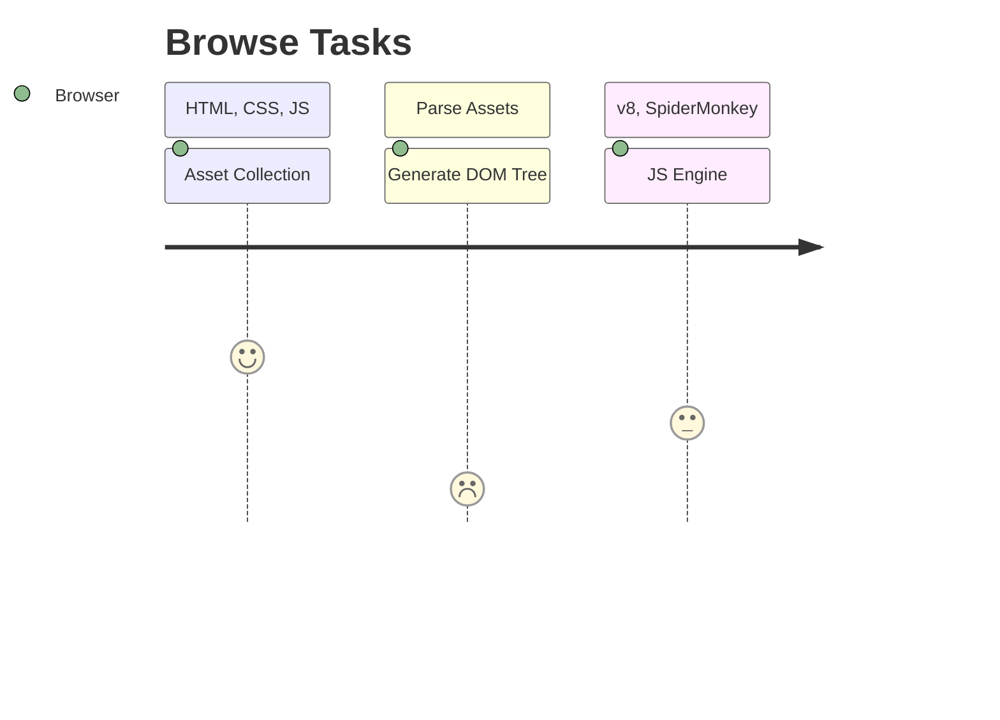

# Browser

<TagLinks />

::: quote
How does a browser works?
:::



What is a Browser?
:   Collection of software programs to access and use WWW - World wide web

    ::: tip
    In 2019, an estimated  $4.3 / 7.8$ billion people used a browser.
    :::

    1. Collects assests (html, css, js, images, other multi media) from across web
    2. Parses and generates DOM Tree
    3. Renders DOM tree using JS Engine

Browser consists of other s/w likes

1. DOM Parser
2. CSS Parser
3. Rendering Engine
4. [Javascript Engine](https://en.wikipedia.org/wiki/JavaScript_engine) - JIT compilers, executes `.js` code at client side
   1. aka [Javascript Runtimes](https://www.google.com/search?q=javascript+runtime)

$$Rendering \, Engine = DOM + CSS \, Parsers$$

[Browser Name](https://en.wikipedia.org/wiki/List_of_ECMAScript_engines) | [Javascript Engines List](https://en.wikipedia.org/wiki/List_of_server-side_JavaScript_implementations)
------------|---------------------
Firefox     | [Spider Monkey](https://en.wikipedia.org/wiki/SpiderMonkey)
Chrome      | [v8 Engine](https://en.wikipedia.org/wiki/V8_(JavaScript_engine))
Safari      | Nitro
IE          | Chakra

Everything is processes by browser, thats why its called **client side**

## JS Notes

* Single threaded, one call stack, one thing at a time
* call stack - where in code base we are
* Blowing the stack - function recursively calls itself unless `Maximum call stack size exceeded`
* blocking - cannot do anythign unless everything is loaded, parsed and rendered
  * Enter Asynchronous calls
  * but browser is single threaded, then how does it work?
* `eventloop` job is to look at `task queue` and `js stack`
  * [Eventloop model](https://developer.mozilla.org/en-US/docs/Web/JavaScript/EventLoop)
  * [Loupe tool](http://latentflip.com/loupe/)
* chrome [webapis](https://developer.chrome.com/apps/api_other)

```js
console.log('Hello')

setTimeout(() => {
    console.log('asynchronous');
}, 5000)

console.log(World');
```


## Jargons

* Context Execution Stack
* Execution Heap

::: warning Browser Question
1. What does it consists of? How can we make one?
2. How does it work? What operations does it take?
3. API to manupulate DOM?
4. Why blocking calls is a problem in browsers?
:::

<iframe width="560" height="315" src="https://www.youtube.com/embed/8aGhZQkoFbQ" frameborder="0" allow="accelerometer; autoplay; encrypted-media; gyroscope; picture-in-picture" allowfullscreen></iframe>

<Quote text="Google chromes devtool is gold standard bitch!" />

## Google Chromes

## What does blue and read line mean in devtools?


The Blue line (DOM content loaded event):
It happens when the browser finished parsing the main document.

The Red line (Load event):
It happens when the browser finished retrieving all the resources required by the main document.

After the red line: Here you will see loading of asynchronous and cached resources required by the main document and by other resources.

##### DNS Lookup

When you connect to a website, it has to look up the IP from the DNS. For example, your computer will contact a DNS asking if it knows where "google.com" is. If it does, it'll give you an IP. If it doesn't, it'll either give you the IP of another DNS or it will contact that DNS itself (I'm not sure which implementation applies where) until eventually you end up with the IP of the host you're looking for.

##### Connecting

Time it takes to connect with that IP. I'm not sure of the details here.

##### Sending

After connecting, you send the request to the server. It can be a request to view a page or submit data or anything.

##### Waiting

After sending your request, you wait for the server to respond to it. It can be busy or might take a while to process whatever you requested.

##### Receiving

Once the server has processed your request, it'll send data back to you.


*[CDP]: Chrome devtool Protocol

<Footer />
