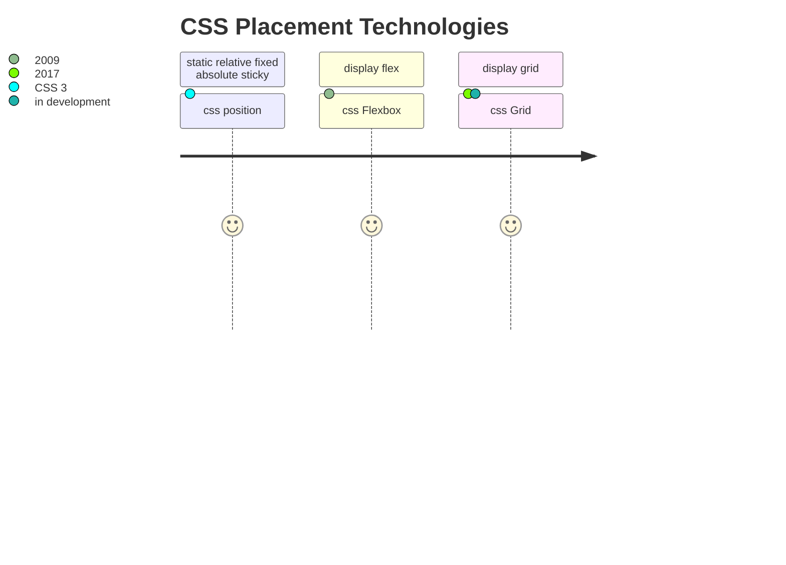

# CSS - Cascading Style Sheets

<TagLinks />

::: quote

Let's make web beautyful!
:::

## Typography

* https://fonts.google.com/specimen/Major+Mono+Display

## Css Features

::: quote CSS Box Model
In css, everything is a Rectangle
:::

* Gap b/w print desing and web design has reduced
* CSS Shapes
* CSS Blend Mode - color compositing and blending
* CSS FIlters **11** filter effects

::: warning
Bounding Box Mode (SVG) $\approx$ CSS Box Model
:::

## SVG Filters

::: tip
How you can re-create photoshop stuff in browser?

::: right
Inspiration [codepen](https://codepen.io/search/pens?q=SVG+Filters)

* https://www.theavocoder.com/
:::

* SVG is 2 decades old
* CSS filters are derieved from SVG filters, but more optimized for use
* Horizontal blur = Motion blur effect
* Filters requires a source image to work on. Else its blank
* Filter is a series of graphic manupulation operations `<feGuassianBlur ...>`
* Apply texture to images and text to recreate effects like smoke, fire, clouds, storms, water etc.
* Filters are only applied to a region

```html
<svg xmlns="http://www.w3.org/2000/svg" width="4in" height="3in">
  <defs>
    <filter id="myFilter">
      <!-- Definition of filter goes here -->
    </filter>
  </defs>

  <text style="filter:url(#myFilter)">a filter applied</text>
  <!-- or -->
  <image xlink:href="..." width="100%" height="100%" filter="url(#myFilter)"></image>
</svg>
```

Displaccement Map
:   is a image whose color information is used to distort the content of another <element></element>

    ### Photoshop

    1. Desaturate the image
    2. Reduec the amount of detail in it by blurring it by 1px
    3. Save it as a displacement map
    4. Create text, apply distortion filter using the image as a displacement map
    5. Reuse the original image as a background behind the text
    6. Refine the effect more by adding slight transparency to the text and blending it with bg image

    ### SVG

    1. Fill the filter region with image that will be used as a texture (using `feImage`)
    2. Desaturate the image (using `feColorMatrix value="saturate"`)
    3. Apply 1px Guassian Blur using `feGaussianBlur`
    4. Use image to distort text with `feDisplacementMap`
    5. Blend text into background `feBlend` and apply translucent effect to decrease opacity `feComponentTransfer`
    6. Display both layers by merging 2 layers `feMerge`

Duo Tone Effect
:   `<feComponentTransfer` with `type="table"`

<iframe width="560" height="315" src="https://www.youtube.com/embed/PHKLzpt-syI" frameborder="0" allow="accelerometer; autoplay; encrypted-media; gyroscope; picture-in-picture" allowfullscreen></iframe>

Why use browser based filter when you can easily use photoshop to do image manupulation stuff?
:   Image manupulation on browser makese sense at scale when we have thousands of images.

    Use same filter over entire website. Update Filter overtime, instead of doing it manually per image in PS

    1. Resolution Independent
    2. Easier and faster changes/tweaks at scale
    3. Content is editable ans dynamic
    4. [ ] Effects are animatable, not possible with static images

## Effects

1. Drop Shadow
   1. SVG Filter chaning
   2. `feOffset in="sourceAplha"`
   3. `feGaussianBlur`
   4. Make shadown translucent
2. Image Morphing - shape transformation effects, pixel level operation
   1. Erosion - thinning, shrinking
   2. Dilation - Thickening, expanding
   3. Preserve the thickness of the text and enable outline
3. [Knock Out <Text></Text>](https://css-tricks.com/css-techniques-and-effects-for-knockout-text/)
   1. `feMorphology`
   2. `feComposite`
4. Poster Effect - reducing the number of colors in an image
   1. range of intensites would end up being 1
5. Create animations from textures
   1. `feTurbulance`
6. Squiggly Text
7. Light Sources
   1. `feDistantLight`
   2. `fePointLight`
   3. `feSpotLight`
   4. increase the number of details - `octaves` usually 5 is max, after that we cannot detect change
8. [Bokeh Effect](https://en.wikipedia.org/wiki/Bokeh)
   1. [Blurr produced in out of focus ares](https://www.google.com/search?q=Bokeh)

$$Compositing = Graphic \, Element + Backdrop$$

::: warning Textures
How to use image of a texture and use it to change the shape and texture of other elements?

How to create SVG textures?

* Textures
* Random Noise
* Lighting effects

:::

* Using [Displacement Maps](https://en.wikipedia.org/wiki/Displacement_mapping)
* [Una Kravits](https://una.im/)
* [Sarah Soueiden codepen](https://codepen.io/SaraSoueidan)
* [Lucas Bebber](https://lbebber.github.io/)
* [Code drops](https://tympanus.net/codrops/)
* [Art of SVG Filters](https://www.smashingmagazine.com/2015/05/why-the-svg-filter-is-awesome/)

## CSS-3 Placement and Positioning System

::: quote
How to palce elements on browser like a css god!
:::

How CSS-3 solves position the element properly on various resolution?

1. Box Model, Position System
   1. static
   2. relative
   3. fixed
   4. absolute
   5. sticky
2. CSS Flex Model - 1 dimensional
3. CSS Layout - 2 dimensional

::: danger CSS Positioning system
When on earth do we use each of these?
:::

Parent `relative` and its children as `absolute` is a common practise.



[A brief history of CSS until 2016](https://www.w3.org/Style/CSS20/history.html)

```css
transform: rotate(2deg)
```
<iframe width="560" height="315" src="https://www.youtube.com/embed/jx5jmI0UlXU" frameborder="0" allow="accelerometer; autoplay; encrypted-media; gyroscope; picture-in-picture" allowfullscreen></iframe>

<iframe width="560" height="315" src="https://www.youtube.com/embed/MdPYenT89o4" frameborder="0" allow="accelerometer; autoplay; encrypted-media; gyroscope; picture-in-picture" allowfullscreen></iframe>

## vue

* [Import css in vue](https://github.com/vuejs-templates/webpack/issues/604)
* [Paframeterizing SVG](https://stackoverflow.com/questions/21763953/parameterizing-and-reusing-custom-svg-filters-defined-in-html5)
* https://css-tricks.com/intro-to-vue-5-animations/

<iframe width="560" height="315" src="https://www.youtube.com/embed/kfOhlU_iRVU" frameborder="0" allow="accelerometer; autoplay; encrypted-media; gyroscope; picture-in-picture" allowfullscreen></iframe>

## CSS animations

> How do we animate objets (reactangles) on browser?

Browser is my canvas. Browser exposes APIs to animate objects. What are those APIs?

1. :star: CSS Animation Specification
   1. best aapproach
2. [SVG SIML Specification](https://www.w3.org/TR/2008/REC-SMIL3-20081201/)
   1. No IE support for <animate… you have to use a polyfill library like fakeSMIL - which is not the end of the world. Also css3 transforms are GPU accelerated on iOS mobile and chrome for mobile (for the most part) so they tend to be smoother.
   2.  SVG's own animation API (SMIL) is not well-supported,
3. Use Javascript to dynamically adjest css properties of element

How to ensure backward portability?

```css
${1:selector} {
   animation-name: $0
   animation-duration:
   animation-timing-function:
   animation-delay:
   animation-iteration-count:
   animation-direction:
   animation-fill-mode:
   animation-play-state:
}
```

Some cool effects

* [Text ANimation](https://www.youtube.com/watch?v=ZQUKEkCuws8)

## Display

* [Difference between inline, block and inline-block](https://stackoverflow.com/questions/9189810/css-display-inline-vs-inline-block)

```css
.storegrid {
  width: 95%;
  display: grid;
  grid-template-columns: 3fr 1fr;
  grid-template-rows: 1fr;
  grid-column-gap: 40px;
  grid-row-gap: 0px;
}
```

Mediaqueries on Grid

```css
@media (max-width: 600px) {
  aside {
    width: 100% !important;
    margin-bottom: 10px !important;
  }

  .content {
    width: 100% !important;
    grid-template-columns: 1fr !important;
  }
}

@media (min-width: 601px) and (max-width: 900px) {
  .content {
    grid-template-columns: repeat(2, 1fr) !important;
  }
}

@media screen and (max-width: 550px) {
  .storegrid {
    width: 90%;
    display: grid;
    grid-template-columns: 2fr 1fr;
    grid-template-rows: 1fr;
    grid-column-gap: 10px;
  }
}
```

### Grid template area

* [CSS grid area](https://developer.mozilla.org/en-US/docs/Web/CSS/grid-area)
* [CSS grid Browser support](https://caniuse.com/#feat=css-grid)

```scss
grid-area: 1 / 1 / 5 / 4;  //shorthand
    grid-row-start: 1;
    grid-column-start: 1;
    grid-row-end: 5;
    grid-column-end: 4;
```

[Generate beauty text overlay graphics using grid-css and text](https://github.com/sdras/ecommerce-netlify/blob/8cb584e224be14f9d173a541833967d593a1f4de/components/AppTextlockup.vue#L27)

<iframe width="560" height="315" src="https://www.youtube.com/embed/tPosqmwIx0w" frameborder="0" allow="accelerometer; autoplay; encrypted-media; gyroscope; picture-in-picture" allowfullscreen></iframe>

<iframe width="560" height="315" src="https://www.youtube.com/embed/qTGbWfEEnKI" frameborder="0" allow="accelerometer; autoplay; encrypted-media; gyroscope; picture-in-picture" allowfullscreen></iframe>

## Trends

* [Diagonal Layouts](https://9elements.com/blog/pure-css-diagonal-layouts/)


## :cyclone: Resources

* https://www.w3.org/TR/SVG/animate.html
* https://www.w3.org/TR/css-animations-1/
* https://cssanimation.rocks/
* https://animation-nation.netlify.app/
* https://tobiasahlin.com/moving-letters/
* https://css-tricks.com/how-to-animate-text-with-svg-and-css/


<Footer />
