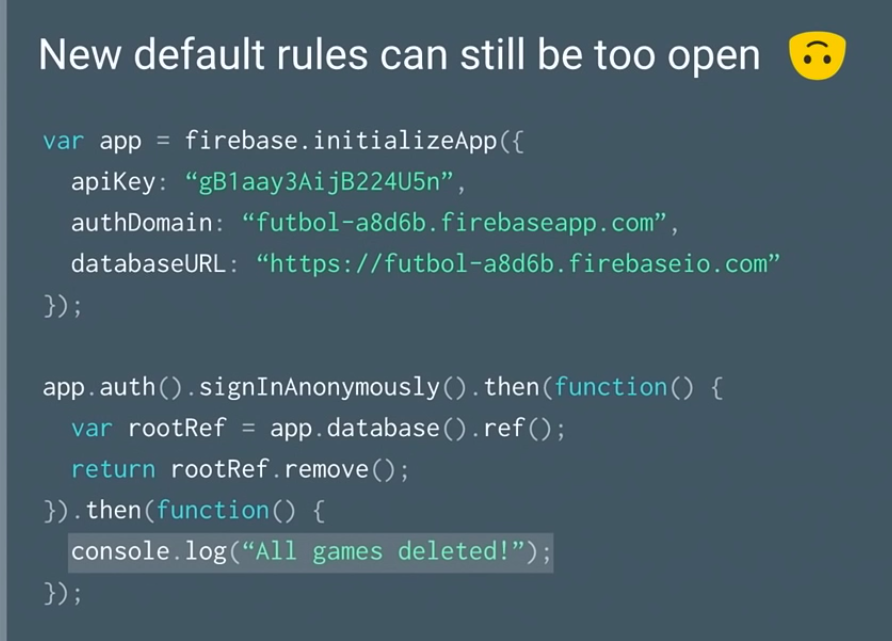
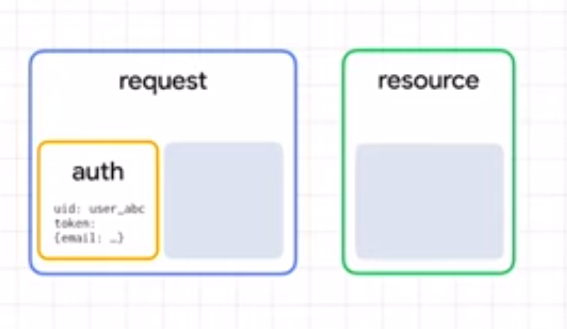
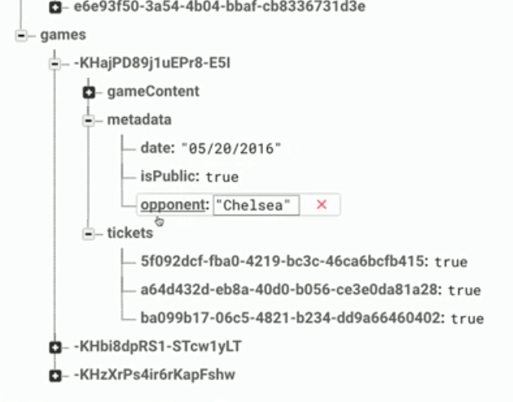
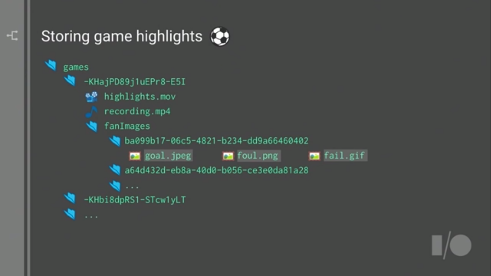
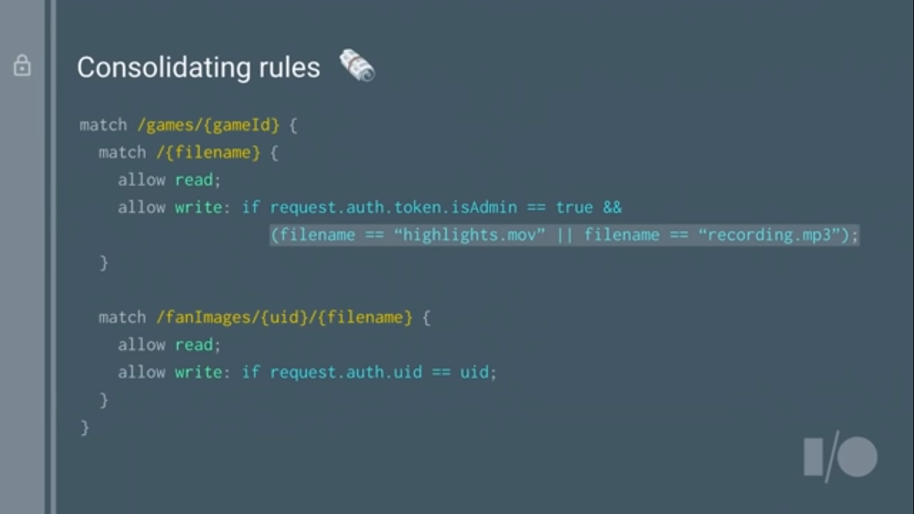
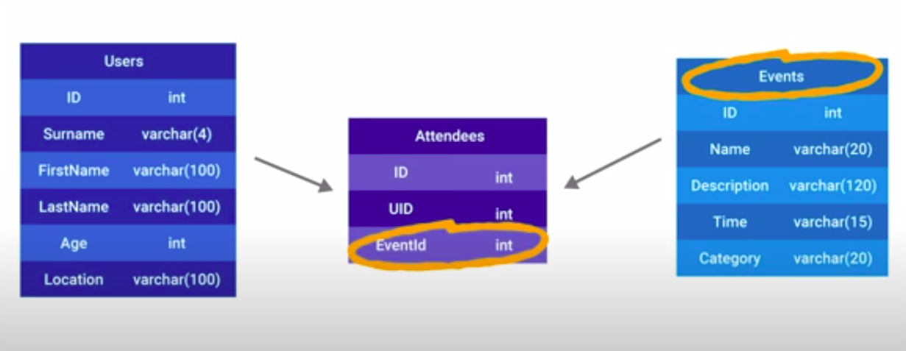

# :fire: Firebase

<TagLinks />

> Firebase provides a platform of suites/services to build cloud apps, its a PaaS acquired by google

Your app might follow  a [client-server](https://en.wikipedia.org/wiki/Client%E2%80%93server_model)
architecture, firebase provides different SDK libraries to work at client, server and devvelopment side.

Firebase Libraries | Application
-----------------|-----------------
[firebase](https://www.npmjs.com/package/firebase) | client-side on web, android, iOS. <br> aka **Firebase JavaScript SDK** in firebase lingo <br> [vuefire](https://github.com/vuejs/vuefire/blob/master/package.json) is based on firebase client javascript SDK
[firebase-admin](https://github.com/firebase/firebase-admin-node) | aka [Firebase Node.js Admin SDK](https://firebase.google.com/docs/admin/setup/) <br> to be used at server side privilages environments
[firebase-tools](https://github.com/firebase/firebase-tools) | Firebase CLI, to deploy services from development environment
[@firebase/testing](https://www.npmjs.com/package/@firebase/testing) | test databases (both) security rules


## :closed_lock_with_key: Authentication

* maintains session
* unique id acrosss all platforms
* Note: By default, authenticated users can read and write data to the Firebase Realtime Database and Cloud Storage.

## :department_store: Realtime Database

> Immutable snapshots of data references

* workd offline mode
* Security Rules
* Listen for data changes - optimize them
* **5$** per GB download
* Can import, export as `JSON`
* Use `push` to auto generate ID
* use `metadata` to add public flags
  * easy to write rules that way

Database rules language

```json
"games": {
  // wildard location
  "$gameId": {
    // metadata object in data
    "metadata": {
      ".read": true
    },
    // rules cascade
    "gameContent": {
      ".read": "auth != null || data.child('isPublic').val() === true"
    }
  }
}
```

```sh
ref().push()
```






## :convenience_store: Cloud Firestone

> use this, its newer

* If the document does not exist, it will be created. If the document does exist, its contents will be overwritten with the newly provided data, unless you specify that the data should be merged into the existing document, `{ merge: true }`
* with an auto-generated ID, `.doc().set(...)`
* To update some fields of a document without overwriting the entire document, use the `update()`
* Transaction and batched writes

```sh
collect.doc()
```

## :postbox: Google Big Query

Connected Sheets allows users to analyze billions of rows of live BigQuery data in Google Sheets without requiring SQL knowledge.

## :robot: Emulators

Run and test database rules locally and generate reports.

* Emulator first development

## :lock_with_ink_pen: Security

1. Authentication
   1. verifying users who they say they are
      1. Anonymous Authentication
      2. username / password
      3. OAuth from external providers
2. Authorization - Firebase Rules
   1. who has access to what

## :bank: Storage

* security rules may look different but concepts are same





## :bar_chart: Analytics

* How to measure if you app (business) is working or not?
* Completely free and completely unlimited, cross platform

## :cloud_with_lightning: Cloud Functions

> Managed backend solution

* [SDk Reference](https://firebase.google.com/docs/reference/functions)
* [Source Code](https://github.com/firebase/firebase-functions)
* Event triggers a function (database change, https call, new user register)
  * great for webhooks, stripe, twilio, slack
* scales up and down
* write complex thoughts clearly
* play with code before - **Pyramid of Doom**
* node version 8 adds `async` and `await` - Hey I need a value and not a promise
  * async/await, simplifying promise management
* [cloud function Examples](https://github.com/firebase/functions-samples/tree/fa9f9dedd8d4ebd74752fb44ece9ffeedfde390e)

### :snowman: Cloud Function Security

> Restricting access

* https://stackoverflow.com/questions/58178243/is-there-a-way-to-restrict-public-access-from-firebase-callable-could-functions
* https://stackoverflow.com/questions/47948561/are-google-cloud-functions-protected-from-ddos-attacks/49282490


```js
const functions = require('firebase-functions');

exports.scheduleSampleJob = functions.https.onRequest((req , res) => {
     let auth = req.header('Authorization');

     if(auth == 'YOUR_API_AUTHORIZATION_KEY'){
         // valid Authorization key, process the call
     }else{
       //send forbidden if Authorization key not valid
         return res.status(403).send('Access is Forbidden');
     }
});
```

## :watermelon: NoSQL for SQL developers

> Structure your data as it would be needed in the view

* firebase databse provides security language to put constraints on JSON entered
  * based on rules language it can accept/reject
* How would we model a events app database in noSQL?
  * Users, Events and Attendes Tables
  * SQL - join query to get all attendes for an event

```sql
SELECT
  event.Name as EventName,
  event.Data as EventDate,
  user.Name as UserName
FROM Events as event
INNER JOIN Attendes as a
  ON e.Id === a.EventId
INNER JOIN Users as User
  ON u.UId = a.UId
WHERE e.Id == 4;
```



* Pagination using query limiters
* Can attach value listener to data values, realtime updates
* joins using callback references
* NOrmalization vs Denormalization (duplication of data to remove querying)
* When to denormalize data?
  * Based on your view
* Add lookups in your json object to cross query tables

```json
userEvents: {
  eventId: {
    fm: true,
    otherEvent: true,
    coolEvent: true
  }
}
```

* Multipath updates using promises

## :question: Questions

firebase apiKey is open to public? Cant anyone who has key make new accounts in firebase?
:   Restrict backend to respond only to your website using [HTTP referer set by browser](https://medium.com/@devesu/how-to-secure-your-firebase-project-even-when-your-api-key-is-publicly-available-a462a2a58843)

How to configure/initialize Client?
:   Using client config as provided by firebase

    ```js
    const firebaseConfig = {
      apiKey:             {some key}
      authDomain:         String
      databaseURL:        url
      projectId:          String name,
      storageBucket:      String,
      messagingSenderId:  Number,
      appId:              Alphanumber String with colons,
      measurementId:      String
    };
    ```

How to initialize admin SDK? When to use it?
:   By providing path to serviceAccountKey.json as provided by firebase for a project

    #### Use cases

    1. Full privilages read/write access to data. Bypass all database rules.
    2. Generate and verify Firebase auth tokens.
    3. Create your own simplified admin console to do things like look up user data or change a user's email address for authentication.

How javascript is parsed by browser?
:   Image tags are fetches asynchronously, non blocking

    * script tags are blocking, parsing stops until script is fetched
      * thats why script tags are at the very bottom of page, so that images can load nbefore that

Difference between static website, SPA and SSR webapp?
:   Static website - everything is prebuilt, all HTML, CSS, JS and possibly wasm

    ##### SPA - Single Page Application

    server sends only a boilerplate HTML with javascript, which generates the whole page at client end.
    <Badge type="tip" vertical="middle" text="vuejs" />. We can also call them CSR - client side rendered <apps></apps>

    ##### SSR - Server Side Rendering

    javascript from SPA is pre-rendered / prefetched by server before sending it to client.
    <Badge type="tip" vertical="middle" text="nuxtjs" />

    ::: tip what is SSR?
    Rendering a client side SPA website as static HTML and CSS website on server at fly.

    Its not free
    :::

    Browser is good at rendering HTML and CSS fast. ==First content load metric==
    Lengthy `js` would only delay browser rendering first meaningful content rendering time and
    ==TTI Time to Interactive==. When `js` starts running thats the time when app becomes interactive.

    Profile and Compare youself [TTI](https://web.dev/interactive/) and
    [FCP](https://web.dev/first-contentful-paint/) on your webapp with and without SSR usind devtools.

    <iframe width="560" height="315" src="https://www.youtube.com/embed/Y5XX2lruhxs" frameborder="0" allow="accelerometer; autoplay; encrypted-media; gyroscope; picture-in-picture" allowfullscreen></iframe>

How to host a nuxt SSR app using cloud functions?
:   SSR~solution~ $=$ Firebase Hosting (http2 enabled) $+$ firebase functions

    setup response caching in server response header.

    <iframe width="560" height="315" src="https://www.youtube.com/embed/ZYUWsjUxxUQ" frameborder="0" allow="accelerometer; autoplay; encrypted-media; gyroscope; picture-in-picture" allowfullscreen></iframe>


## :pen: Personal Notes

* Project Settings > you Apps
* Initialize Firebase in your app (no need to include your Firebase config object when using reserved Hosting URLs):
* If I add firebase.js to head in config.js, it gets loaded for every page. Thats not what is required. For efficiency, should only load on contact me page
* [How to add external JS scripts to VueJS Components](https://stackoverflow.com/questions/45047126/how-to-add-external-js-scripts-to-vuejs-components)
  * https://github.com/vuejs/vue-loader
  * One could ask, why would you event want to include a `<script>` tag inside a template in Vue. The reason why I stumbled into it was to load an external script only on specific pages.
  * Multiple solutions
    * Embed script tag direcctly into template
    * Use javascript to add script tag to DOM
    * Use webpacka nd vue-loader to do your work
* If you use reserved Hosting URLs, your Firebase config is automatically pulled from your Firebase project, so you don't need to explicitly provide the object in your code.
* Associate project to use firebase use --add
* https://github.com/pagekit/vue-resource
* Auto saving forms from vue and firestore
  * something like google docs
* vue dependencies
  * firebase
  * vuefire
    * firestore() methos is exposed to component properties by vuefire plugin
  * debounce

## :slot_machine: Firebase Admin

* Service accounts = Firebase Projects

How to test database in non google environments?
:   Security check happen in 2 stages

    1. Authentication via Private key from service account
    2. Authorize
       1. set `GOOGLE_APPLICATION_CREDENTIALS` to the file path of the JSON file that contains your service account key

*[apiKey]: aka Browser key. Works at client side

<Footer />
