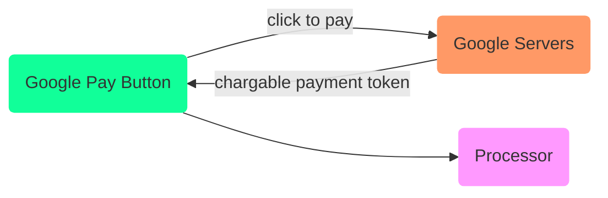
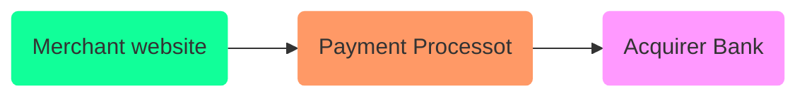

# Payment Gateway

<TagLinks />

::: quote
The first online transaction in 1984 by 72-year old woman named snowflake
:::

* Very big industry
* Mobile Commerce - $150 billion this year US alone
* Web needs a better answer for payments

## Google Pay

> Google Pay lets your customers pay with the press of a button — using payment methods saved to their Google Account.

* Online Conversions
* Google [Pay] API
* It's competition to paypal
* PayPal is different from Google [Pay] in a number of ways. PayPal for example takes care of **processing the payment**, whereas Google [Pay] helps your users utilize their previously **saved cards** to pay in your site, but the processing of the payment still  happens through a payment processor or gateway.
* A better way to pay using your existing cards

[pay]: https://developers.google.com/pay/api#participating-processors

## Payment Processor

1. Checkout.com
2. Stripe
3. Braintree
4. World pay
5. Cloud Pay
6. PayPal
7. Razorpay - india only
8. Paytm
9. Vantiv

Encryption and security is crucial part

## Organization

* Once Payment is complete send a web hook call to cloud function
  * update database
  * send email
  * creating shipping label ando so on

## Solutions

* https://gumroad.com/features/pricing
* https://www.e-junkie.com/wiki/help#Using%20E-junkie%20with%20Payment%20Processors
* https://bejamas.io/blog/jamstack-ecommerce/

## References

* https://www.hostgator.com/blog/online-payment-methods-ecommerce/

<Footer />
