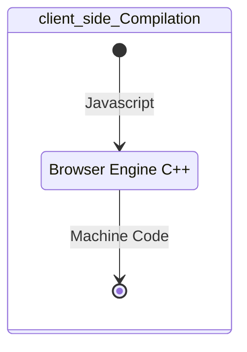

# SVG 2 Specification

<TagLinks />

SVG is a language based on XML implemented in browser.
* works well with other w3c specified technologies
* SVG DOM compatible with HTML DOM
* 18 years old
* [Implementation](https://www.w3.org/Graphics/SVG/WG/wiki/Implementations)
* [SVG Favicon tester](http://xn--dahlstrm-t4a.net/svg/favicon/favicon.html)
* [Browser Engine](https://en.wikipedia.org/wiki/Browser_engine)

::: tip svg
Using XML to draw vector graphics in browser echosystem $=$ SVG specification

[SVG Mozilla Implementation](http://www.graphicalweb.org/2005/papers/MozillaSVG/index.html)
:::

> DOM defines a platform-neutral model for events, aborting activities, and node trees.

Pros

1. CSS Stylable
2. could be Animated
3. Scalable
4. Dynamic changes through JS


How do I check if my browser supports SVG 2?
:   Run following command in browser console

    ```js
    // for SVG 2
    document.implementation.hasFeature(
      "http://www.w3.org/TR/SVG2/feature#GraphicsAttribute", 2.0)

    // for SVG 1
    document.implementation.hasFeature(
      "http://www.w3.org/TR/SVG11/feature#SVG", 1.1)
    ```
::: tip
Though rendering engines like webkit and blink are written in C++ they can directly compile JS to machine code


:::


### DOM

> cross platform, language independent interface for treating XML and HTML

::: right
DOM [Wikipedia](https://en.wikipedia.org/wiki/Document_Object_Model)
:::

* Node tree construction from parsed HTML, CSS. There could be blocking JS as well
* Node traversal, searching and manupulation
* Ordered Sets
* Node/Element Selector
* Events are objects too and implement the Event interface (or a derived interface)
  * Dispatching events
  * Firing events

[specification]: https://www.w3.org/TR/SVG2/Overview.html
[SMIL]: https://www.w3.org/TR/2008/REC-SMIL3-20081201/
[DOM]: https://dom.spec.whatwg.org/
[blink]: https://www.chromium.org/blink

*[SVG]: Scalable Vector Graphics 2.0 2018
*[SMIL]: Synchronized Multimedia Integration Language (SMIL 3.0) 2008
*[DOM]: Document Object Model
*[IDL]: Interface Description Language format for describing application programming interfaces (APIs) that are intended to be implemented in web browsers.

::: warning Questions
* Difference between webkit/blink and v8 engines?
  * Layout/rendering engines and other one is javascript engine
* Why arent there any high level languages on client side? Why cant I run python on browser?
* How is [browser ecosystem made?](https://www.google.com/search?q=chrome+blink+architecture)
* What is HTTP2
* NodeJS how asynchronous calls work? [OS threas vs event loops?](https://nodejs.org/en/about/)
  * Node.js being designed without threads doesn't mean you can't take advantage of multiple cores in your environment. Child processes can be spawned by using our `child_process.fork()` API
* What is the [difference between javascript and NodeJS?](https://www.educba.com/javascript-vs-node-js/)
:::


## Resources

* https://en.wikipedia.org/wiki/Browser_engine
* https://en.wikipedia.org/wiki/Comparison_of_browser_engines
* [What is the difference between HTML and XML](https://www.guru99.com/xml-vs-html-difference.html#)

<Footer />
