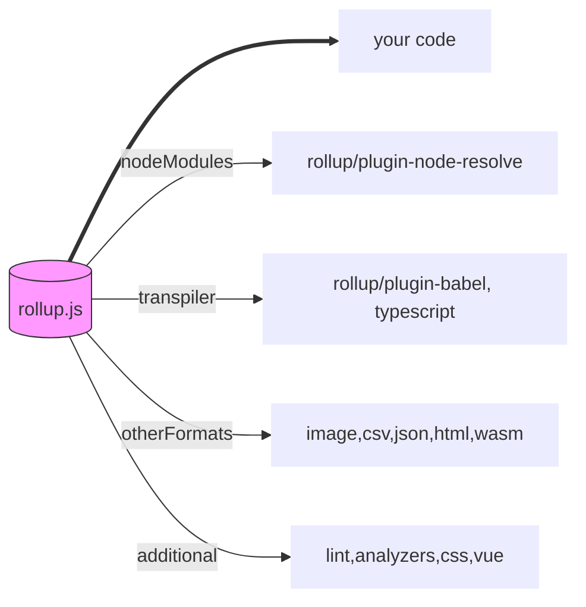

# Typescript

<TagLinks />

javascript is a language that people love to hate

most of the backend stuff is abstracted using technological solutions like
* cloud platforms AWS, GCP
* docker
* APIs like stripe/paypal for payment


## Backgroubd

* Up until 2015 javascript did not had **modules** as like in other languages (**ES6**)
  * We need to export `const`, `var`, `let`, `functions`, `classes` from module files to use it as a package
  * single `export { ... }` is preferred over multiple exports for redability
  * Then `import` javascript objects in source to use them from modules.
  * How do we pack everything up from all modules?
    * [Bundler wars](https://medium.com/better-programming/the-battle-of-bundlers-6333a4e3eda9)
* Build Toolchain
  * compilers - node
  * transpilers - babel
    * to use lates ES features which are not yet supported by browsers
  * bundlers - combine all modules taking care of dependencies and order of appearence
    * your code + code from npm + posssibly other sources
    * IFE (Immediately Invoked Function Expression)




So where is the majority of development?

What got you interested? Why research it?

::: tip vue3
Vue3 totally re-written in typescript
:::


What C++ is to C is the same for
what Typescript is to Javascript

* It is a superset of Javascript

Let see an important landmark in the history of Javascript:

It was launched in September 1995, and It took just ten days to develop this e scripting language which was initially called Mocha
In November 1996, Netscape submitted JavaScript to ECMA (European Computer Manufacturers Association) International
ECMAScript 2 was released in 1998
ECMAScript 3 was released in 1999
In 2005, Eich and Mozilla join ECMA to develop E4X Java script
In January 2009, the CommonJS project was launched with the aim of defining a common standard library
In June 2011, ECMAScript 5.1 was released
In June 2015. ECMAScript 2016 was released
The current version is ECMAScript 2017 which was released in June 2017


* Programming Languague maintained by Microsoft
* Adds [static type checking](https://en.wikipedia.org/wiki/Type_system#STATIC) to javascript
* Typescript code needs to be compiled
* As TypeScript is a superset of JavaScript, existing JavaScript programs are also valid TypeScript programs.
* The TypeScript compiler is itself written in TypeScript and compiled to JavaScript.

TypeScript is a strict superset of ECMAScript 2015, which is itself a superset of ECMAScript 5, commonly referred to as JavaScript.

The TypeScript compiler, named tsc, is written in TypeScript.

s a result, it can be compiled into regular JavaScript and can then be executed in any JavaScript engine (e.g. a browser). The compiler package comes bundled with a script host that can execute the compiler. It is also available as a Node.js package that uses Node.js as a host.

Would you rather have **silly** errors during development or insanity induced error in production!

* Learn it incrementally as you go
* transpile to it multiple javascript flavours
* try writing async await in TypeScript
* By default tsc transpiles to ES3 syntax
* tsconfig.json file for compiler options
  * target ES syntax
  * watch the files?
  * lib -include native dom classes in your applications
    * get free vscode autocomplete and intellisense
* Programming Languagues
  * Static Types
    * Static typing means that types are known and checked for correctness before running your program.
  * Dynamic Types
    * Dynamic typing means that types are only known as your program is running.
  * https://stackoverflow.com/questions/20563433/difference-between-static-and-dynamic-programming-languages
* [Meaning of `<T>`](https://www.typescriptlang.org/docs/handbook/generics.html)
  * Type variable
  * better than `arg: any`

```
public void foo() {
    int x = 5;
    boolean b = x;
}

def erroneous():
    s = 'cat' - 1

print('hi!')
```

tsc hello.ts -> hello.js        // vanilla

Remove type checcking for a variable

```js
let lucky: any = 23;
lucky = '23'
```

Pascal Case

* Restrictign the value of variable to certain values `|`
* Create type interfaces for structs
* String typing a function
  * argumsnt annotation
  * return types

```js
function pow(x: number, y: number): string {
  return Math.pow(x, y).toString();
}

// Arrays, Tuples
// make them optional
type MyList = [number?, string?, boolean?]

//Generics
class Observable<T> {
  constructor(public value: T) {}
}
```

## Debug like a pro

* computed property nams, adding variables to object
  * `console.log({foo, bar, baz})`
* Add custom CSS styles to logs
* Display objects as tables
* console.trace()
  * where was fucntion defined and where was it called?
* Object Destructuring
* Template Literals
* Spread Syntax
* A comma in the end would not break modern JS
* Modern Arrays
  * array reduce
  * array map
  * array filter
* Async await
  * express asynchronous code in synchronous format
  * one of the best things that has ever happened to JS

```js
console.log('%c My Friends', 'color: orange;')
console.log([foo, bar, baz])

// Equivalent of array push
pokemon = [...pokemon, 'Balbasaur']
```

```js
// convert array to object
let data = this.$store.state.cart.map(item => ({ [item.productId] : item:productQuantity }))
data = Object.assign({}, ...data)
```

### Type conversion

string -> json Object -> Array
Object -> Array

## Advanced typescript

* Advanced types
* Intersection Types
* Template literals (Template strings) using backticks ```

```ts
type Duck = Quackable & Swimmable;
type Flyable = Eagle | Butterfly;
```

## :wrench: Bundler Softwares for Frontend

1. webpack
2. Rollup

Universal Module Definition - [UMD](https://github.com/umdjs/umd)
:   UMD is a pattern of universal module definition for JavaScript modules.

    These modules are capable of working everywhere, be it in the client, on the server or elsewhere.

## Why do we need webpack?

Generic way of consuming JS on on webpage

* Script tags
  * jQuery repreccursions
* Put everything into one BIG JS file
  * scoping
  * maintenance
* Modules
* ESM

webpack
: javascript bundler. Creates bundles

loaders
: By default, webpack deals only with JS files, but we might need other assets as well
like images, vue files, css, html templates files, preprocessing, postprocessing etc

plugins
: do fancy stuff with loaded files. Vuetify etc

* builds internal dependency graph
* configure webpack to give us the static bundles
* Use vue-cli to make custom webpack configs
  * `vue.config.js`


## Rollup

> Another build tool similar to webpack, grunt, browserfy

* Bundles only the packages which are actually used in source, unlike webpack which bundles everything together
* results in small final source bundle
* built for ES6
* compiler a JS


*[JS]: JavaScript

## Functional Programmming

::: tip
$Mathematics \simeq	Programming$
:::

* Look at the parameters, and generate output
* Persisatant data structures
* https://files.gotocon.com/uploads/slides/conference_12/546/original/functional-programming%20%20russ%20olsen.pdf

## Webpack Bundler

* Transpiling with babel - writing modern JS
* Tree shaking - elimination of dead code
* webpack by default will  look for a `src` folder with `index.js` file $\rightarrow{transpile}$ to `dist/index.js`
* if we use `HtmlWebpackPlugin` webpack will auto add `index.js` to `html`
* `MiniCssExtractPlugin` same thing for css, compiler `sass` css preprocessor etc

## Questions

* How to create javascript binaries?

## Function Calls

1. Function executuon wheen called
2. Self executing functions, without calls. Gets executes as soon as they appearence

```js
var myFunc1 = function() {
    alert('Hello');
}();                        // <--- () causes self execution

var myFunc2 = function() {
    return 5 + 5;
};

var some_value = myFunc2(); // <--- Again () causes execution (you'd expect this one)
```

### References

* https://www.guru99.com/typescript-vs-javascript.html
* [Lydia Hallie](https://www.theavocoder.com/)

<SimpleNewsletter/>
<Disqus />

[vue3]: https://github.com/vuejs/vue-next
[wiki]: https://en.wikipedia.org/wiki/TypeScript
[ECMA]: https://en.wikipedia.org/wiki/ECMAScript
[typescript]: https://www.typescriptlang.org/
[repo]: https://github.com/microsoft/TypeScript
