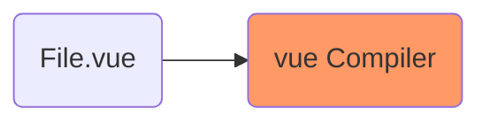

# Vue 2

<TagLinks />

* `Template` section in components needs one top leve, root element
* Use `props` and named `v-slots` with components
* [Vue Components | Vue Plugins | Vue Mixins](https://stackoverflow.com/questions/50474317/vue-js-components-vs-plugins-vs-mixins#:~:text=Components%20can%20be%20extended%2C%20doing,functionality%20to%20an%20existing%20component.)
  * component is individual unit in itself
    * Vue components by nature are meant to be re-used. SFC
    * [How to package vue components for npm ?](https://vuejs.org/v2/cookbook/packaging-sfc-for-npm.html)
  * Mixin add functionality to an existing component
    * could be global
  * Plugins - distribute components
    * Plugins usually add global-level functionality to Vue

### How Properly packaging your SFC for distribution via npm?

* Universal Module Definition (UMD) API
* https://unpkg.com/
* 

*[SFC]: Single File Component

<Footer />
