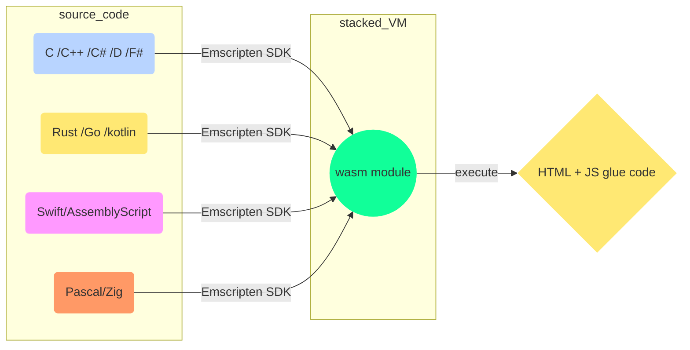
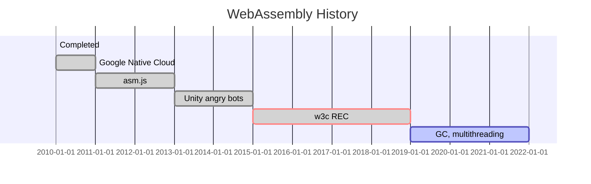

# WebAssembly

<TagLinks />

> WebAssembly (abbreviated Wasm) is a binary instruction format for a ==stack-based virtual machine==.
> Wasm is designed as a portable compilation target for programming languages,
> enabling deployment on the web for client and server applications.

::: quote Franziska Hinkelmann
Portable binary format for web
:::

* wasm became a [w3c] approved specification in 2019
* `wasm` is 4th language to run natively in browser alongside `html`, `css`, `js`
* Compiler LLVM supported languague to wasm using [Emscripten]
* WebAssembly is usually either ahead-of-time (AOT) or just-in-time (JIT) compiled

## :monkey_face: History

Timeline | Events   | Description
---------|----------|--------------------
2011     | precursor technology | [Google Native Client](https://en.wikipedia.org/wiki/Google_Native_Client)
2013     | precursor technology | [asm.js]
2015     | 1st demonstration    | executing Unity's Angry Bots in Firefox,Chrome,Edge
2019     | Became [w3c] recommendation (REC)| Web client now supports 4 language. `html`, `css`, `js` and `wasm`|
Future   | plans to support multithreading and garbage collection | support `python`, `ruby` as well|

::: tip Old browser support
For older browsers, Wasm can be compiled into [asm.js] by a JavaScript polyfill.

In web development, a polyfill is code that implements a feature on web browsers
that do not support the feature.
:::

## :racing_car: Performance

* 20% slower than native code execution
* https://blog.sessionstack.com/how-javascript-works-a-comparison-with-webassembly-why-in-certain-cases-its-better-to-use-it-d80945172d79
* https://medium.com/samsung-internet-dev/performance-testing-web-assembly-vs-javascript-e07506fd5875

* Javascript performance vs C++ performance story and where wasm fits in
* PHP 8 will come with JIT compiler
* So, what performance depends on
  * I/O, images, databases, HTTP, rendering, fonts, frameworks, network
* If you ship slightly smaller images, your improvments are far bigger than any compiler optimization you could make.
* `JS` is dynamically types, `C++` is statically typed
  * faster to prototype but little more work for compiler to keep up with dynamic types
* **property lookup** is all over js `console.log()` log property on console Object
  * TypeError
  * Undefined
  * Property Chain
  * Proxy
* implement same algorithm in both languages (prime #) and then plott for #inputs
  * `js` is maybe <Badge type="warning" vertical="middle" text="2X" /> times as slower as `C++`
* `v8` as `TurboFan` (precursor CrankShell) as its optimizing compiler introduced in 2017
  * in js if you have a function but its bever used, its not even compiled
  * if a fn is executed multiple times, its send to optimizing compiler
    * using some heuristics and speculation techniques
  * get `x86` assembly code
  * is turned on when **function is hot**. Optimization only happens on **hot functions**
* We can turn off the optimizing compiler in node using `--noopt` flag
  * run everything with baseline compiler

<iframe width="560" height="315" src="https://www.youtube.com/embed/aC_QLLilwso" frameborder="0" allow="accelerometer; autoplay; encrypted-media; gyroscope; picture-in-picture" allowfullscreen></iframe>

## How to write wasm?

* https://nodejs.org/api/wasi.html

### :question: Questions

* How to compile your code js to wasm?
* How to debug it from devtools?
* HOw to write wasm?

## :card_index_dividers: open sourced projects

* https://github.com/termoshtt/wasm-svg-example

## :cyclone: Useful Links

* [Official website](https://webassembly.org/)
* [Emscripten]
* [wiki]
* [WebAssembly Studio](https://webassembly.studio/)
* [Virtual Machine](https://en.wikipedia.org/wiki/Virtual_machine)
* [wasm project on github](https://github.com/WebAssembly)
* [Rust wasm](https://www.rust-lang.org/what/wasm)
* https://www.smashingmagazine.com/2019/04/webassembly-speed-web-app/

[Emscripten]: https://en.wikipedia.org/wiki/Emscripten
[w3c]: https://en.wikipedia.org/wiki/World_Wide_Web_Consortium
[wiki]: https://en.wikipedia.org/wiki/WebAssembly
[asm.js]: https://en.wikipedia.org/wiki/Asm.js

*[w3c]: World Wide Web Consortium

<Footer />
